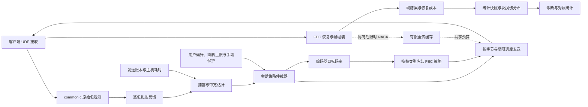

# 逐包反馈、自动码率与会话 FEC 设计

本方案覆盖 Foundation Sunshine、Moonlight PC 和 Moonlight Vplus Android 的视频传输。当前主方案采用客户端逐包到达反馈、成熟拥塞控制、手动设定的逐帧 RS 和受期限约束的发送器，由服务端按会话统一分配视频、冗余与修复预算。GoogCC 在用户上限内调整发送预算，FEC 保持手动策略；增加手动保护也必须从同一预算扣减编码额度。

限时选择重传纳入能力扩展；滑动窗口编码和预测式冗余分配纳入实验路线。本文描述完整目标方案；预算、分片、会话与帧策略、手动 v2 接口、客户端公共观测、成功提交账本和固定 GoogCC 的隔离适配已部分实现，整体尚未验收。实际完成范围见[验证记录](adaptive-fec-validation.zh-CN.md)。代码与公开资料核对于 2026 年 10 月 2 日；标准说明机制，成熟实现与论文说明可行性，是否改善本项目仍须对比验证。所有新增阈值均是实验起点。

2026 年 10 月 4 日移除基于历史突发回放的自动 FEC 适配。自动 FEC 当前不可用，客户端按显式能力禁用，服务端拒绝启用请求；历史验证保留其原版本范围。持续损伤下的动态保护仅作为成熟控制器的隔离评估候选，不属于当前生产实现。

具体任务、验证门槛、代码落点、协议约定、验收与回退见[实施文档](adaptive-fec-implementation.zh-CN.md)。

## 先进手段的依据与采用边界

| 手段 | 公开依据 | 本项目采用方式与边界 |
| --- | --- | --- |
| 逐包接收状态与到达时间反馈 | [RFC 8888](https://datatracker.ietf.org/doc/html/rfc8888) 定义面向拥塞控制的逐包反馈 | 作为主方案的测量基础，利用现有视频 RTP 序号与发送账本；借鉴反馈语义，通过 ENet 传送自定义消息，不宣称实现 RTCP 互通 |
| 延迟趋势、确认吞吐与损伤联合估计 | [WebRTC GoogCC 实现](https://webrtc.googlesource.com/src/+/refs/heads/main/modules/congestion_controller/goog_cc/goog_cc_network_control.cc)；[GCC 分析与实验论文，2016](https://c3lab.poliba.it/sites/default/files/2026-05/Gcc-analysis.pdf) | 优先适配并固定成熟实现的版本，替代仅靠丢包阈值增减码率；针对游戏串流增加发送期限和排队约束，论文结果不等于本项目延迟保证 |
| 关键帧与普通帧差异化保护、保护开销扣减 | [WebRTC FEC 控制器](https://webrtc.googlesource.com/src/+/refs/heads/main/modules/video_coding/fec_controller_default.cc) 有不同帧类型的保护参数，并扣除实际 FEC/NACK 开销 | 保留现有 Reed Solomon，根据 IDR、RFI 恢复帧和普通帧分配保护；具体分配规则由项目实验决定 |
| FEC 与限时选择重传协同 | [RFC 4588](https://www.rfc-editor.org/rfc/rfc4588.html) 的重传机制与总负荷约束；上述 WebRTC 实现支持组合保护 | 仅在剩余期限足以完成修复时请求少量必要数据包；先改客户端未完成帧保留机制，再协商启用 |
| 在线滑动窗口 FEC | [RFC 8681](https://datatracker.ietf.org/doc/html/rfc8681) 定义滑动窗口 RLC；[Tambur，NSDI 2023](https://www.usenix.org/system/files/nsdi23-rudow.pdf) 提供生产轨迹与模拟网络实验 | 作为独立实验协议，对照逐帧 RS；不把 RLC 与 Tambur 当成同一种编码，不直接替换现有分块头 |

上述依据支持选择这些方向，但不证明简单组合后必然优于现状。主方案优先使用已有实现验证较充分、能保留现有视频格式的手段；涉及恢复等待和新编码格式的手段，必须分别证明其收益超过延迟、计算和兼容成本。

## 现有代码与需要补齐的链路

| 范围 | 核对基线 | 与本方案有关的现状 |
| --- | --- | --- |
| Sunshine | `87ea00bc4` | 有 ABR API、动态参数入口、逐帧 Reed Solomon FEC 和会话观测接口 |
| Sunshine common c | `31a2a45` | 有逐块 FEC 状态结构和客户端上报逻辑 |
| Moonlight PC | `8789fb13`，common c `6687783` | 每 3 秒通过 HTTPS 上报 ABR 指标 |
| Moonlight Vplus Android | `1a4a79ec`，common c `31a2a45` | 每次反馈结束后约 1 秒再执行下一次；支持服务端 ABR 和本地回退 |

### 基线动态 FEC 缺口与当前改造

核对基线中，[`src/stream.cpp`](../src/stream.cpp) 的动态参数入口接受 `FEC_PERCENTAGE`，然后将事件投递给视频编码器。[`src/video.cpp`](../src/video.cpp) 中 AVCodec、NVENC 和 AMF 的动态参数处理均没有落实这一参数；视频发包线程每帧读取全局 `config::stream.fec_percentage`。该基线接口的成功主要表示请求已经投递。

当前工作区已改为会话策略：同步与异步编码在帧边界确认配置，输出按自身帧编号取得提交时的策略，发包按快照选择 FEC；[手动策略 API](transport-policy-api-v2.zh-CN.md) 提供接受、配置和首次成功提交回执。源代码接入与确定性测试不替代实际串流抓包、后端失败和重建成本验证。

FEC 的执行位置应在会话的视频分包与发包层。编码器只接收由网络预算推导出的编码码率，不负责生成或设置 FEC。

### PC 和 Android 的丢包统计口径不同

PC 的 `Session::sendSunshineAbrFeedback()` 用 FEC 失败、乱序、无效包等指标之和除以视频与 FEC 包数。其 common c 的 `RtpVideoQueue.c` 中，视频与 FEC 包计数在块初始化时按预期包数增加；本次核对没有找到该文件对上述失败等计数的更新。因此这组值不能作为真实视频网络丢包率，成功恢复的数据损伤也没有进入该计算。

Android 的 `Game.kt` 则将 `PerformanceInfo.lostFrameRate` 填入 `packetLoss`。这一值由进入渲染器的帧编号间隔推导，主要反映接收链路之后的缺帧，不是 FEC 前 UDP 包丢失；它还需要排除发送端未实际发送的帧编号空洞。两端的 `decodeFps` 也不能直接视为实测解码能力：PC 使用活动视频帧率，Android 使用 `totalFps`。

已有 `SS_FRAME_FEC_STATUS` 能表达块的数据包、冗余包与收到包数，但主要在恢复和失败事件上报，队列为尽力投递，并且成功恢复后可能尚有冗余包在路上。它适合辅助诊断与触发保护，直接平均这些报告会产生样本选择和提前结算偏差。Sunshine 目前没有相应的 FEC 状态处理闭环，传统 `IDX_LOSS_STATS` 处理也只打印日志。

### FEC 的带宽换算需要统一

当前 FEC 编码实际采用 `P = ceil(D × F / 100)`，其中 `D` 是数据包数，`P` 是冗余包数。`F = 20` 表示相对数据增加约 20% 冗余，冗余占总包数约 16.7%。

但现有 `encoder_bitrate_from_total_bitrate()` 使用 `V = B × (100 − F) / 100`，RTSP 初始预算和会话总码率反推也使用类似逻辑，且部分路径在 FEC 超过 80 时绕过换算。以忽略其他开销的 40 Mbps 为例，20% FEC 对应的编码预算应约为 33.33 Mbps，当前简单换算得到 32 Mbps。这是语义不一致；增加自适应前应统一，保留旧 API 的兼容适配。

### 会话身份和应用结果需要明确

[`src/nvhttp/abr_api.cpp`](../src/nvhttp/abr_api.cpp) 按 HTTPS 来源 IP 查找会话，ABR 状态及动态参数应用主要使用客户端名称。多个客户端共享公网出口、客户端重名和重连迟到反馈都可能选错状态。项目已有 `launch_session_id`、`client_cert_uuid` 和 `get_client_cert_uuid_from_request()`，可复用它们完成绑定。

Android 服务端 ABR 分支收到 `newBitrate` 后又调用 `setBitrate()`；与此同时 Sunshine 的反馈处理已投递同一修改。新协议应只有一个执行者，并区分请求接受与实际应用。

## 总体架构与必须保持的约束



控制器输出总发送预算 `B`、视频编码目标 `V`、按帧类型划分的 FEC 目标、可选重传额度、发送期限和策略版本。当前仅由 GoogCC 估计容量，保护比例来自手动策略；二者经唯一会话仲裁器分配净编码额度。块损伤快照用于诊断与隔离对照，不产生自动保护候选。

逐包反馈建议每 50 至 100 ms 一次，完整性能快照约每 1 秒一次。频率应根据反馈字节开销、RTT 和客户端负荷协商调整；当前没有自动 FEC 评估或下调周期。条件 RTX 扩展的紧急 NACK 另行验证，不等待常规反馈周期。

以下约束作为实现验收条件：

1. FEC 恢复的包不计入原始收到包，恢复后的好画面不能隐藏链路丢失。
2. 在既定预算内增加 FEC 时同步减少编码预算；增加保护不自动提升总发送量。
3. 一个会话只有一个实时控制者，任何旧客户端命令和管理操作都经过同一仲裁器。
4. 一帧采用同一个策略快照，并从中选定该帧的保护等级；全部 FEC 块采用这一等级，块头仍表达因取整得到的实际比例。
5. 会话身份、反馈序号和策略版本明确，迟到数据不能覆盖新会话或新策略。
6. 统计观察不增加播放等待；重传或跨帧编码只有在明确协商的恢复期限内才允许保留未完成帧，无损路径保持立即交付，受损参考链的依赖等待同样受期限约束。
7. FEC 生成、编码器重配置或发送失败都有可观察结果，不能把排队成功当成应用成功。
8. 数据、FEC、重传和探测均进入实际发送账本；任何恢复方法都不能把已经丢失的原始包改记为原始收到包。

FEC 前后分开反馈符合 [RFC 6363 第 6 节](https://www.rfc-editor.org/rfc/rfc6363.html#section-6) 的原则。将修复流纳入发送负荷控制也与 [RFC 6363 第 8 节](https://www.rfc-editor.org/rfc/rfc6363.html#section-8) 和 [RFC 9265 第 3 节](https://www.rfc-editor.org/rfc/rfc9265.html#section-3) 对 FEC 与拥塞控制关系的讨论一致。

## 客户端统一测量

### 三类损伤指标

| 指标 | 明确定义 | 决策用途 |
| --- | --- | --- |
| 原始包丢失率 `rawLoss` | 已结束观察的 RTP 序号区间中，发送账本确认成功提交的原始传输包减去原始唯一收到包，再除以成功提交包数 | 衡量接收损伤，包括 FEC 包；结合延迟判断拥塞，排除 RTX 与未提交包 |
| 有效帧损失率 `residualFrameLoss` | 已结束帧范围内，服务端确认完成发送的帧中，未在当前协商组帧时限内完整交付的比例 | 衡量传输交付损伤；发送中止与处理丢帧另列 |
| 恢复压力 | 成功恢复数据包数、恢复帧数、块缺失分布、恢复耗时、块结果与样本覆盖率 | 判断 FEC 是否足够及是否过量 |

另行记录乱序、重复、认证失败、播放时限之后到达、解码失败与主动渲染丢帧。低接收帧率可能来自静态桌面、VRR、捕获节流或主机掉帧，不能独立触发 FEC 上调。

`rawLoss` 是有限观察时限下、应用接收侧测得的包缺失，可能包含客户端 socket 溢出等本地接收损伤，不能声称已经定位为运营商链路丢包。可获得的平台溢出计数和主机发送错误应作为独立原因指标。

### 在 common c 增加独立观测器

将核心统计放在 `VideoStream.c` 与 `RtpVideoQueue.c`，供 PC、Android JNI 和后续客户端共用。建议增加 `LiGetVideoNetworkSnapshot()`，返回一个线程安全的一致快照；保留现有 API 的历史语义。

原始观测在成功认证解密、验证基本包头后，进入组帧队列之前进行。即便完整帧已提交，随后到达的有效冗余尾包仍进入原始观测器。FEC 人工生成的包只能进入恢复计数，不能经过原始接收计数路径。Debug 的人工丢包验证也必须与真实接收统计隔离。

观测器维护会话内扩展 RTP 序号、去重位图、块记录和帧结果。16 位 RTP 序号要处理回绕；发生长时间断流、序号跳变超过可判定范围或记录环溢出时，将覆盖区间标为未知并重新同步，不能制造巨大的丢包率。

两个结束时限分别处理不同问题：

- 组帧结果沿用现有播放与队列期限。成功、恢复成功、超时失败只结算一次，不为统计延迟交付。
- 原始包统计保留短暂观察宽限，建议从 20 至 50 ms 起步并依据乱序分布调节。晚于宽限的包计入 `lateAfterObservation`，不能重复改写已提交的区间；晚于组帧期限但早于统计宽限的包属于播放迟到，不属于该原始观察区间的丢失。

扩展序号区间以已经收到的后续包形成高水位。只结算宽限已过的序号空洞。没有新视频包时，不推断未知的尾部发送量；服务端结合发送账本与最后有效接收时间识别中断。需要结算传输尾部时，由服务端携带已发送序号水位并让客户端确认观察，不能依赖两端墙钟相减。

完整帧丢失不能只依赖客户端读到的块头。反馈携带结束的帧索引范围与其中完整交付帧计数，服务端用保留的发送账本计算该范围内完成发送的帧数，排除编码器未产生输出的编号空洞。主动整帧丢弃、部分发送中止与本地发包错误分别记录，不能伪装成链路丢失，也不能从最终冻结和互动体验指标中隐藏。恢复报告、原始序号区间和帧结果区间各自标记水位，不能将未对齐的累计计数相减。

快照使用 64 位累计计数和单调时钟持续时间。250 ms 产生内部汇总，正常约 1 秒报告一次；出现新组帧失败时可每 250 ms 提前报告。这些快照供诊断、兼容控制及隔离对照使用，主方案的拥塞估计另用逐包反馈。按收到的新样本决策，以时间而不是反馈次数计算平稳期。采集线程保有状态所有权，通过双缓冲或短时锁发布快照，不返回正在被接收线程修改的裸结构指针。

### 逐包到达反馈与发送账本

[RFC 8888](https://datatracker.ietf.org/doc/html/rfc8888) 的核心信息是逐包是否接收和接收时间，允许后续报告补充迟到接收。本项目采用这一信息模型；以下消息、期限和账本是针对现有 ENet 与 RTP 的设计选择。

普通视频及 FEC 使用现有 RTP 序号，反馈携带流标识、epoch、扩展基准序号、接收位图或状态游程、首次有效到达的相对时间增量，以及覆盖范围。先不增加每个视频包的 TWCC 扩展。服务端将这些序号映射成内部唯一包标识，记录帧、块、数据或冗余类型、字节数、策略版本和发送结果。未来 RTX 使用独立协商的传输序号空间，不能与原始序号混淆。

接收线程在 `recvUdpSocket()` 返回后尽早记录单调到达时间，完成认证和包头校验后才发布该条记录；不能把解码结束或 FEC 恢复时间当作网络到达时间。发送端在实际提交发送时记录单调时间，不能使用编码完成、生成冗余的时间或 90 kHz RTP 呈现时间戳代替。批量提交的时间精度须有标记；平台支持内核收发时间戳时再提高精度，不假定应用层时间已排除系统调度噪声。

反馈中的序号空洞先标记 pending，经过乱序宽限才转为用于损伤估计的缺失。后续收到原始包时，对拥塞估计补充一次有效到达更新；已结算的 `rawLoss` 历史保持不变，另增加迟到计数。这两种用途分开维护，既不重复扣减带宽，也不让迟到修复反复改写 UI 历史。FEC 恢复结果只能更新帧与保护指标。

服务端维护有界反馈历史：重复报告只处理新的接收信息，覆盖 gap、过老时间增量、账本淘汰和重连分别处理。不能将无法匹配发送记录的包当作零延迟或新损失。序号扩展结合已确认水位和帧索引处理回绕；长断流无法消歧时重同步。

首版协商 50 至 100 ms 反馈周期，编码后消息不得超过控制通道安全 MTU；高码率下按范围拆分，并计入反向反馈带宽。时间增量与状态采用紧凑编码，限制每周期包数、排队时长和总反馈开销。反馈拥堵时合并最新状态并声明覆盖不足，禁止无限累积旧报告。ECN 仅在收包平台与传输路径能正确提供标记时作为附加信号，不作为首版依赖。

### 保留逐块数据而不过度上报

全量观测器必须计入没有丢包的块，避免只看到异常样本。正常反馈携带固定桶直方图和累计计数，例如块规模、原始缺失比例、需要恢复的数据量、恢复耗时和失败块数。详细块样本用于有限数量的诊断或短时间实验。

对于完全未收到的块，服务端发送账本知道应有的块规模。没有足够信息时不能默默将其丢出直方图：标记未知覆盖和完整块缺失事件，必要时补发范围结果。样本覆盖不足时禁止宣称已经满足保护目标，也禁止向下探测 FEC。

现有 `SS_FRAME_FEC_STATUS` 可作为旧客户端的恢复事件信号，并按帧与块去重；不作为全量 `rawLoss` 的分母来源。其 `0x5502` 与 RGB LED 的数值相同但方向不同，接入时须按客户端到服务端的消息语义处理，保留服务端到客户端的 RGB LED 行为。新的扩展编号应核对所有分支后分配。

## 统一码率预算与实际发送

### 预算定义

对新协议明确采用以下定义，单位统一为 Kbps：

```text
Btotal        = 当前会话允许的平均总发送预算
Bother        = 音频及其 FEC、控制和前向设备数据的预算
Brepair       = 协商启用的 RTX 预算，否则为 0
Bprobe        = 本窗口计划使用的容量探测预算
BvideoPrimary = Btotal - Bother - Brepair - Bprobe
rEffective    = 按近期帧类型及实际分块加权的冗余/数据比例
V             ≈ (BvideoPrimary - Hvideo) / (1 + rEffective)
```

`Hvideo` 包括原始视频与 FEC 的 RTP/UDP/IP、视频加密封装、填充等，不对数据和冗余重复扣减。实现以每净视频字节对应的实际发送字节系数为主，公式仅用于解释预算。统一按 IP 层字节计费：应用观测到的 UDP 内容补计 UDP/IP 头，明确 IPv4/IPv6 差异；估计器、发送器和 UI 使用相同口径，链路层开销另列而不混入部分路径。

自动码率开启时，`Btotal` 受用户上限、拥塞控制输出和主机共享出口额度共同约束。FEC 与 RTX 消耗这份预算，不向带宽估计器申请“补偿性扩容”。未用完的修复预留可由仲裁器回收，但不能与编码器重复花费。关闭自动码率时保留测量，按用户固定预算做 FEC 分配，不暗中开启容量上探或自动改写用户码率。

所有分项须满足非负和总额约束，先缩减非必要探测与修复预留；剩余预算不足以支持视频时报告受限并走授权降级，不计算负编码码率或通过透支维持最低画质。

关键帧冗余使用有限突发预留；不能用普通帧的平均保护比例承诺无限 IDR 发送。预测帧类型或尺寸与实际不符时，对当前帧采用可兑现的保护档，调整后续编码目标。将 `encoderKbps` 与 `wireBudgetKbps` 分开命名，编码器接口只接收净编码码率，不再在各后端各自读取全局 FEC 做二次换算。

初始预算由 RTSP 协商统一生成，动态 ABR、手动调整和重连使用同一换算。旧客户端 `bitrate` 保持既有 API 含义并走兼容适配，不能在无版本协商时突然改变其显示值或预算含义。

每块 `ceil(D × r)` 和 `minRequiredFecPackets` 会抬高实际开销，尤其是小帧。记录实际发出的数据、冗余和封装字节，按块规模估计取整成本。展示请求 FEC 与实际平均冗余两个值。静态配置的 `1..255` 与动态接口的 `0..100` 范围应被明确区分；建议自动模式先限定 `0..50`，保留固定模式的历史兼容范围。

### 同一策略的提交与应用

建议策略包含 `revision`、`wireBudgetKbps`、`encoderKbps`、`fecByFrameClass`、`repairReserveKbps`、`probeAllowanceBytes`、`sendDeadline`、`mode`、`reason`。固定模式可将所有帧类型映射到同一 `fecPercent`。不能分别更新独立原子变量并假定它们会同时生效。

编码线程在提交新帧前读取待生效策略，完成编码器码率重配置后确认版本；编码输出携带该帧使用的策略快照。异步编码器在途输出继续携带旧快照，需按提交帧索引保存，不可以在取出编码结果时套用最新 FEC。发包线程据帧快照生成全部块，发送器则始终受当前发送预算约束。

FEC 上调需要先获得降低编码码率成功的确认，避免旧大帧叠加新冗余。发送预算下调可以立即约束发送，即使编码器还没有确认；重配置失败时保持已确认的保护策略并报告失败。FEC 下调后，在途帧仍按旧策略完成，不将码率上升和保护下降同时当成两次试探。

反馈结果区分 `acceptedRevision`、`encoderAppliedRevision` 和 `firstSentFrameIndex`。只有编码器和实际发出的帧证明确认后才更新生效状态。没有输出帧时可以保留 pending，不伪造应用完成；应用失败不推进控制器的已确认基准。

### 发送器负责兑现预算

当前帧内 pacing 近似以 800 Mbps 限制突发，没有跟随会话码率预算。即使平均编码率合适，WiFi、隧道或中继也可能无法承受这种瞬时包流。

建议按会话建立 pacing，数据、FEC、RTX 和探测包进入同一字节账本。音频等流量要么共享调度，要么先预留并计入实际监控。参考 [WebRTC PacingController](https://webrtc.googlesource.com/src/+/refs/heads/main/modules/pacing/pacing_controller.cc) 的发送债务、队列时限和探测调度，实现适合本项目的轻量发送器。

平均预算 `Btotal` 与瞬时 pacing 速率分别定义。平均预算按明确的滑动窗口执行，瞬时速率可在有限额度内更高，以及时完成帧和容量探测；限制单次突发字节、最大债务与排队时长。不能照搬一个固定 pacing 倍率，也不能通过长队列维持平均码率。队列时限随交互偏好设定并验证，报告编码输出至实际发送的 P95/P99。

探测由拥塞控制器调度短包簇，临时占用预留预算或降低本窗口编码负荷，允许有限的瞬时速率试探，实际探测字节仍计入总预算。收到足够新反馈才能确认容量提升；不得用大 IDR 充当探测，或因为静态画面实际吞吐低而持续探测。

发送大 IDR 或超出期限的帧时，采用整帧可交付性判断及已有恢复机制，必要时丢弃过期视频并限频请求恢复。不能只丢依赖帧的一部分数据包，也不能无限透支令牌发送 IDR。普通非 IDR 可能是参考帧，缺少可靠依赖元数据时不能按“普通帧可随意丢弃”处理；主动丢帧须记录发送结果并处理参考链。降低预算、增加冗余和恢复请求均纳入账本。多个会话另受可选主机出口总预算约束，防止每个会话独立满足上限但共同挤满出口。

## 服务端决策策略

### 主方案采用成熟拥塞控制适配器

优先适配固定版本的 GoogCC 核心及必要依赖，建立独立接口，避免为了拥塞控制引入整套 WebRTC 信令与媒体协议。实现时记录上游 revision、构建选项、依赖和许可，保留上游算法测试与本项目轨迹重放。若只能自行重写部分趋势或阈值逻辑，应明确称为实验估计器，不能仅因使用相似公式就宣称等同成熟 GCC。

[当前 GoogCC](https://webrtc.googlesource.com/src/+/refs/heads/main/modules/congestion_controller/goog_cc/goog_cc_network_control.cc) 联合确认吞吐、延迟带宽估计、损伤估计和探测，并处理应用受限状态。项目适配器提供规范化的发送记录、接收时间、包状态、实际大小、探测标记与应用是否提供足够流量，输出网络目标速率、pacing 建议及探测计划。原始数据和 FEC 的有效网络接收均参加估计，人工恢复不参加；其他前向流量计入总负荷与预留。

延迟趋势使用包组的到达间隔与发送间隔之差，例如 `Δq = Δarrival − Δsend`，累积、平滑后观察趋势。参考 [TrendlineEstimator](https://webrtc.googlesource.com/src/+/refs/heads/main/modules/congestion_controller/goog_cc/trendline_estimator.cc)，适配时保留分组及噪声处理，不对每个 WiFi 批量到达包分别判拥塞。固定时钟偏移可通过差分消除，但时钟漂移、断流和路径变化仍需处理；不在未同步时钟间直接计算绝对单向延迟。

[LossBasedBweV2](https://webrtc.googlesource.com/src/+/refs/heads/main/modules/congestion_controller/goog_cc/loss_based_bwe_v2.cc) 对固有损伤与超过可用容量后的损伤建模，可作为联合估计的一部分。它提供模型估计，不证明某次损失来自无线干扰；是否启用、具体参数和适用性必须固定并验证，不能将其输出标记成确定的丢包原因。

游戏串流外层约束包含用户码率上限、主机共享预算、最大发送债务与帧期限。外层因排队或交付失败施加更低限制时，应将实际应用结果反馈给估计器；旧 ABR 的乘法降档不能同时独立执行，避免一次损伤被两个控制器重复降码率。手动保护参与净编码分配，不单独增加网络预算。

静态桌面、VRR、捕获节流和低复杂度画面进入应用受限状态：实际发送不足以证明当前容量下降，也不足以证明仍有额外容量。暂停没有必要的上探；恢复运动画面时使用近期有效估计和受约束的探测，不以历史峰值直接发送。反向反馈排队也会影响估计，需监控反馈年龄与丢失，不能只看 ENet RTT。

[GCC 的 2016 年论文](https://c3lab.poliba.it/sites/default/files/2026-05/Gcc-analysis.pdf) 分析并实验评估了容量变化、竞争流和反向流量；当前上游已演进，不能把论文的旧估计器直接当作当前实现。相关结果支持采用这一方向，游戏串流的高帧率、突发 IDR 和较紧期限仍须本项目验证。

### 区分链路损伤与疑似拥塞

仅凭丢包率不能确定丢失原因。以下状态是策略解释与保护分配依据；主方案的带宽估计由上述适配器给出。只支持统计快照的兼容客户端才使用简化预算控制，不能在主方案中再叠加一个独立阈值调速环。

RTT 可先复用 `LiGetEstimatedRttInfo()`，使用流内滑动低分位作为基线，计算相对上升及趋势。它主要反映 ENet 控制链路，不能视作精确视频单向排队时延；基线应有过期和路径切换处理，反馈不支持 RTT 时报告缺失，不能填 0。

| 判定状态 | 典型证据 | 动作 |
| --- | --- | --- |
| 正常 | 原始缺失低、帧交付稳定、延迟没有持续抬升 | 保持预算，稳定足够长后试探减少冗余 |
| 需要保护 | 原始缺失或块尾部损伤增加，但视频到达与延迟相对稳定 | 保持总预算，提高 FEC 并降低净编码目标 |
| 疑似拥塞 | 延迟持续抬升，同时实际接收低于发送、发送排队或有效帧损失恶化 | 先降总预算，暂停带宽上探；增加保护仍只能在更小预算内分配 |
| 客户端处理受限 | 原始损伤低，但解码耗时或渲染丢帧持续偏高 | 保持 FEC；进入独立画质或帧率降级策略 |
| 未知或反馈失效 | 无样本、视频完全中断、区间溢出或反馈过期 | 停止上探，保持或保守降低预算，执行恢复与重同步 |

未知原因下不能把低 RTT 当作随机丢包的证明。先冻结上探，必要时小幅减少预算并观察损伤是否改善；只有充分证据后才将低成本保护作为主要手段。

对快照兼容模式，建议严重新损伤允许快速反应，但每次降预算后至少等待 `max(250 ms, 一个可测 RTT)` 和新的反馈范围，避免同一段丢失触发多次乘法降档。一般拥塞降低 10% 至 15%、严重交付失败降低 20% 至 30% 仅是该模式的实验起点。主方案使用估计器更新和期限约束，不照搬这一固定比例。到达用户画质下限仍不可用时报告受限状态；如用户允许，进一步降低帧率或分辨率，不能突破预算补偿。

### 固定保护与后续动态候选

当前不根据短时突发或历史缺失分布自动调整 FEC。已结束的突发不能被新冗余修复，历史回放也不证明未来帧仍有同样风险；增加冗余会在固定预算内压低净编码质量。保留原始损伤、恢复与交付观测，用于诊断及独立对照。

持续随机损伤下的动态保护仍可研究，但必须采用隔离的成熟实现候选，并核对其保护比例与本项目实际 RS 分块、取整及最小冗余的转换。一次性突发、持续损伤、拥塞、反馈迟到及本地期限丢弃分别验证，不能用一个损伤百分比宣称获得收益。

候选只有在同一 IP 预算、恢复期限和冻结内容下改善实际有效帧与质量，且成本有界，才考虑启用能力。固定 FecControllerDefault 原型仅证明可编译运行，其最大损伤过滤和忽略损伤向量的行为尚不足以支持生产替换。当前没有生产动态选择器、自动档位或升降档计时。

### 关键帧与恢复帧差异化保护

采用按帧类型分配的 unequal error protection：优先保证恢复解码参考链的帧，而不是将全流冗余一律抬高。已有 `packet_raw_t::is_idr()` 与 `after_ref_frame_invalidation` 可区分 IDR、RFI 后恢复帧和普通帧；首版基于这些可靠元数据，暂不推断所有编解码器的完整参考依赖。

策略维护 `Fkey`、`Frecovery`、`Fbase` 三个目标。当前三项由手动策略设定。后续差异化保护候选可验证 `Fkey ≥ Frecovery ≥ Fbase`，该关系尚未证明最优。候选需结合平均开销、关键帧突发额度、四块上限与恢复成本评估可行档位；关键帧大到无法提高 FEC 时拒绝该候选并调整编码，不能突破协议上限。

差异化参数的工程依据来自 [WebRTC FEC 控制器](https://webrtc.googlesource.com/src/+/refs/heads/main/modules/video_coding/fec_controller_default.cc) 的 key/delta 保护区分；本项目继续采用自己的 RS 编码与预算口径。WebRTC 的保护开销比例与这里相对数据的 `F` 也不是同一个数值，不能直接复制其上限或经验参数。

每帧在分包前按已确认策略选择并冻结 FEC；现有块头可表达不同帧的比例，不需要先修改视频 RTP 格式。编码目标按加权实际保护成本与关键帧预留推导。当前帧若无足够预留则使用可兑现档位，禁止临时加保护造成超预算。普通非 IDR 的参考价值尚不明确，仍保持基础保护；以后只有编码器提供可靠依赖元数据，才扩展到参考层或可丢弃层。

### 限时选择重传与 FEC 协同

该扩展借鉴 [RFC 4588](https://www.rfc-editor.org/rfc/rfc4588.html) 的独立重传身份和总负荷控制原则，采用本项目协商的修复封装，不宣称与标准 RTP RTX 直接互通。它用于有足够时间的缺包，不替代 FEC，也不默认引入更大的播放缓冲。

在客户端检测到需要修复时计算：

```text
remainingDeadline > repairRoundTripUpper + senderQueue + receiverRepairCost + safetyMargin
```

`remainingDeadline` 是客户端当前单调时钟下的剩余恢复时间。期限在该帧首次有效到达时建立，并受播放计划及协商的最大恢复预算约束，NACK 或重复包不能延长期限；没有可信播放计划时采用保守本地上限，不声称能保证端到端时限。检测空洞前消耗的乱序等待已被扣除，不能再重复扣减。`repairRoundTripUpper` 包含 NACK 去程与修复包回程，使用近期上界或高分位估计，不能简单取 RTT/2；其他项包括发送排队、认证、组帧与恢复处理。不满足条件时直接依赖已计划的 FEC 和既有参考链恢复。

只请求让块达到可恢复条件所需的少量原始数据包，优先当前仍有价值的关键或恢复帧。完全未收到块头且无法确定分片身份时不猜测 NACK，依赖发送水位扩展或已有参考链恢复。FEC 和 NACK 可以在期限允许时并行，不必等所有冗余失败后才请求；一旦恢复完成取消未执行请求。NACK 用即时、限频的控制消息，带 session/epoch、帧块与原始包标识、请求序号及剩余期限。首版每个包最多一次重传，重复请求去重，修复负荷始终占用 `Brepair`。

服务端保存按字节与时间有界的短期缓存。请求必须属于该连接且对应真实发出的数据包；收到时再次检查缓存、参考链有效性、保守扣减控制去程后的剩余期限和预计排队。客户端提供剩余时长，不把其绝对时钟与服务端时钟相减；无法获得可信去程上界时使用完整 RTT 上界扣减或拒绝临界请求。到期请求、过老 epoch 与超额度请求不发包。

修复包携带原始帧块和数据分片身份，使用独立传输序号、清晰包类型和经过认证的封装；重新加密时分配新 nonce，不能复用现有视频加密序号而产生歧义。RTX 的实际接收参加拥塞估计与修复统计，原始包仍记为缺失；重传恢复只能改善帧结果。

当前 common c 的 `RtpvAddPacket()` 会丢弃旧帧或旧块，收到新帧或新块时可能直接清理未完成状态；`reconstructFrame()` 还可能提前发出参考帧失效通知。因此仅增加服务端缓存和 NACK 入口不能有效恢复。启用前必须增加有界未完成帧保留和恢复状态机，统一 FEC、RTX、RFI 的完成与到期处理，避免已经宣布失效的帧再迟到交付；依赖帧按有效参考链提交。

无损路径保持原有立即交付；失败帧及其依赖候选在协商期限内处理，期限、帧数和内存都有上限，不能为了等待旧参考帧无限阻塞后续帧。若条件下重传成功率低或延迟变差，自动停用 RTX 并保留 RS。需要单独证明低 RTT 等可用条件下的收益，不能在所有网络上默认启用。

### 冷启动与恢复

初次进入自动码率模式，保留手动 FEC 和用户总预算上限。接管依赖实际编码器应用、首包成功提交及新鲜映射反馈；链路历史不能继承旧会话身份、计数或控制版本。发送期限从开始传输时生效。

容量恢复由固定 GoogCC 调度预算内的真实媒体或已协商认证的独立 padding 探测；旧客户端仅使用真实媒体。样本不足、反馈失效、排队上升或刚发生交付失败时暂停探测；不能把降低冗余释放的编码额度视为测得更高容量。当前没有自动降冗余试探；后续成熟动态保护候选单独验证。

恢复验收区分业务恢复与容量发现：业务恢复以匹配无故障基线的实际质量、帧交付与延迟为目标；容量发现另要求充分媒体供给或有效原生探测及实测可达份额。静态/低产出不要求占满链路，确认发送预算也不等于接收吞吐。具体资格、冻结顺序和结果状态见[实施文档 P2-v2](adaptive-fec-implementation.zh-CN.md#p2-v2业务恢复与容量发现2026-10-07)；历史失败不追认通过。

现有 LLM 游戏识别层可继续提供慢速画质偏好或上限，经兼容转换后交给仲裁器。实时损伤、拥塞判断、FEC 和紧急降档由确定性算法控制，模型不可覆盖网络上限。用户关闭智能码率时保留固定预算与手动 FEC；启用智能码率仍保留手动 FEC。自动 FEC 当前不可用。严重网络受限的处理应与用户授权的自动模式一致。

## 反馈协议与控制权

### 能力协商与传输选择

扩展现有 `/api/abr/capabilities`、配置和反馈接口，协商统计版本、自动 FEC、逐包反馈、修复能力和应用状态。PC 与 Android 复用同一个 common c 实现；功能分别协商，不能以“版本 2”隐含承诺所有高级功能。

| 协商能力 | 反馈路径 | 控制与保护 |
| --- | --- | --- |
| 旧客户端 | 原有 HTTPS 或旧 FEC 事件 | 固定 FEC 与原有兼容 ABR；不声称获得可信原始损伤 |
| `network_stats_v2` | HTTPS 完整快照，约 1 秒 | 可选简化联动；在 UI 标明快照模式，不启用依赖逐包时间的 GCC |
| `packet_arrival_v1` 与实验控制 | 加密 ENet 逐包反馈及完整快照 | 当前主方案：成熟拥塞控制、手动 RS、预算与期限 pacing |
| 再有 `deadline_rtx_v1` | 即时 NACK 与独立修复封装 | 在期限允许且客户端保留机制就绪时使用 RTX |
| 再有独立滑动编码能力 | 新编码头与窗口状态 | 仅实验模式，明确双方支持的编码方案及限制 |

HTTPS 保持连接、仅允许一个在途请求，后续报告合并为最新累计快照。主方案由 common c 在 ENet 控制通道统一发送逐包反馈，客户端应用层不重复执行实时回报。常规到达报告采用尽力、可过期消息，结合 `reportSeq` 去重和有限迟到补报；控制权、能力协商与策略应用状态可靠发送。新增消息的优先级、逻辑通道和队列上限须保证反馈积压不会阻塞输入。

完整快照与逐包反馈可在同一 ENet 链路共存，但分别服务诊断/兼容控制与带宽估计。HTTPS 快照回退和 ENet 主模式互斥，由控制器串行切换并重置估计状态；同一信息不经两条链路重复触发调整。每种传输复用相同身份、范围与计数校验。

### 版本 2 最小字段集合

| 字段组 | 内容 |
| --- | --- |
| 身份与顺序 | 连接绑定的 session id、独立的重连 epoch、递增 `reportSeq`、累计计数 epoch、`lastSeenPolicyRevision` |
| 时间与覆盖 | 单调采样持续时间、最近视频到达距采样时间、结束的扩展序号范围与帧范围、覆盖率、未知与溢出计数 |
| 原始接收 | 范围内原始唯一包数、原始字节数、重复、乱序、播放迟到、观察宽限后到达、认证失败 |
| FEC 与帧结果 | 完整交付帧数、恢复帧数、恢复数据包数、失败块数、块规模和损伤直方图、恢复耗时 |
| 辅助诊断 | RTT 与方差的有效标记、解码与渲染耗时、处理丢帧、实际解码帧率 |

`packet_arrival_v1` 另带流标识、扩展包序号、接收状态与相对到达时间、报告覆盖和反馈时间基准；修复消息另带原始分片身份、请求序号、剩余期限及修复传输身份。时间精度、数值回绕、拆分、迟到更正和状态机必须写入协议定义，不在 C 结构体隐含约定。发送账本只能把匹配到的真实发包映射给估计器。

客户端发送累计计数与水位，服务端从最后接受的快照计算增量；已结束区间的汇总支持合并，丢失一份反馈不能丢掉这一秒的统计。无法覆盖缺失区间时显式报告 gap。编码和发包账本提供应发包数、实际发帧数和当前实际发送负荷，服务端不信任客户端自报的当前目标码率作为基准。

JSON 阶段对 64 位精确计数采用十进制字符串或明确的安全整数边界。二进制阶段显式规定字段大小、字节序、长度与版本，不能直接发送 C 结构体内存。缺失和无样本与零损伤分开表示，浮点数拒绝 NaN 和无穷。

HTTPS 版本 2 通过已配对证书身份绑定会话，再校验 session id 与 epoch；不能仅按 IP 或显示名选择会话。ENet 反馈天然在已绑定的 `session_t` 上处理，再核对 epoch。旧反馈版本继续走兼容路径，不伪装为可靠的原始包统计。

### 应用回执与回退

版本 2 的回复包含接受的 `reportSeq`、控制者、控制权 lease、当前已应用策略、待应用策略、帧边界与 reason code。收到应用状态后，客户端只更新本地显示和配置镜像，不再调用 `setBitrate()` 重发同一决定。

反馈失效与控制权转移分开处理。实际持续发送视频时，逐包主模式可从超过 `max(3 × feedbackPeriod, 2 × recentRttUpper)` 未收到有效新覆盖时进入 degraded 起步，暂停探测并约束预算；该阈值须在反馈抖动与高 RTT 下验证。应用受限且没有新发包时依靠控制心跳确认存活，不因没有新视频样本就判拥塞。无 RTT 时采用协商的保守超时，完整快照有独立时限。不能为了等待几秒的 lease 失效而继续容量上探。

客户端本地回退须有明确控制权：服务端 lease 有效时关闭本地网络控制。控制权层可从 3 秒反馈失效进入 stale、5 秒后尝试申请本地回退起步，不能将它们作为主模式的拥塞反应周期。服务端按自己的单调时钟检查 lease 到期并串行授予新的控制权 epoch，旧服务端控制器失效。客户端不能仅凭本地计时宣称已取得控制权；不能完成申请时保持冻结。回退命令携带新 epoch，恢复服务端控制通过重新协商，禁止两端同时写入。

旧客户端不能遵守 lease 时，先采用固定 FEC 与旧 ABR 兼容策略，不对其启用双端自动联动。旧逐块报告只能提供辅助保护信号，没有报告不等于零丢包。

手动 FEC 进入当前会话固定 FEC 模式，手动码率更新预算或暂停该维度自动控制，界面明确显示当前状态。用户可以重新开启自动；命令带新版本，迟到反馈不能覆盖手动操作。反馈过期、视频暂时静止、客户端切后台或没有足够块样本时均禁止向上探测容量。

## 协议限制与恢复边界

主方案继续沿用现有 RTP 数据报与 Reed Solomon，FEC 比例由各块包头携带，一般不需要重连或强制 IDR。逐包测量经显式协商后，在视频 AES GCM 明文中给每个数据与冗余包增加 16 字节完整连接和包身份；原 RTP 数据报和 RS 符号保留，packetSize 扣减对应开销。这样跨多次回绕的迟到包不依赖 24 位展开猜测，新身份的加密、拷贝和分片成本仍须实测。旧客户端沿旧封装；只有能力明确支持对应统计与控制模式且完成兼容验证的客户端才启用自动联动。RTX 和滑动编码各有独立协议协商。

现有最多 4 个 FEC 块。开启 RS 时每块满足 `D + P ≤ 255`；`P` 必须根据头中能够表示的实际百分比反推，最小冗余不能只通过增加生成包数满足。比如 `D=200、请求 1%、minParity=5`，头中取整为 2% 会被客户端解释为 4 个冗余包；取整为 3% 才能一致地生成、解释 6 个冗余包。提高 FEC 会减少单块数据容量，不能只代入近似比例。关闭 FEC 时不调用 RS，数据包仍须满足现有 10 位计数字段的 `D ≤ 1023` 与四块边界。

异常大帧当前会跳过 FEC。新方案先估算各候选策略是否可用：如果提高冗余将导致超过 4 块，就拒绝该候选并降低后续编码负荷；当前帧仍明确记录 `fecSkippedOversize`。自动模式冷启动或配置变化也须遵守同一限制。不能在监控中仍显示“该帧受 50% 保护”。

已有 IDR 和参考帧失效请求保留。网络失败导致的参考链损伤由现有恢复链处理并限频；恢复事件是反馈输入之一，不能以每次 FEC 变化都请求 IDR 的方式形成大帧风暴。音频当前采用独立固定 FEC，首版只统计其预算，不改变音频协议和保护算法。

## 滑动窗口与预测式保护的实验路线

[RFC 8681](https://datatracker.ietf.org/doc/html/rfc8681) 定义在线滑动窗口随机线性编码：新修复符号可覆盖仍在窗口内的先前数据，无须等待形成完整传统块；窗口与符号寿命受恢复期限约束。这使跨短突发修复成为可研究的方向，但它针对 FECFRAME 的方案不能直接塞入当前 RS 的分块头。

[Tambur，NSDI 2023](https://www.usenix.org/system/files/nsdi23-rudow.pdf) 将 streaming codes 与预测式冗余分配结合，在 Microsoft Teams 生产损伤轨迹的模拟中，相对逐帧块码基线报告不可恢复帧频率减少 26.5%、冗余开销减少 35.1%。这证明该研究方向具有实证依据，数值不能迁移为 Sunshine 的预期收益。

该论文实验采用 30 fps、150 ms 最大目标延迟、50 ms 单向传播，允许约 100 ms 恢复时间；还讨论了尾部冻结与关键帧恢复的局限。本项目 60/120 fps 和更紧交互期限下，跨帧等待与解码计算可能抵消收益。因此先保留逐帧 RS 为基线，在独立实验中分别比较窗口 RLC 与特定 streaming code，而不是把二者视为可互换算法。

实验实现须满足以下边界：

- 以剩余时间定义符号寿命，分别试验 8、16、30 ms 等附加恢复预算；不直接继承论文的三帧窗口。
- 无损路径与可独立解码的完整帧无需等待窗口，缺失帧及依赖等待至多保留到协商期限；设置窗口字节、待恢复帧数、每轮运算和内存上限。
- 新协议明确数据符号编号、修复窗口、系数或生成种子、帧依赖与加密认证；不能复用原有 `fecInfo` 表示另一种编码。
- 过期符号移出窗口，新 IDR 恢复时重置旧参考链相关窗口，避免已失效历史数据拖累新关键帧。
- 在线预测先与确定性经验块模型对照；离线训练的轻量模型只选择预算内保护候选，保留模型版本、置信度和可解释回退，不允许其抬高网络预算。

只有在同预算、同恢复期限、同设备条件下同时改善有效帧损失或冻结，且不恶化交互延迟尾部与计算负担，才进入后续灰度。预测模型不属于主方案依赖；需要项目轨迹证明优于简单经验策略，不能用大模型推理接管实时控制。

## 用户界面与可观测性

主设置保留“智能码率”和“自动 FEC”，后者当前按服务端能力禁用；并以“画质优先、均衡、低延迟”调整期限、试探速度和目标。固定 FEC 的旧数值保留在高级设置。默认对未协商客户端使用固定模式；完成实验验收后按实际协商能力逐步启用自动。限时修复自动遵守该偏好的期限；实验编码保持单独显式开关。

以下是固定手动保护的界面设计示例，统计与预算数值不表示当前实现的验收结果：

```text
网络丢包 2.1%    传输丢帧 0.03%    FEC 手动：基础 15% / 关键 30%
总发送预算 40 Mbps    视频目标 约 33 Mbps    实际发送 39 Mbps
手动保护 · 自动 FEC 不可用
```

“网络丢包”标注观察窗口与统计有效性，“传输丢帧”与解码和渲染丢帧分开。详细面板补充实际平均冗余、各帧类型保护、恢复帧比例、RTX 成功与过期、发送排队、探测开销、反馈覆盖、当前控制者、策略是否待应用及受限原因。主界面以用户能理解的保护状态为主，上面的数字是界面示例，实际预算取决于帧型混合、音频和封装开销。

扩展 `session_info_t`、`perf_recorder` 和会话 API，以 session id 记录原始损伤、有效损伤、实际发送字节、请求与实际冗余、恢复耗时、估计器模式、策略版本和原因。区分算法预测与实际观测，不把应用接收速率标记成物理链路容量。控制面板与客户端尽量读取同一已应用状态。日志记录策略变化和失效边沿，常规计数按时间汇总；逐包轨迹仅在有界实验采样中保存，避免常态逐包日志影响性能。

## 实现顺序与验收

| 阶段 | 改动与主要落点 | 完成条件 |
| --- | --- | --- |
| 1 让配置真实生效 | `stream.cpp` 增加会话 FEC 与帧快照；`video.cpp`、`rtsp.cpp` 统一码率预算；动态接口区分接受与应用 | 手动 FEC 确实改变线上的分片，多个会话互不影响，取整与大帧受约束 |
| 2 统一测量与协议 | 两套 common c 增加快照与逐包时间；服务端发送账本；HTTPS v2 和 ENet 到达反馈；PC/JNI 接入与身份绑定 | 恢复与原始接收区分，完整丢帧与静态桌面均正确；逐包时间、覆盖与回绕可以离线重放 |
| 3 完成先进主方案 | 固定版本 GCC 适配器、会话仲裁器、期限 pacing、按帧类型 RS；旧 ABR 接入兼容层；Android 去除重复执行；UI 与灰度 | 同一控制者应用整组策略，预算和发送债务可验证；主方案通过同预算消融及真机验收 |
| 4 条件启用限时 RTX | 双端能力、服务端有界缓存、即时 NACK、修复封装；common c 有界未完成帧与恢复状态机 | 有效期限内恢复成功；旧帧不错误交付；相比阶段 3 在可用网络下改善交付而不恶化延迟尾部 |
| 5 实验跨帧编码与预测 | 独立协议分支、窗口 RLC 或特定 streaming code、可选轻量预测器 | 在本项目帧率、码率和恢复期限下证明收益；计算与窗口有界，不拖累关键帧恢复，未达标保持关闭 |

控制算法尽量是接受快照、时间和已应用状态后返回候选策略的纯逻辑，便于离线重放。网络解析、会话路由、策略应用和 pacing 分开实现。兼容层继续接收旧 API，但归一化后进入相同的会话仲裁器。

建议用可控 UDP 故障注入或独立路由器进行对比。除现状基线外，必须逐项消融，让每种先进手段的收益可归因：

| 对比组 | 用途 |
| --- | --- |
| 固定 20% FEC、现有 ABR | 描述当前体验与负荷，作为项目基线 |
| 统一预算与 pacing + 固定 FEC | 隔离预算修正与基础控制的收益 |
| 逐包反馈 + GCC + 均匀 RS | 隔离成熟拥塞控制的收益 |
| 上一组 + 帧类型差异化 RS | 证明保护资源重新分配的收益 |
| 上一组 + 限时 RTX | 分别评估可用与不可用 RTT/期限下的收益和自动停用行为 |
| 相同主控制器 + 实验窗口编码或预测 | 分开比较编码与预测的增益，不能一次同时切换后归因 |

对比相同实际发送预算、恢复期限、用户画质约束与网络轨迹，记录净编码质量和所有修复、探测字节，防止把额外带宽或更大缓冲当作算法收益。保护算法使用相同预算做严格对照，端到端容量自适应另在相同用户上限和网络条件下比较利用率与排队。对故障轨迹重复试验并报告波动与失败样本。优先覆盖 60/120 fps、30 至 150 Mbps、RTT 5/20/60/120 ms，并增加实际常用配置；这些是测试网格，不是支持能力承诺。

| 场景 | 必须观察的结果 |
| --- | --- |
| 无丢包有线，静态桌面，VRR | 不虚构损伤或自动改变手动保护；静态与 ALR 探测按独立授权和期限验证 |
| 0.5%、2%、5% 独立随机损伤 | 原始损伤仍可见，当前保护比例固定；有效损失、恢复时延、净画质及未来隔离候选分别评估 |
| 10 至 50 ms 连续突发，整块或整帧完全丢失 | 块尾风险、未知覆盖与完整帧失败均被记录，不把超时当作正常 |
| 50 Mbps 突降到 20 Mbps，共享链路竞争 | 快速降低总负荷，无新增冗余导致的持续排队；稳定后分离试探恢复 |
| 正常冗余尾包、重复、乱序和迟到 | 提前完成帧不导致虚假原始丢包，重复报告不能反复降档 |
| WiFi 聚合到达、ACK 压缩、时钟漂移、路径切换 | 延迟趋势不过度误判；无法解释的时间或账本匹配失效显式重置 |
| 反向反馈拥堵、逐包报告拆分或丢失 | 不把反馈缺失当成视频丢失；反馈负荷有界，输入不被旧报告阻塞 |
| 客户端过热或解码受限 | 保持 FEC，正确报告处理瓶颈，不把低 FPS 单独当作拥塞 |
| 16 位序号多次回绕，长断流，记录环溢出 | 区间与累计计数可靠或显式无效，不生成极端假损失 |
| 两台同 NAT 客户端，同名客户端，断线重连 | 反馈只影响所属会话，旧 epoch 与策略回执失效 |
| 大 IDR，超过 4 块，最小冗余与小帧 | 单块分片上限、实际冗余成本、跳过 FEC 和发送债务都可观察 |
| 关键帧与 RFI 恢复风暴 | 差异化保护没有造成预算超支；参考链恢复及其尾部延迟单独计量 |
| FEC 与 RTX 并行、重复 NACK、修复在下一块之后到达 | 同一帧只完成一次，过期修复不交付，原始损伤不被掩盖，缓存与重传量有界 |
| 实验窗口到期、连丢、新 IDR、计算峰值 | 旧符号及时淘汰，无损路径不额外等待，恢复窗口不跨失效参考链无限延伸 |
| HTTPS 延迟与失败，旧客户端，手动修改 | 无反馈队列积压，无双控制者，手动操作不被旧结果覆盖 |

上线指标至少包括有效传输丢帧率、冻结次数与持续时间、恢复与发送排队 P95/P99、输入到显示的互动延迟、实际发送总字节、净编码质量、CPU/内存、策略变化频率及统计覆盖率。使用固定测量方法；只测传输时延不能替代完整互动延迟。平均值改善但 P99 恶化的方案不能直接进入低延迟默认模式。

0.1% 帧损失目标和反应时限应注明条件及置信区间，不写成任何网络条件下的保证。未完成容量受限与 PC、Android 真机 WiFi 验证前，自动联动维持显式开关和可回退配置。高级修复与实验编码分别验收，不能凭主方案通过就同时默认启用。

建议首个实现迭代覆盖阶段 1 与阶段 2 的测量基础，阶段 3 作为完整主方案交付门槛。已有公开依据的先进手段进入正式设计，协议与延迟成本较高的手段各有实施和验证路线。共用逐包反馈编解码、双方协商、完整身份和报告收发入口现已接入，当前契约见[协议 v1](packet-feedback-protocol-v1.zh-CN.md)；真实串流对账、控制接管和性能验收仍是实施依赖。
