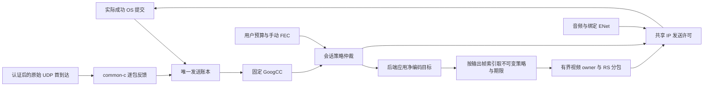

# 逐包反馈、自动码率与会话 FEC 设计

当前方案在 Foundation Sunshine、Moonlight PC 与 Moonlight Vplus Android 的既有视频协议上接入固定版本 GoogCC，按用户上限分配网络与编码预算，保留手动逐帧 RS。自动 FEC 已删除；突发丢包不会驱动新的保护档位。默认实验开关、构建边界与剩余验收见[实施文档](adaptive-fec-implementation.zh-CN.md)和[验证记录](adaptive-fec-validation.zh-CN.md)。

## 采用成熟实现的范围

| 职责 | 当前实现 | 项目适配的原因 |
| --- | --- | --- |
| 容量与拥塞估计 | 固定 WebRTC `GoogCcNetworkController` | 需要把现有视频成功提交、首到达与迟到更正映射为 SDK 输入 |
| 探测计划与进度 | 固定 WebRTC `BitrateProber` | 媒体/认证 padding 必须通过现有协议、期限和真实 OS 提交；预测副本不推进实际实例 |
| 原生 padding 缺额 | 固定 WebRTC `IntervalBudget` | 每次成功视频/FEC/探测 IP 回执都扣费，不能凭请求或入队制造发送信用 |
| 视频纠错 | 现有 nanors 与逐帧 Reed Solomon | 保留双方既有分块格式、最低冗余和四块限制 |
| 控制可靠交付 | 现有 ENet，增加序列化前准入与发送后结算 | ACK、重传和音频也要计入同一会话 IP 额度，`enet_peer_send` 成功不是 OS 发送成功 |
| 视频期限、参考链与生命周期 | 项目有界 owner/pacer | 编码帧的主数据完成、可放弃 FEC 尾部、未知提交和会话停止需要真实提交语义 |

源码和依赖版本固定在[清单](../third-party/webrtc-googcc/versions.json)，构建、上游测试与通知文件见[依赖说明](../third-party/webrtc-googcc/README.md)。当前方案复用拥塞控制、探测、padding 预算和 RS 算法；协议身份、编码回执与 OS 边界仍需要适配。完整 WebRTC 迁移会另行涉及信令、媒体格式及客户端兼容，不属于当前实现，也没有比较证据证明本方案性能优于完整 WebRTC。

## 数据与控制流



common-c 的原始观测与 FEC 恢复分别计数。Sunshine 的成功提交账本是丢包分母的权威来源；未发送的预留身份、未知尾部及没有覆盖的区间不算丢包。首到达时间在接收边界记录，经认证和包头检查后发布；FEC 合成包不能进入原始收到集合。

包状态与首到达反馈借鉴 [RFC 8888](https://datatracker.ietf.org/doc/html/rfc8888) 的信息模型，但实际消息通过现有加密 ENet 传输，不宣称 RTCP 互通。当前完整连接/包身份、报告范围、限流、乱序、回绕及时钟重置契约以[逐包协议 v1](packet-feedback-protocol-v1.zh-CN.md)为准。统计查询不增加播放等待。

## 预算与手动保护

统一使用 IP 层字节。IPv4/IPv6 基础 UDP/IP 开销分别为 28/48 字节，映射地址按实际线上家族计费；隧道、扩展头和大音频分片另验。数据、FEC、音频、绑定 ENet、探测和持续 padding 都消费已有额度，无绑定握手另列。

RS 的名义百分比相对数据定义：`P = ceil(D × F / 100)`。忽略取整和封装时，20% 冗余对应总包数中的约 16.7%，净编码预算近似为：

```text
V ≈ (Btotal - Bother - Brepair - Bprobe - Hvideo) / (1 + F / 100)
```

实际分配使用既有分片规划器，按手动 base/key/recovery 的最高保护、协商帧率上界、最低冗余、填充、身份与加密开销计算保守编码上限。当前没有根据近期帧型加权预测保护或临时降档的算法。网络预算与编码上限分别报告，队列回压可只降低编码生产，保持网络排空额度。

手动 v2 接口的三种帧保护均由用户策略指定；同一帧所有块使用同一已确认快照。RS 块满足 `D + P ≤ 255`，最多四块；最低冗余必须能由块头百分比反推。超出已有格式的帧显式记录跳过 FEC，不能在显示中声称仍兑现请求保护。旧接口的数值语义经过兼容转换，身份解析仍严格。

## 策略、权限与回执

配对 HTTPS 校验证书、sessionId、connectionEpoch 和策略版本。逐包反馈、控制、探测、独立 padding 与可靠状态分别协商；观测或 SDK 实例存在不授予控制权。精确字段和状态以[策略 API v2](transport-policy-api-v2.zh-CN.md)及[状态协议 v1](transport-policy-status-v1.zh-CN.md)为准。

策略区分接受、后端应用和首次实际媒体提交。AVCodec 通过实际重建应用净编码目标；NVENC/AMF 返回真实后端结果。缓冲输出按自身帧索引恢复提交时的策略、期限和 NAL 替换所有权，不套用最新快照。失败、停止或被取代的请求不会伪造成功回执。

GoogCC 接管需要规范化策略实际应用、真实媒体首发，以及新鲜且映射到近期成功发送的覆盖。迟到旧覆盖仍参与原始记账，但不能凭处理活跃续期探测或升预算权限。手动命令和重新开启自动模式推进控制代次，旧实例不能重获权限；新实例需要新的应用、首发和覆盖。

当前控制来源仅有兼容、手动与 GoogCC。`local` 枚举只为协议解析兼容保留，不能取得或使用控制租约；没有自动转到客户端控制器或 HTTPS 调速模式的生产回退状态机。客户端只读与控制服务互斥，重连只继承已确认设置。

## 有界发送与恢复

编码生产者的有界入口持有完整输出；视频 owner 分包后持有加密数据报，再进行按字节轮转、信用积分和期限判断。两级队列对应不同所有权边界，不能合并为借用编码器缓冲的排队视图。预算换档保留已有债务，停止先封准入再排空；未知 OS 提交保留已知成功前缀并关闭相关账目。

完整视频 owner 也用于兼容路径：采用 1 秒期限、64 KiB 突发和既有 800 Mbps 兼容速率，没有新会话总预算保证；实验归一化策略才使用对应视频预算、默认 100 ms 期限和 SDK 控制。所有共享 socket 音频复用现有非阻塞重试队列（256 包、256 KiB、入队后 40 ms），发送线程退出后再关闭 socket；该边界仍需真实播放与停止验收。

帧可交付性按最后一个主数据包的期限判断，包括其前面的交错 FEC。已知及时完成主数据后，可放弃来不及发送的 FEC 尾部；未知提交、缺失/迟到主数据或显式参考损伤不能据此恢复参考链。依赖丢弃不重复制造 IDR 请求，新的恢复帧失败仍走既有恢复路径。

探测由原生 SDK 请求，受租约、新鲜覆盖、同一帧可用媒体或另行协商 padding、预算与期限约束。持续 padding 只填补原生缺额，媒体到达先清退其未发尾部。实际簇提交、有效原生估计和容量恢复分别验证；读取请求、最终预算接近上限或静态画面流量少都不能代替容量证据。

## 后续成熟手段的独立评估

以下只保留研究方向，不新增当前生产模块、开关或协议承诺：

| 候选 | 依据与评估条件 |
| --- | --- |
| 持续损伤下的动态 FEC | 固定上游 FEC 控制器只能作为隔离候选；核对实际 RS 取整和开销，在同预算、同期限、冻结内容下证明交付/质量收益。历史一次性突发选择器已删除 |
| 限时 RTX | [RFC 4588](https://www.rfc-editor.org/rfc/rfc4588.html)提供重传机制。先建立有界未完成帧保留与独立认证/nonce/传输身份；剩余期限足以覆盖修复往返、队列和处理后才发送。现有新帧到达时的清退逻辑不能直接支持它 |
| 滑动窗口 RLC | [RFC 8681](https://datatracker.ietf.org/doc/html/rfc8681)定义随窗口生成修复符号的编码。需要独立格式、窗口字节/运算上限和失效参考链清退，不复用当前 RS 块头 |
| Streaming code 与预测保护 | [Tambur，NSDI 2023](https://www.usenix.org/system/files/nsdi23-rudow.pdf)提供研究依据；它与 RLC 分别评估，论文条件与收益不能迁移为 60/120 FPS 串流保证。预测器只选择既有预算内候选，不抬高网络上限 |

主方案先与固定预算/RS、仅预算与调度、仅自动码率、原生回压等组分别对照。高级候选各自证明新增收益与资源/延迟代价，不能一次加入多个机制后宣称先进组合有效。两设备同预算 QoE、容量恢复、持续饱和公平性、真实出口/驱动故障和客户端生命周期仍按实施文档逐项验收；目标修订不追认历史失败通过。

## 文档分工与历史

本文维护当前技术选择与不变量；实施文档维护职责、命令和冻结的验收契约，验证记录维护实际版本与证据范围。原完整提案见 [6b359198a 的设计文档](https://github.com/AlkaidLab/foundation-sunshine/blob/6b359198a77fa8a17ace4038fbb9ccebe2e72168/docs/adaptive-fec-design.zh-CN.md)，其中未实现能力、旧建议阈值与假定字段不作为当前源码契约。
