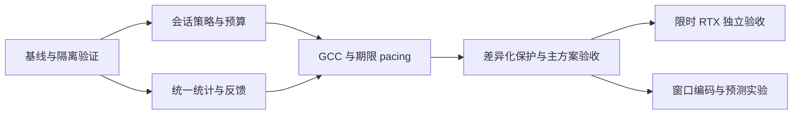

# 逐包反馈、自动码率与会话 FEC 实施文档

本文将[逐包反馈、自动码率与会话 FEC 设计](adaptive-fec-design.zh-CN.md)转为 Sunshine、Moonlight PC 和 Moonlight Vplus Android 的实施任务。执行顺序是建立可复现基线，补齐会话 FEC 与可信测量，接入逐包反馈和成熟拥塞控制，验证固定保护下的控制与预算后再灰度。限时重传与跨帧编码分别验收。

## 实施入口

2026 年 10 月 4 日按项目决定移除基于历史突发回放的自动 FEC 适配：生产选择器、轨迹投影、回放缓存、稳定覆盖计时、诊断、实验配置及专用测试一并删除。现有 nanors RS、逐帧不可变保护快照、手动 FEC、原始损伤统计和固定 GoogCC 自动码率保留。自动 FEC 当前不可用，不能将已删除实现的历史运行结果视为当前能力。

服务端状态显式返回 `experimentalAutomaticFecAvailable: false`，活动控制请求中的 `automaticFec: true` 返回 400；启动意图固定为 false。策略状态入口同样拒绝自动 FEC 请求和含 true 的初始意图，不能先接受再等运行时拒绝。PC/Android 仅在能力字段为 JSON boolean true 时允许开启，否则禁用开关并在请求入口拦截；自动码率与手动预算仍可操作。持续损伤下的动态保护另以成熟实现做同预算、同期限验证，未通过前不接回生产。

主方案由服务端统一仲裁总发送预算、净编码码率和 FEC，客户端提供原始接收反馈、恢复结果及用户操作。增加冗余必须从同一发送预算内支付；FEC 修复不能掩盖原始网络损伤。该原则有 [RFC 9265](https://www.rfc-editor.org/rfc/rfc9265.html) 的公开讨论依据，具体控制策略与游戏串流收益由本项目验证。

| 本次决策 | 实施内容 | 完成依据 |
| --- | --- | --- |
| 主方案 | 逐包反馈、固定 GoogCC、共享 IP 字节预算、期限 pacing、手动设定的逐帧 RS | M0 至 M4 的功能、应用、成本及同预算对照证据 |
| 先做的工作 | 冻结版本、设备、内容与判据；完成下文最小首轮验证执行单 | V1 至 V4、V6 的准入记录；失败或缺测逐项列出 |
| 服务端交付 | 会话策略、SDK 应用回执、发送账本、统一预算、期限及失效处理 | 策略接受、编码应用、实际发送分别可核查 |
| 公共库和客户端交付 | 统一统计、身份协商、PC/Android 控件、连接生命周期与状态展示 | 公共测试输入一致，实际应用及设备单独验收 |
| 条件扩展 | RTX、窗口 RLC、streaming code、预测与编码回压分别评估 | 独立开关、单项消融、期限与资源证据；不由主方案通过自动启用 |

实施负责人先填写具体责任人与实验参数，再领取“首轮执行卡”中的任务。历史构建或功能验证只证明对应版本和场景；本文交付不增加任何运行通过结论。

本文更新于 2026 年 10 月 5 日，面向 Sunshine、公共客户端库、PC/Android 应用的开发者及验证负责人。实施结论是继续交付主方案，保持实验开关的既有默认值；正式启用以 M4 验收为准。整体自适应闭环尚未完成。共享预算已接到视频、音频和 ENet 的实际出口，并通过 IPv4、纯 IPv6 及双栈 IPv4 映射的单会话对账。此前 D0 固定手动 FEC 产物已发送认证独立探测与原生请求的持续 padding；该历史产物在本机 Hyper-V Linux 的已校准 TBF 链路上完成 20/1.5/20 Mbps 容量阶跃，确认总预算至少 19 Mbps 连续 17.9528992 秒，原五秒门槛在此场景通过。原 Python 队列场景的失败继续保留，内核字节队列不替代原队列规则。内容未冻结，该结果不证明完整 P2、同预算 QoE 或设备性能；静态/零产出、收益归因、公平性、真实故障与设备验收仍待补齐。

| 当前能力 | 已取得的证据 | 本次实施仍需补齐 |
| --- | --- | --- |
| 会话策略、手动接管和逐帧应用 | 实际 AMF 回执、线上策略版本、控制代次与手动接管；原生工具验证真实 AMF 调用在途停止及串行恢复，当前 Qt/common 完整应用验证正常停止后晚到成功不能应用或首发，另以私有入口验证同一 Session 程序化中断后的在途串行重连；真实UDP断流触发普通Qt自动重连、实际解码/渲染及旧会话隔离子项17+18+2项通过；真实SDK调用在途时的UDP故障、原生回调与串行重连组合29+33项通过；活动会话模式与上限的服务端闭环 | 其他 SDK 的失败/重建、完整网络故障矩阵及Android应用边界、两端完整活动操作与展示 |
| 手动 RS 线上几何 | 0–100%及6个不同档位组合的实际SDK、普通帧/IDR、加密分片及共享IP对账；500ms几何诊断447+3项核对通过 | 原100ms场景放弃3个冗余后缀，完整分片门槛仍失败；实际恢复帧、参考链/期限及同预算画质仍待验收 |
| 固定画面原生基线及容量恢复 | 历史D0/A700的三阶段基线32+7项、双会话45+17项通过；当前e558/A700重新执行固定源容量对照，两组各22项IP、30项内核、12项像素核对通过，另16项配置/应用回执对照通过 | 默认关闭回压最终9090kbps，原19Mbps/5s门槛失败；开启回压连续7.9612735秒达标，但实际编码额度可降至974kbps；同预算画质、完整应用、持续饱和公平性与成本仍待验收 |
| 加密逐包反馈、身份与兼容 | 独立故障对账、离线解码、新旧 profile 四组合回退 | 完整 PC/Android 应用串流、展示与设备成本 |
| 期限 pacing 与自动码率 | 实际单视频预算、源分片完成与正常排空；自动 FEC 的旧运行证据仅保留在历史记录 | 共享预算完整验收、真实探测、多会话与严格恢复目标 |
| 原生 ALR 与独立编码回压 | 上游输入重放和实际队列核对；三种自动控制共同生效的结果属于删除自动 FEC 前的历史证据 | 当前固定手动 FEC 下的原因消歧、静态心跳、无损画面的回压代价及同预算消融 |
| 会话共享 IP 预算 | 三种 IP 路径的单会话实际对账；Hyper-V 双会话六路出口、各自整数信用及可靠通知丢失、ACK 丢失、延迟乱序后的真实重传计费核对通过；饱和窗口不足，公平性未验收；已修正映射音频多计头部 | 持续饱和公平性、真实 owner 部分/未知提交、完整可靠传输故障矩阵、大音频分片、控制/音频连续性、物理设备路径与 V6 |
| 预算内媒体/独立探测 | 固定 SDK 的原生 BitrateProber、IntervalBudget 与认证 padding；兼容、固定 RS、反馈及预算核对通过，已校准内核链路的 19 Mbps/5s 恢复子项通过，原 Python 队列场景仍失败 | 冻结内容的完整 P2、静态/零产出与高码率范围、原因消歧及同预算收益；编码回压另做消融 |

2026年10月5日实际解锁后，使用e558生产产物重新执行两组70秒固定源/60秒原生客户端实验。默认组1123/1123个解码单元、回压组1416/1416个单元均匹配八相位；仅开启已有回压的组最终确认预算19809kbps，44个削减编码额度的策略分别核对实际SDK应用与媒体首发。这只关闭该配置的预算恢复子项，两组实际预算历程不同，不能据此宣称画质或成本改善，默认值不变。默认组34652份原成功发送及2574份原始认证REPORT另做两次固定SDK回放，16项核对通过；末段为原生AIMD increase、默认200ms内部RTT、非ALR且没有追加探测，实测组件增速约12.72kbps/s。此诊断没有测量RTT、发送新流量或修复生产恢复行为。历史D0对照及快速恢复选项诊断保留原范围。容量恢复、回压代价和严格恢复目标继续作为验收风险，不能用策略调整证明画质、延迟或交付率改善。各版本结果统一见[验证记录](adaptive-fec-validation.zh-CN.md)；未确认的行为仍是实施契约，论文收益不能作为项目验收结果。

阅读顺序：先按“实施前验证与准入”完成基线和参数冻结，再按 M1 至 M4 交付主方案。开发按“服务端任务”“客户端公共任务”和“协议与数据契约”领用任务；测试按“测试计划与验收记录”保存证据。M5 与 M6 各自决定是否启用，不与主方案共用一个通过结论。

### 执行导航

| 使用者 | 首先阅读 | 需要交付 |
| --- | --- | --- |
| 实施负责人 | [首轮执行卡与结束条件](#首轮执行卡与结束条件)、[阶段交付与依赖](#阶段交付与依赖) | 填写负责人和依赖，逐项登记代码完成与验收完成 |
| Sunshine 开发者 | [服务端任务与代码落点](#服务端任务与代码落点) | 会话策略、编码应用、共享预算、实际发送及故障处理 |
| 公共库及客户端开发者 | [客户端公共任务与应用接入](#客户端公共任务与应用接入)、[协议与数据契约](#协议与数据契约) | 一致测量、协商、生命周期、用户控制与真实状态展示 |
| 验证负责人 | [实施前验证与准入](#实施前验证与准入)、[测试计划与验收记录](#测试计划与验收记录) | 冻结基线和判据，保存真实故障、同预算对照及设备结果 |
| 发布维护者 | [灰度与回退](#灰度与回退)、[变更拆分与完成清单](#变更拆分与完成清单) | 可复现版本组合、默认值、兼容和可执行回退步骤 |

本文是实施契约。下文历史结果仅说明已取得的证据，具体版本与限制以[验证记录](adaptive-fec-validation.zh-CN.md)为准；本文更新不表示重新运行了这些实验。

交付状态以最后一次冻结的验证记录为准。当前可靠策略通知已有服务端、公共库和两端消费实现，包括 `transport_policy_notice.*`、`TransportPolicyStatus.*` 和通知触发的查询补偿；第 41 阶段通过组件、三端构建及原生实际加密 ENet/配对查询对账，第 42 阶段补充完整 Qt 只读会话的原生通知到实际查询与菜单状态快照的验证。Qt 控制会话、Android 实际应用、可靠故障和通知成本仍待验收，P3d 保持未完成。精确格式与状态边界见[可靠通知协议](transport-policy-status-v1.zh-CN.md)。源码存在不能提升验收状态。

## 执行摘要与首轮交付

主方案沿用逐帧 RS，接入可信逐包反馈、固定版本 GoogCC、统一 IP 字节预算、期限 pacing 和手动设定的逐帧保护。服务端唯一仲裁器决定总预算、净编码码率与 FEC；PC/Android 提供观测、用户操作和实际状态展示。增加保护必须在同一总预算内扣减编码负荷，不能由丢包率直接触发额外带宽。

本轮优先完成可信观测与真实客户端验收，并同步冻结对照条件、补共享预算边界。现有模块继续增量完善，不重复建立另一套控制器。RTX、窗口 RLC、streaming code 和预测分别建立变更包，只有取得各自收益与期限证据才启用。

| 工作包 | 责任角色 | 本轮具体产物 | 验收及依赖 |
| --- | --- | --- | --- |
| P0 基线与准入 | 验证负责人，三端维护者 | 版本与修改 manifest、固定内容/设备、实际故障记录、V1/V3 基线、V6 参数表 | 包级真实值可复核；预算、延迟和成本容限在对照前填写；可立即开展 |
| P3e 可信观测 | Sunshine、公共库、PC/Android | 原始丢包窗口及本地过期契约；修复/帧交付/解码/渲染的独立统计；两端界面与实际会话记录 | 成功提交和原始接收可对账；未知或过期不显示 0%；stats_only 不获得调速权限；设备测试单列 |
| P1/P2 预算与恢复 | Sunshine 控制、发送及 ENet | 混合出口字节账本、多会话与故障报告、反馈中断/静态心跳、容量回升的实际探测证据 | 所有分项满足冻结额度与期限；静态、拥塞和处理受限分别诊断；依赖可信反馈，功能开发可并行 |
| P3a–P3d 活动会话接入 | API、公共库、PC/Android | 生命周期、独立开关、上限与手动接管、分阶段回执、可靠通知及查询补偿 | 自动码率开关、自动 FEC 不可用及重连/在途故障通过；旧 epoch 或旧租约不能覆盖替换连接；实际应用独立验收 |
| P4/P5 联合验收 | 三端及验证负责人 | SDK 故障/重建、参考链与期限、同预算消融、设备成本、兼容及回退演练 | P0–P3 证据齐备后评价收益；M4 全部满足才评估灰度 |

负责人按组件角色分工；领用时填写具体人员、依赖和预计工期。工单必须附源码范围、复验步骤、产物散列、原始证据、通过判据与回退动作。设备准备和 P0 可与隔离开发并行；自动接管、收益结论及正式启用分别遵守阶段准入。

### 首轮必须作出的技术决定

| 决定 | 当前约定 | 开工核对与后续动作 |
| --- | --- | --- |
| 统计口径 | 原始包丢失、FEC 修复、帧交付、解码及渲染分别计量 | 每项登记观测位置、分母、窗口、未知/迟到、重置与过期；PC 的包指标和 Android 的缺帧不能互换 |
| 带宽与保护 | FEC 百分比相对源数据；真实 IP 字节承担最终预算核对 | 显式纳入音频、控制/重传、头部与取整；编码应用和首次成功发送分别确认 |
| 版本与时间 | 策略 API v2、反馈 body v1、视频 profile 2、统计内层 v2 独立编号 | 固定依赖及公共库版本；计数/身份用十进制字符串；统计相对有效时长扣除完整请求与本地持有时间 |
| 权限与生命周期 | 测量、自动控制和手动接管分别处理；旧连接不能更新新连接 | 自动码率开关、自动 FEC 拒绝、无能力主机、查询失败、停止、后台恢复及迟到回执逐项验证 |
| 启用与回退 | 保持实验开关既有默认值，主方案由 M4 决定启用 | 当前无缝退旧 ABR 尚未完成，兼容回退需重连；演练实际回退并检查已确认设置继承 |

### 首轮执行卡与结束条件

首轮交付范围为 M0 至 M4。已有实现按下表补缺和复验；已有证据引用对应版本，不重复开发。负责人领用时填写具体人员和预估工作量，未知设备成本先安排测量任务。

| 顺序与任务 | 主责及接入位置 | 可检查的交付 | 进入下一步的条件 |
| --- | --- | --- | --- |
| 1：P0 固定实验输入 | 验证负责人；三端构建与 V1/V3/V6 | 版本清单、两端设备及内容、有线无损和容量下降叠加突发的基线、冻结参数表 | 实际故障可复核；体验和成本容限在对照前填写 |
| 2：P3e 补业务观测 | 公共库 `VideoNetwork.*` / `RtpVideoQueue.c`；PC Session；Android JNI / Game | 原始包、修复、帧交付、解码、渲染分开统计；未知和过期展示；两端同输入对账 | 修复包不充当原始接收；正常块和失败块各计一次；统计不授予控制权 |
| 3：P1 完成出口边界 | Sunshine `transport_send_budget.*` / `stream.cpp` / 平台 UDP；ENet | 三路字节对账，多会话、部分提交、可靠重传、停止和非 loopback 运行证据 | 所有实际发送受同一会话额度约束，债务和队列有界，未知提交不重发 |
| 4：P2 完成控制稳定性 | `googcc_adapter.*` / `googcc_runtime.*` | 容量下降及恢复、静态转运动、反馈失效和预算内真实探测轨迹 | 控制权唯一；容量与处理受限分别诊断；保护增加从编码额度支付 |
| 5：P3a–P3d 完成应用控制 | 配对 HTTPS v2、公共库通知；PC Controller / Android Service 和控件 | 自动码率开关、自动 FEC 不可用、手动接管、版本回执、通知查询补偿和旧请求故障 | 客户端展示对应 accepted/applied/first-sent 阶段；重连后旧 epoch 不覆盖新状态 |
| 6：P4 完成设备和编码边界 | Sunshine 编码后端；PC / Android 实际应用 | SDK 失败与重建、在途帧、参考链、后台恢复、停止及温升记录 | 应用呈现单独测量；构建或离线解码不替代设备验收 |
| 7：P5 判定 M4 | 验证负责人及三端维护者 | 同预算同期限消融、冻结判据逐项结论、兼容及回退演练、候选发布包 | 硬约束全部成立，性能满足预登记容限；失败和未测项目保留 |

第 2 至 5 项可在接口稳定后并行开发。实验性闭环运行与正式发布分别准入，开发完成不自动进入灰度。M4 检查表及其证据齐备后，本轮主方案结束；M5/M6 单独立项，不追加为主方案的隐含完成条件。

每项任务只更新自己的通过、失败或未测结论。发现失败先保留输入和日志，修复后重跑受影响检查；源码或配置变更使依赖证据失效时才扩大复验范围。新增测试数量、策略变化次数和更多实验批次均不单独构成收益或完成判据。

### 当前证据与下一步

截至 2026 年 10 月 3 日，第 39 阶段已完成组件、完整构建及 native 实际接口验证；第 40 阶段新增完整 Qt stats_only Session 的真实回复过期与恢复验证；第 41 阶段新增可靠通知的组件、构建与原生实际收发证据；第 42 阶段补充完整 Qt 只读会话的通知提前唤醒查询与独立回执对账。源码、产物与运行证据按各阶段 manifest 归档。以下是证明范围，不能替代 M3/M4 的联合验收：

| 当前增量 | 已确认结果 | 尚需取得的证据 |
| --- | --- | --- |
| 原始统计与相对过期 | 服务端 256 项组件测试及四个 CTest 目标；PC 24 项控制/统计、九项菜单测试；Android 67 项 JVM 测试通过 | 完整应用中的统计消费与过期故障；实际高包率成本和锁持有时间 |
| 客户端展示及构建 | PC 普通完整构建、八张 offscreen 菜单检查；Android 普通、隔离及设备测试 APK 构建通过 | 第 40 阶段完整 Qt stats_only/basic 已通过真实 TLS 回复扣留/迟到/恢复的 28 项检查；默认 threaded 与桌面合成仍待验收；Android Game/JNI、后台恢复及真机运行和设备测试未执行 |
| 主机完整构建 | 第 39 阶段独立 ON/OFF 构建均退出 0，归档 ON 产物完成三段 native 串流、90 次实际状态采样与 689 项检查；三段媒体离线解码 446 帧且无损坏或 API/日志错误 | 不包含驱动安装包、完整 Qt/Android 串流、实时呈现或 QoE 验收 |
| 后续业务能力 | 原始损伤显示、只读查询及可靠通知已接入源码；通知已有原生和 Qt 只读会话证据 | FEC/帧交付/解码/渲染业务指标，通知的完整控制会话及 Android 验收，以及设备/收益/成本验证 |

下一步补 FEC/帧交付/解码/渲染业务统计，并完成可靠通知的应用与故障验收；Android 在具备设备执行条件时补真实 Game 验收，PC 继续默认 threaded、完整生命周期与成本验证。P0 参数与设备准备同步推进。不得用旧构建证明后来修改的版本，也不得用组件截图证明媒体收益。

[设计文档](adaptive-fec-design.zh-CN.md)说明选型，[逐包协议](packet-feedback-protocol-v1.zh-CN.md)与[API 契约](transport-policy-api-v2.zh-CN.md)说明通信格式，[验证记录](adaptive-fec-validation.zh-CN.md)保存历史通过、失败和未测结论；本文负责工作包、依赖与验收。第 39 阶段原始记录与冻结索引见验证记录；原始失败、未测设备与不支持的证明范围继续保留。

### 当前应用接入状态

以下状态用于确定接下来领用的任务，构建与组件测试均不替代真实应用串流验收。

| 组件 | 当前交付 | 继续实施的边界 |
| --- | --- | --- |
| Sunshine | 配对启动与策略共享连接 epoch，兼容码率/FEC/ABR 绑定证书和 tuple；第 34 阶段 ON/OFF 完整构建、242 项组件测试，以及 IPv4 映射 loopback 的 72 项实际请求/生命周期检查通过，四段媒体离线解码通过 | 非 loopback、服务端处理中停止或回复丢失、SDK 故障与完整预算/性能门槛继续验收 |
| Android | `Game.kt` 接查询服务与码率卡；独立开关、上限与分阶段回执已接；预算继承、不可变镜像、旧请求串行化、停止排空、连接槽及兼容身份已接；第 35 阶段已绑定 18 个监听器通道和首帧任务，61 项 JVM 测试与普通、隔离、设备测试 APK 构建通过 | 3 项设备控件测试尚未执行，USB 安装限制仍未解除；Game 实际握手与 XML 解析、后台恢复、SDK/JNI 停止、兼容切换、实际旧回调故障和温升须联合验收 |
| PC | 完整 Qt 构建及协议/菜单组件回归通过；D3D11/basic 完成新控制 13 步及私有主机重启 6 步闭环；第 36 阶段完整兼容 Session 完成五步手动/重连操作、30 项检查、45 次独立采样和两个 epoch 下六个策略版本，修复实际请求中重复 clientname；普通构建不含开发驱动；第 37 阶段以真实 TLS 转发分别验证延迟确认和丢失回复时的在途排空与预算继承，每种 32 项检查通过 | 默认 threaded 渲染循环仍未完成启动；自然断连到停止的完整时限、主机仍在处理时停止、开启旧 ABR 的完整应用隔离、旧主机兼容、桌面合成、原始指标、可靠通知与成本仍须验收 |
| 公共库与应用统计 | 第 38 阶段统计链通过 ON/OFF、两端完整构建、共享样本解析及 native 配对接口验证；第 39 阶段源码新增统计内层 v2、相对过期、只读会话查询与原始丢包控件，并通过组件回归和 PC/Android 完整构建 | 第 39 阶段 native 统计 v2 接口已核对；第 40 阶段完整 Qt stats_only/basic 的只读与真实回复过期已验证；Android、默认 threaded、高包率设备成本、FEC/帧交付/解码/渲染业务指标和可靠通知继续验收 |

Android 和 PC 的上述证据见[验证记录](adaptive-fec-validation.zh-CN.md)。第 29 阶段 PC 组件验证使用捕获样本、模拟传输与 offscreen Qt 菜单；第 30 阶段新增软件界面后端下的实际 Session 功能，第 31 阶段补核对 D3D11/basic 渲染循环和连接生命周期，第 32 阶段补 Android 预算保存与状态镜像，第 33 阶段补客户端停止组件及 PC 回复校验，第 34 阶段补兼容请求的服务端身份与代次边界。第 34 阶段的媒体来自独立 native 驱动，不是完整 Qt Session 或 Android Game 验收。第 36 阶段新增关闭逐包控制/反馈时的实际 Qt Session 和生产码率菜单运行，使用 IPv6 loopback、默认图形后端和 basic 渲染循环；未扩展 Android 或 threaded 运行的证明范围。无故障 loopback、非冻结桌面和渲染循环覆盖条件须随结果报告。旧冻结批次保持原结论，不能用后续源码变化更新它的证明范围。

## 实施决策

主方案采用客户端原始逐包反馈、服务端固定版本 GoogCC、统一网络预算、期限 pacing 和手动设定各帧类别保护比例的 RS。客户端负责提供可信观测与显示真实应用状态，服务端持有唯一控制权，统一分配净编码码率和冗余；用户手动设置通过同一仲裁器接管。容量下降时收紧总发送负荷，丢包观测继续输入拥塞估计，不能自动改动手动保护比例。动态保护仅作为隔离候选，通过同预算、同期限验证前不接回生产。

原始丢包、FEC 修复后交付失败、解码损伤和渲染丢帧分别统计。当前不根据原始丢包或历史连续缺失自动修改 FEC；丢包统计继续服务观测与成熟拥塞控制。首版保留现有 RS 和客户端兼容路径；限时 RTX、窗口 RLC、streaming code 与预测分别按附加门槛进入实验。

立即执行的是冻结 V1/V3/V6 的基线、测量与成本条件，补齐两端设备证据和共享预算的完整验收。当前隔离实验开关保持默认关闭；只有 M4 完成兼容、回退、同预算消融和性能验收，才讨论正式启用。任务依赖和验收责任见阶段表与文末执行清单。

## 目标与范围

正式主方案交付以下能力：

- 客户端统一区分原始包缺失、FEC 恢复、传输交付失败与解码或渲染损伤。
- 服务端以会话为单位统一控制网络预算、净编码码率和手动设定的各帧类型 FEC；手动修改经 SDK 应用和逐帧快照确认后改变实际发包。
- common c 通过现有加密 ENet 反馈原始包的接收状态与到达时间，服务端适配固定版本的 GoogCC。
- 数据与 FEC 使用同一发送账本和受期限约束的 pacing；预留的探测和修复开销也计入预算。
- 支持自动码率开关、手动 FEC 及自动 FEC 不可用状态，提供已应用状态、明确回退和新旧客户端兼容。

限时 RTX 属于后续条件扩展，默认关闭。滑动窗口 RLC、特定 streaming code 与预测式保护属于实验扩展，默认关闭。首版保留逐帧 Reed Solomon 和现有 RTP 数据报；新反馈模式经显式协商，在视频加密明文内增加 16 字节完整包身份，旧客户端沿旧封装。音频保护算法维持现状，但其发送量参加总预算。

### 技术选型与依据

| 手段 | 依据 | 实施决定 |
| --- | --- | --- |
| 逐包接收与到达反馈 | [RFC 8888](https://datatracker.ietf.org/doc/html/rfc8888) | 主方案必需；借鉴语义，在现有加密 ENet 内定义消息，不宣称 RTCP 互通 |
| 成熟 GoogCC | [固定版本上游控制器](https://webrtc.googlesource.com/src/+/a4a13a6690591c017b5ad2ae6649fa2437ba8bff/modules/congestion_controller/goog_cc/goog_cc_network_control.cc)及本地[固定依赖清单](../third-party/webrtc-googcc/versions.json) | 主方案采用实际上游实现；实现版本以固定清单为准，调参与游戏串流收益仍需项目验证 |
| 原生拥塞窗口编码回压 | 固定上游 `CongestionWindowPushbackController` 与 `cwnd_reduce_ratio` | 独立实验接入本地 owned IP 队列；编码上限与网络排空速率分离，默认关闭，须核对 SDK 与真实帧证据 |
| 关键帧差异化保护与开销扣减 | [WebRTC FEC 控制器](https://webrtc.googlesource.com/src/+/refs/heads/main/modules/video_coding/fec_controller_default.cc) | 主方案保留 RS，依据 IDR、RFI 和普通帧分配；不直接复制其他编码格式的参数 |
| 限时选择重传 | [RFC 4588](https://www.rfc-editor.org/rfc/rfc4588.html) | 条件扩展；总负荷和参考链约束成立，实测修复能赶上期限才启用 |
| 窗口 RLC 与 streaming code | [RFC 8681](https://datatracker.ietf.org/doc/html/rfc8681)、[Tambur NSDI 2023](https://www.usenix.org/conference/nsdi23/presentation/rudow) | 分别实现和对照的实验候选；视频会议结果不能直接外推到本项目游戏串流 |

期限 pacing 是本项目对低延迟和资源上限的工程约束，必须通过实际提交账本验证。轻量预测属于可选实验，现阶段没有本项目的收益证据；它不能替代确定性保护策略，也不是主方案依赖。

引用的适用边界须随选型保留：[RFC 8888](https://www.rfc-editor.org/rfc/rfc8888.html) 定义 RTCP 逐包拥塞反馈，本项目借鉴反馈语义并使用现有加密 ENet；[RFC 8681](https://www.rfc-editor.org/rfc/rfc8681.html) 定义 FECFRAME 的窗口 RLC，本项目若采用需另行协商自己的封装。两者均不构成现有客户端已具备相应标准协议互通的证明。[RFC 9265](https://www.rfc-editor.org/rfc/rfc9265.html) 是 FEC 与拥塞控制关系的信息性讨论；[Tambur](https://www.usenix.org/conference/nsdi23/presentation/rudow) 的研究场景是视频会议。采用原则和实验候选有公开依据，游戏串流收益由本项目对照实验判定。

### 先进手段的采用条件

本方案对先进性的判断分成外部依据、项目功能验证和项目收益验收。RFC 证明协议或编码方法已有公开规范；固定上游代码证明采用了实际控制器；论文证明其特定实验条件下取得结果。这些依据不能单独证明本项目在相同预算、游戏串流期限和两端设备上获益。以下采用条件是本项目的工程决定。

| 手段 | 进入的阶段 | 必须回答的问题 | 不满足时的决定 |
| --- | --- | --- | --- |
| 逐包反馈与固定 GoogCC | M2/M3 主方案 | OS 成功提交、原始到达、时间差分与反馈年龄是否可信；容量下降及恢复是否稳定 | 保留观测与安全已确认策略，停止上探；不得用 FEC 修复到达充当原始到达 |
| 统一预算与期限 pacing | M1/M3 主方案 | 视频源数据/FEC、音频、控制及重传实际字节是否共同受限；排队和债务是否有界 | 不允许正式接管；先修复出口和预算对账 |
| IDR/RFI/普通帧差异化 RS | M4 主方案 | 同预算同期限下，是否减少参考链损伤和有效帧失败，且净画质与延迟尾部满足容限 | 使用已验证的均匀保护，不以更高冗余比例宣称收益 |
| 实际媒体探测与 ALR 处理 | P2/M3 | 静态低产出、编码处理受限与链路容量不足能否区分；探测是否实际发送并产生有效反馈 | 取消不满足预算或期限的探测；低产出不直接解释为容量下降 |
| 原生队列编码回压 | 独立实验 | 与主方案相比是否降低积压；无损、正常帧突发时是否产生画质损失或额外延迟 | 保持关闭；网络排空额度与净编码上限分别处理 |
| 限时选择重传 RTX | M5 条件扩展 | 实测修复往返上界、两端处理及排队能否赶上剩余播放期限 | 拒绝该修复，保留 RS；没有可用期限证据时不启用 |
| 窗口 RLC | M6 独立实验 | 符号窗口、计算与内存是否有界；同预算同期限下是否优于逐帧 RS | 保持关闭，以协商方式安全重置或重连回 RS |
| 特定 streaming code | M6 独立实验 | 研究假设、突发模型和跨帧恢复时限是否适用于游戏串流 | 不外推视频会议收益；与 RLC 分别报告结果 |
| 轻量预测保护 | M6 可选实验 | 相对固定手动保护是否有独立增益；失配和分布变化是否有安全边界 | 回到最后确认的手动 RS 策略；预测不授予额外预算或控制权 |

每个扩展分别保存对照组、开关、源码版本和失败结果。主方案验收不自动通过扩展验收；同一实验同时加入多个扩展时，仍须补单项消融才能说明收益来源。

### SDK 与上游模块复用

先进手段保留，工程实现优先复用成熟依赖。当前范围包含拥塞控制和发送调度，已经超过单独的动态 FEC；每项自研模块都须说明 SDK 尚未覆盖的项目语义及其成本。整理目录不能替代这项核查。

| 部分 | 当前实现与可复用候选 | 替换前要证明的边界 |
| --- | --- | --- |
| 拥塞与带宽估计 | 已通过隔离适配器调用固定版本的真实上游 GoogCC，未重写其估计器 | 保持版本、构建及许可可追溯；继续缩小适配层，仅转换项目观测与控制输出 |
| 发送调度 | 评估 WebRTC [PacingController](https://webrtc.googlesource.com/src/+/refs/heads/main/modules/pacing/pacing_controller.h) 对现有 deadline pacer 的替换 | 当前上游接口使用 RtpPacketToSend，SendPacket 返回 void，且可在积压时提高发送速率。须验证真实 OS 部分提交、未知提交、帧期限与参考链、音视频/ENet 共享预算；不能把回调调用视为成功提交 |
| FEC 保护决策 | 评估 WebRTC [FecControllerDefault](https://webrtc.googlesource.com/src/+/refs/heads/main/modules/video_coding/fec_controller_default.cc) 的关键帧保护和实际开销扣减 | 当前上游实现忽略 loss_mask_vector，默认采用随机损伤掩码。须核对保护比例到本项目 RS 分块的转换，并在相同预算和期限下对照随机与突发损伤；原历史回放选择器已删除，候选库未进入生产 |
| 完整传输 SDK | 完整 WebRTC Native SDK 等作为传输迁移候选 | 需单独证明现有协议兼容或新的能力协商、两端接入与回退。官方 WebRTC [构建流程](https://webrtc.googlesource.com/src/+/refs/heads/main/docs/native-code/development/README.md) 使用 GN/Ninja 及 Chromium 依赖；须计入平台、包体、构建和升级维护成本 |

上述接口核查是选型依据，尚未完成 SDK 替换或收益验收。已通过固定清单版本的 git show 核对 pacer 与 FEC 的上述接口；其中 modules/pacing/BUILD.gn 明示客户端不应直接使用 pacing target，api/fec_controller.h 也保留尚不应供其他用户使用的提示，不能将这些模块当成具有稳定承诺的独立 SDK。原型仍须登记准确依赖与构建版本，放在隔离构建中，登记可删除的生产代码、所需适配及上游修改、平台覆盖、兼容性和最坏处理成本，再进入既定 M4 同预算对照。复用能减少总维护成本且通过相同语义验收时，替换对应自研模块；完整目标和验收要求保持不变。

固定版本 FecControllerDefault 的隔离原型已在 Windows/UCRT GCC 15.2 编译运行，五个确定性场景通过：相同损伤率的分散/突发序列、模拟开销上限、无损与禁用。新增编译 18 个未修改的上游源文件并使用其原始依赖；没有新增生产 FEC 模块。分散和突发输入产生相同建议，故尚不能证明它适用于本项目 RS 保护控制，不能据此重新启用自动 FEC。适配还须核对 0–255 损伤输入和相对源包的保护比例单位，以及基于上一秒回调开销的编码目标与新策略 RS 开销之间的关系；维持先计算新策略预算、再按帧一致应用的约束。此原型只证明组件可用性与上述行为，没有实际 RS 线上包、成本或 QoE 对照。

同一固定版本 PacingController 的隔离原型完成五个场景：真实 IPv4 loopback UDP 成功、OS 拒绝、过期提交、发送器期限拦截，以及探测发送全部遭 OS 拒绝。成功发送接收了 1012 字节；OS 拒绝返回 Winsock 10058 时，SDK 队列仍排空、内部记账仍增加 1040 字节并记录首次发送。在本次 10 ms TTL、20 ms 处理时刻的配置中，过期包仍到达发送回调；适配层拦截后没有实际发送，但 SDK 仍记账。探测场景的六次探测回调均被 OS 拒绝，探测流程仍结束；这不证明 GoogCC 获得了成功发送或有效带宽估计。因此复用调度算法仍须保留最终期限检查与实际提交账本，避免将内部调度进度当作出口回执。原型没有修改上游源码或进入生产路径，也没有证明媒体兼容、多会话预算、成本或 QoE。

当前先形成项目内模块：已有传输文件收拢到 `src/transport/`，编码、会话和实际出口接线保留在各自所属层。Sunshine 是当前主机侧唯一消费者，不立即将整套实现独立发布为 SDK；否则还须维护公开 API、版本兼容、包和发布流程。出现第二个真实消费者时，再依据实际共用代码提取不依赖 Sunshine 会话与编码对象的核心。无论采用上游模块还是独立 SDK，都以“能删除多少生产实现、还需多少适配、平台与升级成本、相同预算下的收益”评估，不能仅以新增一个库或换目录视为工程精简。

2026 年 10 月 4 日按 `44af08a8` 的实际生产调用重新审计，确定如下收敛顺序。下表是实施取舍，候选替换尚未进入生产；代码规模包括头文件、注释及空行，不能把整个模块行数视为可删除量。

| 部分 | 本轮决定 | 保留的项目职责与验收 |
| --- | --- | --- |
| 带宽与拥塞估计 | 保留已接入的固定 GoogCC，继续缩小适配层 | 上游算法不改；真实成功发送、原始反馈和控制输出转换仍由项目完成 |
| RS 编解码 | 保留现有 nanors 与两端兼容格式 | 动态选择保护比例不要求更换纠错码；改用其他编码库须先证明矩阵、分块和客户端兼容 |
| FEC 参数选择，原 312 行 | 删除原历史回放选择器；固定 FecControllerDefault 仅作为隔离对照候选 | 验证上游比例到 RS 的换算、普通/关键/恢复三类映射及新策略实际成本；候选须分别验证一次性突发与持续损伤的响应 |
| 发送 pacing，1267 行 | 优先评估将通用节奏、队列与探测调度交给固定 PacingController | 只保留一套调度队列；最终帧期限、参考链、实际 OS 提交及音视频/控制共享额度由项目适配层守住 |
| 逐包账本与反馈协议 | 保留一个有界、权威的成功发送账本 | 上游 TransportFeedbackAdapter 消费 RTCP TWCC/RFC 8888，本项目采用协商后的 ENet 反馈；增加协议转换与第二份历史尚无精简依据 |
| 发送预算及策略确认 | 保留项目规则，使用现有标准库原语 | 共享 IP 额度、未知提交、接受/编码器执行/首发确认不能由通用限流器或状态机替代 |
| 有界入口、JSON 与生命周期 | 收敛局部重复，暂不新增任务运行时或解析库 | 已使用标准库同步/容器及 nlohmann::json；有界所有权转移、停止排空和字段校验仍需保留 |

全仓调用检查确认 `deadline_pacer_t::external_allowance`、`debit_external_success` 及 `externally_submitted_ip_bytes` 仅有实现、声明与单元测试引用，生产外部流量已走 `session_send_budget_t`。下一项直接清理是删除这组旧接口，并把信用、债务及时间边界的有效测试迁到实际调度或共享额度路径，避免仅为测试保留第二套外部扣账模型；本轮尚未删除。

已删除自研选择器在 `44af08a8` 上的确定性反例：704 个已结算观测中仅连续缺失 8 包，随后 344 包均收到，仍建议 FEC 从 10% 提到 40%；同一 10 Mbps 总预算下编码额度从 8363 降到 6571 Kbps。最后一个缺失包的发送时间距决策时刻为 641 ms，这不是精确的网络损伤发生时刻。反例只验证该历史选择器缺少一次性突发与持续损伤的区分，不证明真实体验已经变差。历史重叠窗口中的恢复能力不得直接当成未来交付收益；M4 必须分别验证一次性突发、持续损伤、拥塞和本地期限丢弃，以及调整后的实际有效帧与画质代价。

换成 SDK 不自动消除该反例的根因：固定 FecControllerDefault 使用最大窗口损伤过滤，且忽略损伤向量，故仍须核验持续性、响应速度和实际净收益。固定 pacer 队列在入队和重新选择优先级时清理过期包，`Pop()` 则直接取出当前优先级的队首；这解释了隔离原型的期限行为，不能把其 TTL 当作每次 OS 提交前的绝对帧期限检查。复用验收须记录实际删除的生产代码、留下的适配代码以及新增构建/升级成本；两者均为固定版本的上游内部模块，不承诺独立 SDK 的稳定接口。

### 许可、分发与专利边界

2026 年 10 月 3 日核对当前依赖：Sunshine 为 GPL-3.0-only，common c 为 GPLv3；固定 WebRTC 为 BSD-3-Clause 并附 PATENTS，Chromium Abseil 为 Apache-2.0，现有 nanors/ENet 为 MIT。按 [Apache 官方兼容说明](https://apache.org/licenses/GPL-compatibility.html)及 [GNU 许可说明](https://www.gnu.org/licenses/license-list.html#ModifiedBSD)，这些主要许可未显示与本项目 GPLv3 的明显冲突。这是本次传输变更的初步核查，不是完整发行包或专利自由实施意见。

分发二进制时须保留适用版权、许可与通知，并按 [GPLv3](https://www.gnu.org/licenses/gpl.en.html)提供实际对应源码，包括适用的依赖及构建、修改脚本；只有固定版本和上游链接不足以证明义务已经履行。GoogCC 启用版现在收集 WebRTC LICENSE/PATENTS/AUTHORS、Abseil LICENSE/README.chromium、存在时的 NOTICE、版本及构建说明，并安装到 `assets/third_party_licenses/googcc/`。这修补具体的顶层通知交付缺口，不代替其他依赖、源码交付和最终包的核验。GoogleTest 只用于验证目标，不作为此运行通知包的组成。

SDK 化不自动改变许可：从 GPL 代码形成派生实现或与其组成同一程序时，须评估相应 GPL 义务；闭源商业 SDK 不能仅凭目录、动态库或进程命名主张独立。完全独立的新实现及可获得额外授权的代码须按实际权属另行判断。GPL 允许商业分发，商业用途与闭源许可是不同问题。依据见 [GNU GPL FAQ](https://www.gnu.org/licenses/gpl-faq.en.html#GPLStaticVsDynamic)。

版权许可不能证明没有专利风险。[WebRTC PATENTS](https://webrtc.googlesource.com/src/+/refs/heads/main/PATENTS)的固定版本已核对：覆盖特定 Google 可许可且被原实现必要实施的权利要求，不覆盖仅因后续修改产生的权利要求，也不保证其他主体的专利已获授权。采用 SDK、自行实现或公开论文都不能替代自由实施排查；M5/M6 的 RTX、窗口编码和预测扩展在实际选型后分别核查代码许可与专利。商业发布前还须明确发行地区、产品形式与拟实施功能，按这些边界取得法律审查；当前没有作零专利风险或完整合规结论。

## 核对基线与已知缺口

| 仓库或组件 | 核对提交 | 本地位置 |
| --- | --- | --- |
| Sunshine | `87ea00bc4` | 当前仓库 |
| Sunshine common c | `31a2a4589` | `third-party/moonlight-common-c` |
| Moonlight PC | `8789fb131` | 同级 `moonlight-qt` |
| PC common c | `668778377` | PC 仓库 `moonlight-common-c/moonlight-common-c` |
| Moonlight Vplus Android | `1a4a79ecf` | 同级 `moonlight-vplus` |
| Android common c | `31a2a4589` | Android 仓库 `app/src/main/jni/moonlight-core/moonlight-common-c` |

开始实施时重新登记实际提交与工作区修改；上表用于定位本次核对，不要求覆盖已有工作。三个 common c 检出并非同一版本，必须比对、同步公共接口并分别验证，不把修改某一份检出视为所有客户端已经升级。

| 已确认缺口 | 代码落点 | 实施要求 |
| --- | --- | --- |
| 基线动态 FEC 被投递给编码器，发包读取全局值 | Sunshine `src/stream.cpp`、`src/video.cpp` | 已接会话与帧策略；实验动态 FEC 的真实应用与分片已对账，完整客户端与 SDK 异常仍待验收 |
| 基线上层码率接口返回 void，同步循环未消费动态事件 | `src/video.h`、`src/video.cpp`、NVENC/AMF 接口 | 已返回 SDK 结果并接入两种循环；失败、AVCodec 重建和成本待设备验证 |
| FEC 相对数据的比例与现有码率折扣公式不同 | `src/video.cpp`、`src/rtsp.cpp`、`src/stream.cpp` | 新协议统一预算定义，旧 API 明确保留兼容适配 |
| PC 包指标与 Android 帧缺失指标不等价 | PC `app/streaming/session.cpp`；Android `Game.kt` | common c 提供一致快照，不再将旧 UI 指标直接当作原始丢包 |
| 旧 FEC 状态主要报告恢复或失败事件 | common c `RtpVideoQueue.c`、`ControlStream.c` | 全量统计包含正常块与冗余尾包，旧报告只作辅助 |
| 基线 ABR 依赖来源 IP 或名称选择状态 | `src/nvhttp/abr_api.cpp`、`src/abr.*` | 已接配对身份、会话与 epoch 的兼容扩展，ABR 状态按连接隔离；两端完整应用、迟到操作与旧格式边界分别验收 |
| Android 服务端分支会再次提交码率修改 | Android `AdaptiveBitrateService.kt` | 新模式由服务端执行，客户端仅更新镜像 |
| 当前发包 pacing 不跟随会话预算 | Sunshine `src/stream.cpp` | 按实际字节和期限调度，验证批量发送与单包回退 |
| 新帧或新块可能使未完成状态直接丢弃 | common c `RtpVideoQueue.c` | RTX 启用前增加有界保留及统一恢复状态机 |

上表包含已处理的基线缺口和仍待完成的事项，不是运行时性能测量。动态 FEC 实际生效、统计口径、发送期限和 GCC 输入各自的证明范围，以验证记录为准。

## 实施前验证与准入

允许先制作仅采样、离线重放和隔离网络原型。只采样模式不应用自动码率或 FEC 决策；隔离闭环原型仅控制其试验流量，不能接管正常串流的控制权。离线重放检查解析、计数和决策逻辑；闭环稳定性需要网络原型，因为改变发送速率会改变排队和丢包。

| 验证任务 | 执行动作 | 必须提交的证据 | 不通过时的处理 |
| --- | --- | --- | --- |
| V1 建立基线 | 固定服务端和两端客户端版本、视频内容、编码与网络条件，重复测固定 FEC 和现有 ABR | 配置清单、实际发送量、冻结与丢帧、排队、互动延迟、CPU 和内存 | 先修复复现环境，不比较新算法收益 |
| V2 检查测量口径 | 注入可核对的包丢弃、乱序、重复与迟到，覆盖 FEC 恢复、整帧丢失和回绕 | 实际注入记录与包级轨迹逐项对账，两端相同输入的相同结果 | 修改观测位置或统计状态机，不启用自适应 |
| V3 检查反馈与时间 | 采集实际提交发送和最早有效接收时间，测 WiFi 聚合、批量发送、反馈年龄及字节量 | 时间精度、调度噪声、覆盖率、反馈负荷和输入影响报告 | 校准时间、分组与反馈频率，缺少时间时仅允许快照模式 |
| V4 检查 GCC 接入 | 固定上游版本，完成服务端最小构建，映射包记录并重放容量变化与应用受限轨迹 | revision、依赖清单、构建结果、输入映射说明和确定性重放结果 | 缩减依赖或调整接口，不将自写简化逻辑标成成熟 GCC |
| V5 检查恢复期限 | 分解捕获、编码、发包、网络、修复、解码与显示耗时，实测 NACK 修复链 | 剩余恢复时间与修复耗时分布、RTX 可用条件、窗口编码候选期限 | 不启用来不及完成的修复；主方案继续使用 RS |
| V6 冻结验收预算 | 根据基线和用户偏好确定预算窗口、债务、排队、反馈、计算与延迟界限 | 参数表、测量方法、统计区间及非劣化容限 | 不进入正式闭环和默认启用阶段 |

V1 至 V4 和 V6 是主方案接管串流前的门槛。V5 先用于确定扩展可行范围；RTX 与窗口编码分别取得自身证据后才能开启，不能阻塞已验证的主方案。

### 最小首轮验证执行单

以下执行单用于启动 P0，不代替后续完整网络矩阵。每项由验证负责人登记执行人、日期、版本、原始证据路径及通过/失败/未测结论。随机种子、运行长度、重复次数和性能容限在对照前填写；没有测量条件的指标保持未测。

| 顺序 | 实验动作 | 重点核对 | 首轮产物 |
| --- | --- | --- | --- |
| 1 | 固定一个可重放运动片段和一个静态片段，在 PC、Android 分别运行有线无损基线 | 原始包、修复、帧交付、解码、渲染分开统计；保存实际发送字节与设备成本 | V1 配置和基线报告，设备不支持的配置单列 |
| 2 | 对同一包序列注入随机丢弃、短突发、整块/整帧缺失、乱序、重复及迟到；保留实际动作记录 | 与成功提交集合逐包对账；修复合成包不计原始接收，未发送包不计网络丢失，未知尾部不显示零丢包 | V2 独立真实值与双端差异报告 |
| 3 | 在真实批量发送和 WiFi 聚合条件下采样；分别延迟、丢弃和限制反向反馈 | 发送/到达时间差分、覆盖、反馈年龄、反向字节及输入响应；旧反馈不能延长接管资格 | V3 时间噪声和反馈成本报告 |
| 4 | 固定上游版本，先重放、再运行容量下降及回升；切换静态与运动内容 | 输入来自真实账本；探测实际发出且计费；区分应用受限、编码处理受限和网络容量不足 | V4 映射说明、重放结果及隔离闭环轨迹 |
| 5 | 按相同实际预算和恢复期限比较固定保护与固定保护加自动码率；动态保护候选另行验证 | 增加保护同时扣减净编码负荷；完整核对视频、音频、控制、重传与探测字节 | 消融输入清单及预登记判据，性能结论按 M4 后续验收 |
| 6 | 在两端实际应用中运行只读、独立自动开关、手动接管、反馈失效、停止和重连 | 唯一控制者；accepted/applied/first-sent 显示正确；旧 epoch 和旧回调不能覆盖新连接 | 应用生命周期报告及实际回退记录 |

容量阶跃必须包含下降和恢复，两向条件分别记录；只测降码率不能证明恢复能力。第 4、5 项的隔离闭环必须先满足其功能运行的身份、预算和资源边界，正式主控制接管仍按下文准入检查点执行。

### 基线采样与真实值来源

每次实验固定内容和网络计划，保存实际发生的故障事件而不只保存目标百分比。原始缺失的真实值来自成功提交包与有效原始接收的对应关系；发送失败、主动中止和认证失败另列。加密视频的故障代理可以通过密文散列与发送账本映射包身份，不要求代理解析明文帧头。

有线无损、固定随机损伤、短突发、容量阶跃、静态桌面和客户端处理受限分别取样。PC 与 Android 使用共同的离线输入验证统计一致；不同设备的端到端结果单独报告，不要求硬件性能数值相同。

输入到显示使用固定且经校准的方法，例如外部高速摄影与可识别输入标记。无法测量完整链路时明确写未测，不能把发送至接收时间冒充完整互动延迟。

### 参数冻结表

| 参数 | 初始安排 | 冻结要求 |
| --- | --- | --- |
| 手动 FEC | 沿用现有相对源数据的比例；当前没有自动候选档位 | 校验取整、最小冗余、字段与四块限制；固定模式保留历史兼容范围 |
| 逐包反馈周期 | 从 50 至 100 ms 起步 | 满足反向开销、覆盖、反馈年龄和输入负荷预算 |
| 动态 FEC 汇总周期 | 当前不适用；原历史回放选择器已删除 | 后续候选在隔离验证时单独冻结时序与成本，不能沿用旧阈值宣称当前能力 |
| 原始包观察宽限 | 从 20 至 50 ms 起步 | 根据乱序和迟到分布校准；不改变播放等待 |
| 动态 FEC 下调周期 | 当前不适用；没有自动档位或驻留计时 | 后续候选分别验证一次性与持续损伤后预登记下调策略，不恢复历史默认值 |
| 预算窗口与发送债务 | V6 根据帧突发与交互偏好冻结 | 为平均预算、最大突发字节、债务及队列时限分别给出值 |
| 延迟与计算容限 | V6 根据基线和测量精度冻结 | 明确 P95/P99、CPU、内存、反馈开销的允许变化，测试后不能放宽来制造通过 |
| 有效帧损失目标 | 0.1% 作为候选目标 | 写清网络条件、观察长度与置信区间；不作为所有网络的保证 |

未填写的性能界限是 V6 的必交结果。公开资料没有提供适用于本项目所有设备的统一值，因此不得以未经测量的常数替代这一任务。

### 待填写的实验冻结单

领用 P0 时复制本表填写实际值，填写时间必须早于候选方案对照。表中“待填写”表示尚未取得本轮冻结值，不表示采用源码默认值；候选起点见上表。

| 冻结项 | 值与单位 | 测量或核对方法 |
| --- | --- | --- |
| 输入与版本 | 待填写：三端及公共库提交、修改散列、内容、设备和编解码配置 | 与实际运行产物、配置及子模块核对 |
| 样本与统计 | 待填写：运行时长、重复次数、种子、统计区间和置信方法 | 相同输入分别运行；相关突发按预登记方法处理 |
| 总发送预算 | 待填写：IP 层 Mbps、核对窗口 ms、突发字节和债务上限 | 成功提交账本与独立出口记录对账，分项求和 |
| 排队与恢复 | 待填写：视频/音频/控制排队上限 ms、帧恢复期限 ms | 区分本地发送期限、接收组帧期限与实际显示时间 |
| 反馈约束 | 待填写：最大年龄 ms、覆盖下限、反向 kbps 和处理耗时 | 纳入请求往返与本地持有时间，保存过期故障 |
| 体验判据 | 待填写：画质、有效帧失败、冻结次数/时长、互动延迟 P95/P99 容限 | 固定内容及测量方法；无法取得的端到端指标列未测 |
| 设备成本 | 待填写：服务端及两端 CPU、内存、温升和功耗容限 | PC、Android 分开报告，预热与测量时长固定 |
| 停止与回退 | 待填写：停止时限、触发阈值、已确认安全配置及回退步骤 | 实际演练；重连恢复和无缝切换分别记录 |

冻结单附负责人、冻结日期和版本。参数发生变化时解释原因并重新建立对照，不能沿用不同预算或期限的旧结果宣告收益。

### 准入记录的填写要求

每个验证项须填写负责人、测试日期、服务端/公共库/客户端版本、配置与开关、设备、内容、故障计划、实际故障、原始证据位置、结论和遗留问题。结论只能为“通过”“失败”或“未测”；构建、组件、隔离串流、完整客户端和设备验证分别记录，不互相替代。

V6 在运行对照实验前补齐以下数值及测量方法：总预算的方向和字节层级、突发与债务上限、视频/音频/控制的排队期限、反馈年龄与覆盖下限、反馈反向开销、互动延迟 P95/P99 容限、选择器与反馈处理耗时、CPU/内存上限、无损画质非劣化容限，以及有效帧失败目标的适用网络与观察时长。没有冻结数值的项目保持“未测”，不能在看到结果后修改容限来宣告通过。

测试负责人预先登记重复次数、内容片段、故障种子、统计方法和失败处理。相关突发与重叠窗口不能直接套用独立样本置信区间；统计方法尚未确定时，只报告经验结果。实验失败和异常退出同样进入汇总，不仅保留成功运行。

### 开工与发布的检查点

基线准备、接口开发和隔离原型可以并行推进。接管实际用户串流、宣告体验改善和修改默认值分别需要以下证据，不能因前一项完成就跳过后一项。

| 检查点 | 必须具备的产物 | 允许继续的工作 |
| --- | --- | --- |
| 开始组件实施 | 三端和公共库版本、工作区修改清单、接口约定、资源上限及确定性测试输入 | 离线、模拟出口和隔离串流开发；性能判据尚未冻结时只判断功能 |
| 主控制接管 | V1 至 V4 与 V6 准入记录，M1/M2 完成证据，唯一控制者和实际出口预算核对 | 显式实验模式下完成 M3/M4 联合验证 |
| 宣告主方案获益 | 冻结内容及设备、同预算同期限消融、失败样本、画质/冻结/延迟尾部与成本结果 | 根据预登记容限判定通过、失败或未测 |
| 灰度与默认启用 | PC/Android 实际应用兼容与生命周期，SDK 故障、回退演练、M4 全部结论与可复现发布包 | 在已协商客户端范围内灰度；独立扩展继续按自身门槛处理 |

领用 P0 时至少先建一条有线无损基线和一条容量下降叠加突发损伤基线，再扩展完整矩阵。分别在 PC 和 Android 保存固定内容、硬件/驱动、编解码参数与实际故障轨迹；运行长度、重复次数和统计方法须在比较候选方案前确定。短时 loopback、合成链路和非冻结桌面运行继续作为功能证据。

## 阶段交付与依赖



| 阶段 | 主要工作 | 交付与完成门槛 | 当前状态 |
| --- | --- | --- | --- |
| M0 | 完成 V1 至 V4、V6 的采样、隔离原型和参数冻结；初步记录 V5 候选范围 | 基线可复现，测量可信，GCC 可接入；V5 尚未通过不阻塞主方案基础工作 | 进行中：确定性测量对账、固定 GoogCC 最小构建和合成容量重放通过；实际串流基线与时间噪声待测 |
| M1 | 会话 FEC、统一预算、帧策略快照及应用回执 | 手动 FEC 在线生效；异步在途帧版本正确；无会话串扰 | 部分实施：会话、两种编码路径、输出映射与回执已接入；AMF 手动应用及首包成功提交已实测，其他 SDK、重建成本与逐帧保护对照待测 |
| M2 | common c 观测器、发送账本、HTTPS v2、ENet 逐包反馈、身份与控制权 | 确定性注入对账通过；PC/JNI 接口一致；无重复执行 | 部分实施：真实加密串流与独立故障对账、TLS 归属隔离、四组合版本回退、manual 与隔离自动接管已有证据；业务展示与两端设备运行待验收 |
| M3 | 固定版本 GCC 适配、唯一仲裁器、期限 pacing 与反馈失效处理 | 受控闭环稳定；发送预算和债务可审计；旧 ABR 不竞争控制 | 部分实施：单视频预算、源数据完成、排空、自动码率、活动模式与上限已有真实证据；总预算、探测、多会话与性能完整验收仍待补齐；自动 FEC 历史实现已移除 |
| M4 | 手动逐帧 RS、性能展示、对比与真机灰度 | 完成主方案消融、兼容与回退验证，满足 V6 门槛 | 保留帧类别手动保护，移除候选整帧几何回放；参考损伤、播放期限、展示、冻结内容消融与真机仍待交付；动态保护候选另行验证 |
| M5 | 独立修复封装、缓存、即时 NACK、客户端未完成帧保留 | 在可用范围内取得额外收益，过期或低效时停用，参考链正确 | 待实施且默认关闭 |
| M6 | 独立窗口编码协议与可选预测模型 | 同预算同期限下改善交付，计算有界且延迟尾部满足门槛 | 实验待实施且默认关闭 |

M1 和 M2 都完成后才能由 M3 接管串流。M4 是正式主方案完成门槛；只有快照联动不等于完整主方案。任何阶段未通过时保留已通过的基础能力与旧兼容路径，不连带启用后续扩展。

### 当前实施优先级

以下顺序针对现有实现的缺口。V1/V3/V6 的基线与冻结、客户端设备准备可与服务端隔离开发同时推进；主模式正式接管和发布仍受上述门槛约束。

| 顺序 | 负责组件与交付 | 必须提交的验收证据 |
| --- | --- | --- |
| 1 | Sunshine 与 ENet：完成已接线共享预算的边界验收，覆盖视频、音频数据/FEC、控制/ACK/可靠重传 | 真实混合流量逐项对账、整数预算重建、降限与停止、多会话公平性、控制响应和音频连续性 |
| 2 | Sunshine 控制器：预算内探测、反馈老化、静态无发包心跳与 ALR/队列原因判断 | 实际探测发送回执；容量回升、静态→运动、反馈中断轨迹，拒绝探测也有明确原因 |
| 3 | 服务端 API 与 PC/Android：会话内自动码率开关、自动 FEC 能力禁用、手动上限和真实状态 | 手动抢占撤销旧租约，旧回执不能覆盖新策略；客户端准确显示 pending/applied/failed |
| 4 | 公共库与两端应用：完整设备运行、参考链损伤/恢复和播放期限 | 同一故障输入的统计一致性、PC/Android 实际串流、温升与生命周期记录 |
| 5 | 验证负责人及三端：冻结内容、总预算和恢复期限后的消融 | V6 全项结论、失败样本、画质/冻结/延迟尾部及成本报告；逐项解释收益来源 |
| 6 | 三端发布维护：兼容回退、小范围灰度与回滚演练 | 默认值与能力标志核对、退出实验后的实际应用证据、可复现发布包 |

每项交付附源码版本、构建产物散列、原始轨迹与汇总，由接口两侧核对后更新验证记录。第 1 项已完成实际接线、IPv4/IPv6 及双栈映射的单会话对账；多会话、公平性、真实故障、大音频分片和非 loopback 路径仍未验收。其余交付继续按依赖推进。

### 可领用的实施任务

以下任务按当前缺口拆分，负责人采用组件角色，领用时填写具体人员。每项交付实现、可重复的运行步骤和验收记录；完成代码与通过验收分别登记。工期在基线和设备准备完成后估算，不用固定天数代替尚未确定的工作量。

| 任务 | 负责人角色与依赖 | 具体交付 | 完成判据与停止条件 |
| --- | --- | --- | --- |
| P0 基线与参数冻结 | 验证负责人，PC/Android 协助；可先执行 | 固定内容、设备、版本和故障计划；完成 V1/V3/V6 参数记录 | 测量可复现且容限在对照前冻结；缺少端到端测量的指标保持未测 |
| P1 共享预算边界 | Sunshine/ENet；已有三路接线及 IPv4/IPv6/映射的单会话证据 | 补非 loopback IPv6、大音频数据报分片计费、多会话、真实控制重传、部分提交及停止故障 | 三路实际字节与整数额度独立对账，响应/音频满足 P0；未知提交关闭该 epoch，不能盲目重试 |
| P2 预算内探测与反馈失效 | Sunshine 控制/发送；依赖 P1 的预算与出口契约 | 实际探测簇、取消与回执，反馈老化、静态心跳和 ALR 原因诊断 | 容量回升有真实发送与原始反馈证据；预算、期限或覆盖不足时拒绝探测并记录原因 |
| P3 活动会话控制与展示 | API、公共库、PC/Android；服务端隔离闭环与两端入口/组件已有证据，两端联合验收待完成 | 按 P3a 至 P3e 交付应用接线、独立自动开关、手动上限、状态查询/通知与界面消费 | 两端操作、服务端回执、实际策略一致；旧租约/epoch 不得恢复控制或覆盖新状态 |
| P4 设备与参考链 | 公共库及 PC/Android；依赖 P1/P3，准备可提前进行 | 完整应用串流、参考损伤与恢复、后台/重连、SDK 失败/重建 | 交付、解码、渲染和期限分别核对；源数据未完成或参考链不确定时不宣称恢复 |
| P5 主方案对照与灰度 | 验证负责人及三端；依赖 P0 至 P4 | 同预算消融、性能报告、兼容与可执行回退步骤 | 满足冻结的 M4 门槛才进入灰度；回压或保护出现非劣化失败时保持对应功能关闭 |

P2、P3 可以在各自接口稳定后并行开发，正式联合验收仍等待依赖完成。P1 的互斥正确性不能替代公平性，P4 的离线解码不能替代应用渲染；M5/M6 按各自期限与收益门槛另建任务。

## 服务端任务与代码落点

### 实施启动规程

先保留当前固定 FEC 与旧 ABR 的基线产物，再进入只测量路径。每次试验按下列顺序执行，配置、版本和实际故障计划一起保存：

1. 登记 Sunshine、PC、Android 与三份 common c 的实际提交和未提交文件散列，记录设备、编码器、分辨率、帧率、用户码率与 FEC。保存可重启的旧产物与配置；新功能先保持关闭。
2. 按本文件的构建与 CTest 入口运行组件及兼容回归。PC 完整构建使用项目 qmake/MSVC 流程；Android 同时编译 Java 与两种 ABI 的原生库。只通过组件测试时，记录“组件通过”。
3. PC 在启动进程前设置 `MOONLIGHT_VIDEO_PACKET_FEEDBACK=1`，该模式同时开启观测；检查 ANNOUNCE 确认和 READY。Android 已提供默认关闭的“逐包反馈测量（实验）”，在取得连接槽后、原生启动前调用 Java/JNI setter；profile 2 隔离验证包已构建，仍须取得应用运行证据。不能把 JNI 符号存在当成已开启测量。
4. 先运行无损和静态桌面，再注入已登记的随机、突发、整帧和尾包丢弃；同时保存成功提交集合与最早有效原始接收。核对身份、包类型、字节量、missing 与 late correction，失败和认证拒绝另列。
5. 检查旧客户端、新客户端关闭测量、拒绝协商和重新连接。退出完整身份格式须关闭客户端请求并重连；不能在正在收包的同一会话中直接切换视频封装。现阶段 API 的归一化策略回退也按 API 契约重连，后续仲裁器切换验收独立完成。
6. 将 V1/V3/V6 原始结果填入冻结参数表，记录通过、失败和未测。完成门槛前继续保持自动接管、RTX、窗口编码和预测关闭；已接的手动策略只在其独立试验中验证。

当前入口与默认值如下。打开构建选项或发送器实验开关，不意味着取得自动控制租约：

| 入口 | 当前默认与用途 | 继续实施的门槛 |
| --- | --- | --- |
| `SUNSHINE_EXPERIMENTAL_GOOGCC` | CMake 默认 OFF；ON 使用已验证的 Windows x64 UCRT GCC 15.2 接口；配合实验 pacer 与已协商反馈，运行上游控制器 | 未请求控制时仅观察；显式控制按下述启动门槛授予租约，主方案仍须完整验收 |
| `experimental_transport_pacer` | 服务端默认 false；隔离视频期限调度 | 全流量预算、其他平台、多会话与 V6 |
| `experimental_transport_trace` | 服务端默认 false；实验逐包回执与期限证据 | 实验限定持续时间与产物大小，公开前清理凭据和视频 |
| `experimental_packet_control` | 服务端默认 false；仅在 GoogCC 构建 ON 且 pacer 开启时公布 capability 1 | 显式请求及全部加密/profile 门槛成立才确认；三个正式能力标志仍为 false，实验状态单独查询 |
| `experimental_packet_bitrate` | 默认 true；只有已授予租约的实验控制模式才能调网络预算 | 启动值在会话策略中冻结；活动会话可经独立实验 API 更新，两端 UI 与实际操作继续验收 |
| `experimental_packet_queue_pushback` | 默认 false；使用原生拥塞窗口回压提出独立编码上限 | 不降低用于排空队列的网络预算；新 owner 读取，需控制租约，实际 SDK/帧边界仍单独确认 |
| `experimental_packet_probe` | 默认 false；在既有预算内调度原生媒体/独立簇与 SDK 请求的持续恢复 padding；分别使用原生 BitrateProber / IntervalBudget；旧客户端保留无 padding 恢复配置 | 新 owner 读取；持续 padding 需另行协商、有效租约与反馈；完整容量恢复、稀疏媒体、全高码率范围及成本待验收 |
| PC `MOONLIGHT_VIDEO_PACKET_CONTROL=1` / Android“自动网络保护（实验）” | 独立显式请求；Android 默认关闭 | profile 2、视频与控制加密、非零 epoch 和严格服务端确认全部成立；测量模式不授予控制权 |

客户端只有 native 确认控制协商成功后，才跳过旧 ABR；未协商按原用户设置回退。源代码开关、协商结果、实际控制来源和 API 能力标志分别记录，UI 不得只依据本地开关显示“已启用自动保护”。

实施分工采用组件角色：服务端负责策略、SDK、身份、账本与发送；公共客户端负责协议、观测、恢复和生命周期；PC 与 Android 应用负责开关、单控制者与展示；验证负责人保存故障真实值、冻结参数和消融结果。每个变更包附对应证据，由相邻接口的实现方核对契约，再进入下一阶段。

### 会话策略与预算

在 `src/stream.cpp` 的 `session_t` 中增加独立传输状态，状态键采用会话与 epoch。FEC 由传输层执行，编码器只接收净编码码率。动态 API、ABR、手动设置和未来 LLM 上限全部进入同一会话仲裁入口。

| 任务 | 已有落点 | 新增或调整内容 |
| --- | --- | --- |
| S1 会话绑定 | `src/stream.cpp`、`src/stream.h`、`src/nvhttp/abr_api.cpp` | 新入口按已认证身份与 session/epoch 定位，禁止新模式按 IP 或名称选会话 |
| S2 预算归一化 | `src/video.cpp`、`src/video.h`、`src/rtsp.cpp`、`src/stream.cpp` | 提取唯一预算计算，统一初始、动态与显示路径，保留旧语义适配 |
| S3 帧策略应用 | `src/video.h` 的编码输出、`src/video.cpp`、`src/stream.cpp` | 提交帧保存 revision，异步输出携带对应快照，发包按帧冻结保护 |
| S4 应用回执 | `src/nvhttp/dynamic_params.cpp`、ABR API、ENet 处理 | 区分 accepted、encoder applied、first sent、failed 与 pending |
| S5 生命周期 | 会话 alloc/start/stop/join | 会话停止后取消任务、清理历史，禁止裸会话指针被异步工作继续使用 |

拟定的 `TransportPolicy` 包含 `revision`、`controlEpoch`、`wireBudgetKbps`、`encoderKbps`、`fecByFrameClass`、修复预留、探测额度与发送期限。使用不可变策略快照，不通过多个独立原子变量假定整组同时生效。

帧策略执行顺序如下，初始启动、动态调整、显示重建与编码器重建均遵守同一规则：

1. 会话仲裁器校验身份、epoch、预期 revision 和总预算，生成不可变候选；此时只回报 accepted。
2. 编码线程在下一次提交帧前应用净编码码率。后端明确成功后才推进 encoder applied；失败保留旧已确认策略并返回原因。只改 FEC 且净码率相同的情况也要记录明确的策略应用边界。
3. 提交编码输入时，将实际输入帧编号绑定到该策略。编码器可能缓冲或重排，输出按自身帧编号或 PTS 查询提交历史，不能读取最新 revision；历史缺失时拒绝该输出并安排参考链恢复。
4. 输出包携带策略的有效所有权。分片根据该帧的 IDR/RFI/普通分类选择保护，整帧使用同一个快照；新策略不能改变正在发送的旧帧。
5. 出口确认该版本首个 UDP 包成功提交后，才记录 first sent 及对应帧编号。该回执表示开始实际提交，不表示全帧已发完、对端已收到或解码成功。

新请求可以使尚未开始应用的旧候选变为 superseded。正在重配置的版本必须等实际结果返回后结算，随后再应用新候选；停止后不再推进回执。策略历史与输出映射有界，容量由最大编码在途量和回执查询需求确定，并验证溢出路径。

### 编码器应用确认

下表列出当前后端改造及 M1 仍需取得的设备证据。直接策略路径使用实际 SDK 或新 codec 初始化结果，旧 void 兼容方法不作为新回执依据。

| 路径 | 当前可核对的行为 | 实施及验收要求 |
| --- | --- | --- |
| 原生 NVENC | 直接策略路径取得 `nvEncReconfigureEncoder()` 成功或失败结果，配置镜像仅在成功后更新 | 验证 SDK 失败、重置或强制 IDR 对缓冲帧和版本映射的影响 |
| 原生 AMF | 目标、峰值及 VBV 的必需调用均检查结果，预读属性后在失败时尝试回滚；失败触发重建 | 验证部分失败与回滚失败，不允许使用不确定配置继续编码 |
| AVCodec | 策略路径重建并打开 codec，保留一张有所有权的图像；输出包拥有 NAL 替换数据，新参考链请求 IDR | 分实际 codec 验证重建、旧输出丢弃、缓冲区生命周期与延迟成本；字段赋值不算动态应用证据 |
| 同步与异步循环 | 两种循环均消费策略与动态事件；启动和重建采用已确认净编码目标 | 验证初始、动态、显示重建的行为一致；新模式不再次使用全局 FEC 折扣 |

SDK 配置成功也不保证输出立刻达到目标码率。编码器瞬时超调由实际字节统计与发送预算约束；验收同时记录配置回执和实际编码、发送轨迹。

### 预算计算

预算统一按成功提交的 IP 层字节记录，区分 IPv4/IPv6；应用 UDP 字节补计头开销，不把部分路径的链路层开销混入。净编码预算近似为：

```text
primaryVideoBudget = totalBudget - otherTraffic - repairReserve - probeReserve
encoderTarget     ≈ (primaryVideoBudget - videoOverhead) / (1 + effectiveFecRatio)
```

实际分配使用测得的开销系数、各帧类型比例与关键帧突发预留。所有分项非负且总和不超额度；冗余上调先确认编码预算降低。在途旧帧继续用旧快照，但发送器立即受新网络预算约束。重配置失败不伪造已应用版本。

例如在暂不计其他开销的 40 Mbps 总预算下，相对数据 20% FEC 的净编码目标为 `40000 / 1.20 = 33333 kbps`。实际分片还受向上取整和最小冗余影响，因此这个值只证明预算语义；线上是否符合总预算以成功提交的实际 IP 字节为准。混合帧保护的首个安全实现可按最高保护档保守分配，再以实测帧型和分片开销优化，不能在缺少样本时低估保护成本。

### 模块边界与线程所有权

下表包含已实现基础及后续落点，正式服务端模块加入 `cmake/compile_definitions/common.cmake` 的源文件列表和适用依赖配置。固定 GoogCC 已通过 OFF/ON 构建隔离；完整 ON 主机的实验视频 owner 已验证观察与显式请求后的租约接管。关闭控制请求时仍只有观察，不因控制器实例存在而取得控制权。

| 模块 | 职责 | 不承担的职责 |
| --- | --- | --- |
| `src/transport/transport_budget.*` | 字节口径、开销换算、预算与分片可行性 | 编码器重配置或网络发送 |
| `src/transport/transport_policy.*`、`src/transport/transport_policy_json.*` | 已接不可变策略、候选与幂等历史、配置和首发回执、严格手动 API 契约 | 拥塞估计与网络发送 |
| `src/transport/transport_feedback.*`、`src/transport/transport_feedback_wire.*`、`src/transport/transport_send.h` | 已接成功提交账本、批量后缀回退、串行协议入账和反馈输入限流；客户端实际报告已完成闭合前缀对账 | 直接修改码率 |
| `src/transport/googcc_adapter.*` | 已实现固定上游估计器的隔离输入映射、时钟转换与探测请求输出 | 发送探测包或执行编码/FEC 策略 |
| `src/transport/googcc_runtime.*` | 已接真实 owner 的串行发送/反馈/时钟输入；组件实现明确协商、应用/首发与有效反馈门槛，以及不可自动重获的租约 | 自建第二份包账本、把 accepted 当作 SDK applied，或伪造探测发送 |
| `src/transport/transport_controller.*`（拟定，尚未创建） | 保护需求、唯一会话仲裁、模式切换与估计器接管；当前相关职责在 policy/runtime 中 | RTP 分包与阻塞发送 |
| `src/transport/transport_pacer.*` | 有界发送队列、债务、期限与实际提交记录 | 将排队成功当作发送成功 |
| `src/transport/transport_send_budget.*` | 已实现共享 IP 字节额度、同 epoch 许可、策略版本防回退、停止与结算；视频、音频、ENet 共用一个实例 | 把许可、排队或 ENet 入队计为 OS 成功，或在提交已开始后退款 |
| `src/transport/transport_owner_inbox.*` | 已接有界帧、反馈与预算命令入口，停止 gate、排空确认及异常清理 | 授予控制权或把未提交身份计为网络丢包 |
| `src/transport/transport_trace.*`（拟定，尚未创建） | 有界实验轨迹与离线输入输出；当前轨迹在已有 owner/出口中记录 | 常态记录明文视频或无限逐包日志 |

接收线程拥有原始观测器状态；控制器由一个会话执行上下文串行更新。编码线程取得不可变策略并回报应用结果，发送线程拥有队列与发送账本。跨线程以有界队列或一致快照传递数据；停止与回执不能持有全局锁等待编码或网络操作。

延后发送的队列必须持有分片、填充与加密缓冲区的有效所有权，不能保存随后释放的编码包视图或栈上描述符。批量发送、部分提交和单包回退逐包对账，未提交的包不进入成功发送集合；停止清理须同时释放这些缓冲区。

出口接口应返回本次明确成功提交的包集合或前缀以及失败原因。单个 bool 不能表达部分批次已提交；回退只重试确定未提交的部分，不盲目重发整个批次。账本时间记录在提交边界附近，并明确它是操作系统接受时间，不是网卡物理出线时间；需要更精细时再验证平台时间戳能力。

当前视频发包已在共享广播线程中接入有界 owner 和非阻塞到期调度。不能等待某会话令牌导致其他会话被阻塞；多会话压力、公平性、控制命令响应与停止清理仍属 M3 的必测项。音频与控制保留各自线程，共用会话 IP 额度；媒体包探测已有实际提交和簇完成证据，容量回升收益尚未证明。混合流量对账不能替代全部场景的总预算验收。

共享预算组件每个 epoch 仅允许一个在途提交许可，额度不足或其他提交占用时立即返回。调用方在有限的非阻塞 OS 调用前执行 `begin_submission`，按实际成功 IP 字节在完成时结算；不能先扣额度、等待后再退款，否则慢调用期间的补充额度可能被错误保留。已知零成功不扣字节，未知后缀保守占用额度并停止实例，撤销只能发生在提交开始前。原子停止先关闭新准入，已经在途的已知成功仍要结算；额度变更使用旧速率积分并保留已有债务。许可保留状态所有权，但必须由取得它的线程结算。

现有接线已实现 ENet 的 ACK/可靠命令序列化前准入和 OS 发送后结算，避免额度不足时命令已经出队；不得将 `enet_peer_send` 的返回值用作成功提交量。音频检查实际发送结果，纳入加密后的数据及全部 FEC 包；视频单独表达共享预算暂缓，避免把额度不足计成连续 OS 失败而破坏参考链。三种出口共享同一会话实例、IP 口径和额度变更事件。继续补实际故障、公平性与响应成本，不能从已通过的单会话运行推断所有场景通过。

### 共享预算出口接线任务

本节的三类出口已接线，IPv4、纯 IPv6 与双栈映射的单会话实测范围见验证记录。计费按实际线上族取 28/48 字节基础头部；IPv4 映射地址保留原生路由地址，只归一化计费判断，不能因 socket 是 IPv6 就多计 20 字节。该规则已在视频、音频数据/FEC、ENet 三路核对；大音频分片、隧道/扩展头和非 loopback 路径另行验收。当前要求逐包控制已协商、实验 pacer 已启用；未协商兼容路径保留原行为。统一预算限定为服务端向已绑定会话发出的实时 UDP 流量，未绑定握手单列；管理 HTTPS、RTSP 建连流量另列。客户端向服务端发送的反馈属于反向链路，有独立开销上限；不能把它与正向额度混算后宣称双向容量均受控。

| 出口 | 代码落点与接线顺序 | 拒绝或异常时的处理 |
| --- | --- | --- |
| ENet 控制 | `enet/protocol.c` 的实际出口，在 ACK/命令出队与标记发送前准入；最终加密/压缩后的 UDP 长度与 IP 头用于结算 | 额度不足保留命令并继续超时处理，不标记已发送；没有 OS 提交的路径撤销许可。实际提交后按已知结果结算 |
| 音频 | `src/stream.cpp` 的 `audioBroadcastThread`，为持有有效生命周期的加密数据和每个 FEC 包接入有界非阻塞出口 | 忙或额度不足由有界队列和冻结的音频期限处理，不持许可等待；明确记录拒绝、过期与实际成功 |
| 视频 | `src/stream.cpp` 的视频 `send_batch`，按完整包 IP 成本取得可发送前缀，提交后更新共享额度和原有权威包账本 | 共享额度暂缓与 OS 失败分开；未尝试后缀留待调度，已知成功前缀不重发，未知提交停止该 epoch |
| 策略与停止 | 会话持有同 epoch 的唯一预算实例；策略更新形成有序额度事件，停止先关闭新准入 | 降限保留旧债务；忙时延后更新并保持安全约束，不能自建临时额度绕过。旧会话回执不能结算到新实例 |

控制回调在同一提交线程结算许可，异常不能穿过 C 接口。未绑定会话的握手流量单独登记；已绑定的实时控制包不得通过握手路径绕过预算。映射、许可和延后音频包必须持有安全生命周期，不能依赖可能已释放的 session/peer 指针。

分类采用互斥口径：视频数据与 RS 冗余计为 video，音频数据与现有音频 FEC 计为 audio，ENet 数据、ACK 和 ENet 自身可靠重传计为 control；将来的独立视频 RTX 计为 repair，探测计为 probe。分项可另拆诊断字段，但每个实际 IP 数据报只扣一次共享额度。音频预留先按实际包周期、加密填充、冗余和 IP 头校准，不能将现有估算值当作实测值。

在固定速率 `R`、突发上限 `B` 和债务上限 `D` 的任意窗口内，独立核对：

```text
实际已知成功 IP 字节 + 保守计费的不确定 IP 字节 ≤ R × 窗口秒数 + B + D
```

不确定字节只参与保守预算，不计为成功包或网络丢失。速率变化时按变更时间分段积分；突发/债务上限变化时逐事件重建整数额度状态，不能用最终配置检查整个历史。回执按 epoch 和事件序号排序，避免跨线程日志顺序造成假倒退。独立故障代理/接收记录核对实际成功量，预算回放核对许可与额度，两个结论分别保留。

接线验收至少覆盖真实视频、音频和 ENet 混合发送，IPv4/IPv6，批量部分成功与单包回退，额度忙/不足，降限时在途提交，停止/重连和多会话。另测输入/控制响应尾部及音频连续性；共享额度的互斥正确并不能证明调度公平。当前四线程组件测试没有真实网络，不能作为这些项目的通过证据。

音频实验发送队列当前最多 256 包/256 KiB，按入队后 40 ms 期限处理，忙或不足保留并约 1 ms 后重试；这些值未冻结为 V6 默认参数，也不保证端到端播放期限。音频生产者传递共享 gate，发送侧使用会话时持 gate 锁；join 在生产者退出后清除 raw session，延后数据报仅保留独立缓冲、地址、策略与预算。额度边界使用单调策略 revision，旧出口快照不能覆盖新限额。

### 发送期限与参考链完成契约

源数据完成、整帧发包完成、接收端交付和解码成功分别记录。发送端的 `primary_complete` 只表示：该帧全部源数据包都有明确 OS 成功提交回执，且每包回执时间早于帧冻结的发送期限。整帧全部数据与 FEC 提交成功才记完整发包；期限、容量或出口失败中止 FEC 尾部时保留原失败原因、实际提交字节和未发送包数，不显示完整保护成功。

参考帧的发送可行性检查覆盖队首至最后一个源数据包，包含源数据块之间的 FEC；最后源包之后的 FEC 尾部不能阻止本可及时完成的源数据发送。源数据完成后，剩余 FEC 继续按预算和期限检查，无法提交时记录放弃，不退款已提交字节，也不将其标记为完整保护。

及时、确定的源数据提交可避免仅因冗余尾部中止而新增参考链损伤。只有比全部已知损伤更新的 IDR 源数据完整提交，才可清除发送端参考链屏障；普通参考帧不能清除既有屏障，RFI 暂不作为完整恢复证明。缺源数据、迟到源数据、未知提交、显式参考损伤和停止仍走各自失败处理；不能退款已提交的字节或重用身份。

该契约不证明接收端已收到源数据。接收丢失、FEC/RTX 修复、参考损伤和解码结果仍由独立反馈与客户端恢复状态机确认。验收需从独立代理解析认证后的帧、块和源分片身份，与真实回执核对全部声明的块及源分片、无重复提交和发送期限，再单独核对客户端交付与解码。

### GCC 与差异化保护

GCC 运行在服务端，客户端只提供观测与反馈；不要求把完整 WebRTC 栈引入 Android。固定上游 revision、选项与必要依赖，保留上游测试和轨迹回放。将真实发送时间、有效接收时间、包大小、缺失状态、探测标记和应用受限信息映射到适配器，禁止用 FEC 恢复包或编码时间代替。

预算内探测属于 P2 的部分实施内容。`experimental_packet_probe` 默认关闭；开启且自动码率和有效租约成立时，runtime 转交原生请求，pacer 使用已拥有视频帧的真实包前缀调度。请求最多等待一秒、每个 owner 最多保留 32 个；反馈失效、接收时钟重置、手动抢占或停止会取消未发送部分。默认关闭及固定码率模式仍拒绝探测。适配器字段测试、真实提交和有效容量估计分别验收，不能互相替代。完整实施继续按以下顺序完成：

1. 由适配器输出上游簇编号、目标速率、最短间隔、持续时间和最小包数；由视频 owner 保存有界请求状态。发送资格同时检查有效控制租约、新鲜反馈、当前总预算、可用实际包与帧期限。
2. 在共享预算内安排短簇，瞬时发送也受冻结的突发/债务上限限制。可以使用真实待发媒体包；若需要独立探测负载，先明确协商、身份、加密和客户端处理方式。不得伪造媒体包，也不得为了探测自动提高总额度。
3. 探测标记绑定实际 OS 成功提交的包身份、时间和字节。批量提交的同一时间不能伪装成满足间隔的多次发送；拒绝、未尝试后缀与未知结果分别处理，只有成功提交进入发送账本。
4. 反馈继续使用原始到达信息，并映射回该簇。记录请求、准入、成功包数/字节、取消原因及上游是否形成有效估计；发出部分簇不能直接记为探测成功或容量恢复。
5. 在容量下降后回升、静态转运动、队列拥塞、反馈中断、手动抢占和停止/重连场景验收。容量确认前不增加平均总额度，短簇可在既有预算内使用已冻结的瞬时突发空间；失去租约、新鲜度或期限条件立即取消尚未发送部分，已经成功的字节仍保留计费。

适配器通过固定上游 `RtcEventLog` 回调记录原生有效/拒绝更新次数、最后一次簇、速率、原因和处理时间；这些更新次数不是完成簇数，最后一次结果也不是完整事件日志。接收时钟/路由重置后，旧簇的迟到反馈保留原始交付与丢失记账，只移除其上游探测标签，防止重新估计新路由；新簇继续正常输入。

反馈新鲜度同时检查最近新映射反馈的处理时间和所覆盖包的最大真实 OS 发送时间，两者均不得超过当前实验的一秒门槛。迟到反馈继续结算原始统计并输入原生控制器，但不能仅凭近期处理时间授予接管、探测、升预算资格。没有变化的存活报告、未映射身份和旧包的迟到修正不延长发送水位；接收时钟重置先清空覆盖资格，直到新映射变化到达。owner 的有界定时处理在无新视频输出时仍使资格到期，独立静态探测协议另行实现。1.4 秒实际反向控制延迟已通过过期区间及后续反馈恢复核对；该新鲜度参数仍须 V6 冻结。

传输接入须兑现上游 padding 契约。固定版本 LossBasedBweV2 默认使用两秒 `PaddingDuration`，在损失受限恢复阶段可请求 padding，并暂时阻止周期 ALR 探测。已协商认证 padding 的自动码率实验使用默认原生恢复模式；缺少该能力的客户端在媒体探测实验及自动码率同时开启时，保留上游支持的 `WebRTC-Bwe-LossBasedBweV2/Enabled,PaddingDuration:0ms/`。算法、SDK 版本及共享总预算不变。

持续 padding 复用既有 adapter 内已经链接的 `IntervalBudget(0, true)`，按真实 owner 时间维护原生最多 500 ms 的有界亏欠；保留 underuse 是为了在多个有界批次及会话轮转间兑现同一请求。每个已接受的 OS 成功 IP 回执扣减一次，无论是媒体、RS、独立 padding 或已标记的媒体探测。重复/拒绝回执不扣减，接收时钟重置清空调度额度。额度只是媒体产出不足时的调度需求，不能替代共享总预算或发包许可。

owner 仅在有效租约、新鲜真实覆盖、另行协商及已应用策略首个媒体提交成立时，在空队列中以最多 32 包的有界批次兑现 SDK 请求；编码帧编号、首发回执与参考链保持媒体语义。已确认一次批次后可继续使用剩余调度额度，并先处理命令、反馈和其他会话；仍由原 pacer 的期限、轮转、突发及债务规则和音频/控制共用预算限制。50 ms 期限、手动抢占、接收时钟重置或原生请求撤销会退役未发 suffix；实际 OS 前缀保留计数，不回收序号或 nonce，不将 padding 降级为媒体。

同一低产出及损失历史的成对重放已证明该配置恢复原生请求；真实容量恢复实验也观察到七个恢复后簇被原生估计接受，随后十个较高预算/编码策略版本经 SDK、pacer 和实际包核对。该证据只证明功能路径，不证明恢复到 20 Mbps、探测独立贡献或体验改善，具体输入、失败与证明范围见[验证记录](adaptive-fec-validation.zh-CN.md)。私有轨迹新增 padding 请求、配置模式与上游 `NetworkEstimate` 的 loss/RTT 字段；后两者不得当作原始逐包丢包率或实测 RTT，当前回放与实验中的零值不能解释为无损或零延迟。

验收报告分别回答“探测是否真实发出”“估计是否响应新反馈”“画质与延迟是否获益”。前两项通过不能代替第三项，也不能用没有探测的自然流量回升宣称探测收益。

容量阶跃实验须明确客户端上限与链路高容量的关系。历史原生实验请求 10,000 kbps，而恢复后的虚拟链路为 20 Mbps，只证明原配置上限内的功能恢复。2026 年 10 月 4 日的 Python 队列实验通过既有配对 API 将总预算及自动上限提高至 20000 Kbps，并实际确认 GoogCC 的视频上限为 19708 Kbps，但未达到至少 19000 Kbps 持续五秒的预登记观察条件，原失败保留。后续同一 `d0e97f9d` 产物经已校准 Hyper-V TBF 链路，最终确认总预算 19975 Kbps，至少 19000 Kbps 连续 17.9528992 秒；原五秒门槛在该内核链路子项通过。两种队列规则和未冻结内容分别登记，确认预算不能当成恒定实际媒体吞吐或完整 P2/QoE 结论。完整验收仍须冻结内容，核对响应、原因消歧及成本。

当前媒体包路径要求同一已拥有帧有足够连续分片。组大小、组计数、簇完成条件及发送时间由现有固定版本的 WebRTC BitrateProber 提供，调度延迟上限读取原生默认配置 10 ms。发送组可跨多个有界批次，每次提交后轮转到其他会话，整组实际字节仍须容纳于既有桶的突发/债务上限；仅已知且按期限完成的成功整组推进原生探测器，不持跨批发送许可，也不重置调度容限。下一发送时间沿用原生的首个完成组时间锚点。100 Mbps 多批组已有确定性预算/轮转测试，IPv4/IPv6 的真实 UDP 组件验证另覆盖多批组及系统调用失败前缀；全高码率串流与 V6 仍待验收。短等待使用已有平台高精度定时器，每次请求等待最多 1 ms，期间不持发送许可，再进入 owner 处理命令与反馈。期限不足的请求可在一秒有效期内等待下一帧，不能延长当前帧期限。静态/低产出时没有足够媒体并非网络容量不足。本轮另行协商的独立认证 padding 已接入同一 owner、原生探测器和预算；恢复阶段已有实际探测及 SDK 估计更新，原 Python 队列上限恢复失败，已校准 TBF 链路恢复子项通过。零产出保活、全高码率范围、原因消歧、成本和完整容量回升仍须验收，P2 不能据此标为完成。

当前固定 GoogCC 通过 `OnSentPacket` 的成功提交 IP 字节与原时间维护自身 ALR，收到原始反馈后交给其吞吐和损失估计器；项目没有额外按 FPS 或低吞吐判定 ALR。实验 trace 中 `application_limited` 来自上游目标更新的 `is_bandwidth_limited` 取反，`target_updated_at` 是该次目标更新的时间，不能当成反馈心跳。低产出无损重放保留 30000 kbps 目标，恢复真实发送后按上游迟滞退出 ALR；低产出期间真实丢失仍进入损失估计并降低目标。ALR 不授予控制权、不授权 FEC 下调，也不屏蔽拥塞信号。

固定版本的屏幕共享 ALR 默认参数为带宽使用比例 80%、进入预算比例 40%、退出预算比例 −60%；本项目未改参数，也不强制恢复发送后的即时退出。该信号只描述上游发送率推断，发送器限速或排队也可能使流量低于估计；V3/M3 仍须结合实际队列、编码产出与静态无发包心跳完成原因消歧，不能仅凭 ALR 标志宣称网络没有拥塞。

第十八阶段接入 pacer 拥有但尚未成功提交的 IP 字节。入队增加，真实 OS 成功提交减少，期限中止/拒绝/停止释放剩余字节；IPv4/IPv6 分别包含 28/48 字节头部。样本必须携带当前 connection epoch、当前 owner 时间和有效核算状态，缺失、过期、跨会话或已停止的样本先拒绝再进入上游，不能以零队列代替未知。计数不包含编码入口、内核发送缓存或网络在途字节；网络在途仍由唯一成功提交账本提供。

独立实验开关启用原生 `WebRTC-AddPacingToCongestionWindowPushback`，窗口队列时间采用该 owner 的发送期限，并使用 `DropFrame:true` 输出 `cwnd_reduce_ratio`。项目将此比例换成不可变策略中的编码上限，`encoderKbps=min(预算/FEC分配, encoderCeilingKbps)`；网络目标与 pacer 排空速率保持独立。手动抢占清除上限，SDK 未确认或反馈不新鲜时不能提高/撤销旧上限。这里借用原生比例控制连续编码目标，尚未实现逐帧主动丢弃。固定SDK的`api/call/bitrate_allocation.h`将该比例定义为通过丢帧降低码率；当前接入方式与上游VideoStreamEncoder的执行语义不同，须单独验证。已有同源捕获的PSNR/SSIM诊断未显示运动样本收益，不能用预算恢复通过来启用此实验。原生算法源码未改，显式启用改变 field trial 配置。默认关闭时仍输入实际队列但不创建该独立编码上限。组件与实际队列/AMF/线上帧核对已验证此隔离；稳定成本、三种控制同启与原因消歧仍须另验，不能宣称全链路收益。

固定上游默认配置本身已有 `QueueSize:350,MinBitrate:30000,DropFrame:true`，可仅依据网络在途字节产生原生比例。项目开关控制“加入 pacer 队列、使用 owner 期限参数并将比例应用到编码策略”，不能将默认关闭解释成上游比例永远为零。关闭时须核对实际策略的 `encoderCeilingKbps=null`，而非要求观测比例为零。

服务端只有一个权威成功发送账本。线协议先验证并结算，再把拥有数据的变化事件交给同一 owner 内的 GoogCC；事件保留接收时钟 epoch、接收采样时间与服务端处理时间，不跨线程借用数组。完整 64 位传输序号映射到独立、有界的 GCC 有符号序号，不直接强转。接收时钟改变后清除旧探测并重建时间锚点；重复或无新匹配的报告只证明存活，不能证明容量恢复。

`googcc_runtime_t` 已接真实租约入口，要求独立 control 协商、期限 pacing、已应用且已实际首发的归一化策略，以及近期新增、已映射的反馈。归一化策略可以来自可信启动准备或明确手动请求；裸 legacy 预算不能接管。激活策略在接管前被更新使旧请求失效。取得租约后用同一策略锁提交归一化候选，保留各项预留与固定的手动 FEC，约束当前用户上限；反馈过期或编码器未就绪不能上调。手动抢占、同类控制器替换或停止使旧实例不可自动重获。独立启动开关已有隔离证据；第 27 阶段另验证活动模式与上限、手动抢占后显式重新开启。两端入口、完整反馈故障矩阵和多会话继续验收。

实验自动启动依次执行：服务端确认 capability/profile/加密和原始用户预算，准备 normalized revision 2，保留 legacy 来源与 control epoch 1；准备不产生 SDK 应用或首发回执。编码器实际应用、该版本首包成功提交、近期匹配反馈全部成立后，owner 原子交接为 GoogCC，control epoch 变为 2。后续 accepted 预算在 owner 内立即更新实际视频 pacer，编码线程再异步应用并回报各版本；网络限制不能等 SDK 完成后才生效。停止排空前撤销实例租约，不伪造一次发送或应用事件。

第十二阶段三组隔离运行验证上述路径；容量组验证目标降低、实际限速和 AMF 回执均发生。该阶段音频/控制与视频头预留使用保守估计，FEC 保持固定档位。第十三阶段曾接自动 FEC 并取得散点与容量组合下的真实应用证据；该实现已在 2026 年 10 月 4 日移除，历史结果不代表当前功能；全流量预算的完整验收仍未完成。

观察者按真实 OS 回执原时间入账，再处理反馈和后续定时事件；不能重写迟到提交时间来满足控制器。控制器输入或时钟拒绝的处理范围已收紧为对应 flow，跨会话实际故障注入仍待验证。关闭实验探测时，上游请求仍明确拒绝；开启后的媒体探测须按实际包、发送组和终态分别核对，不能用读取请求代替已发簇。

探测首版优先标记实际视频或 FEC 包，保持其原包类型。每簇记录产生时间、控制 generation、过期时间及上游请求；簇最少组数、最小字节、组大小和下一发送时间均来自原生 BitrateProber。既有 googcc_adapter 内的薄适配器持有原生实例，pacer 负责所有权、预算、轮转和期限；准入预测使用独立实例副本，实际实例仅接收成功整组回执，取消时销毁。生产构建复用既有固定版本和许可，只加入原生 bitrate_prober.cc，不增加完整 WebRTC 传输栈。媒体不足、预算不足、期限不足或反馈失效时明确拒绝或中止，不填充虚假探测结果。独立填充另行协商 packetProbeVersion:1，认证后观察并在 RS/视频解包前丢弃；协议详见逐包反馈契约。发送只在媒体队列空时接入同一 owner，序号与 nonce 消耗不回收，编码帧编号与首发回执不受其推进。该工作在原生簇取消或期限/预算失效后丢弃未发后缀，不冒充普通媒体。最多每 500 ms 尝试一个受预算及 50 ms 期限限制的空闲保活包；同一封装现另兑现 SDK 请求的持续恢复 padding，额度由既有原生 IntervalBudget 提供。真实容量、零产出实测与资源成本仍待验收。

当前 `start_probe()` 必须从队首同一帧取得完整媒体组合；低码率时不能仅凭已有请求认定可以完成探测。整帧身份和密文在入队前预留，成功账本要求传输序号严格递增；独立包不得插入已冻结的 RS 帧、消费编码帧编号、改变参考链或触发编码帧首发回执。后续专用封装须显式协商，复用已有 owner、认证身份、nonce 分配和共享预算，保留上游探测请求及估计算法，不再引入自研拥塞或 FEC 算法。静态无媒体时的存活证据仍需另行定义和验证；现有 READY 与媒体探测不足以证明该验收已完成。

只输入视频及 FEC 的估计不能直接宣称总 IP 预算已经兑现。音频、控制、ACK 与可靠重传的实际同路径开销须且仅须计入一次；实现选择同一发送 owner，或速率、突发和债务总和不超总预算的严格分区。反向反馈开销单列。不能把预留值当作实际发送，也不能在其他线程先发送、事后才检查 pacer 额度。

旧 ABR 实时乘法调速在逐包模式下停用；旧模式仍经兼容层执行。手动上限与游戏识别偏好只约束候选策略，不能覆盖网络限制。应用受限时保留有效历史，暂停无必要上探；容量下降与反馈失效时停止探测并约束负荷。

当前维护手动设定的 `Fkey`、`Frecovery` 与 `Fbase`，依据 `is_idr()` 和 `after_ref_frame_invalidation` 使用该帧不可变快照中的对应保护值。普通非 IDR 可能是参考帧，不能直接判为可丢弃。自动码率改变总预算时继续按这些固定比例扣减净编码额度，不触发 FEC 参数选择。

历史突发回放不足以证明未来交付收益，且可能在一次性损伤已经结束后提高冗余、压低画质。因此删除完整自动 FEC 回放路径，不保留空控制器或隐藏的默认实现。通用成功发送账本、迟到更正与新鲜度资格仍用于原始统计、GoogCC 和探测，不为被删除选择器保留轨迹投影或额外整帧几何。

后续动态保护先在隔离原型评估固定版本的成熟控制器。必须分别验证一次性突发、持续随机损伤、拥塞和本地期限丢弃；按同一 IP 预算、播放期限及冻结内容核对有效帧、净编码质量和资源成本。上游建议须转换为实际 RS 分块并经过现有预算、SDK 应用和帧快照链路；组件可运行不能作为收益证据。未通过这些门槛时保持 `experimentalAutomaticFecAvailable: false`，不新增生产依赖。

开启 RS 时每块遵守 `D + P ≤ 255`，帧最多四块。`F = 0` 时不强加最小冗余，不调用 RS，仍受每块 `D ≤ 1023` 的现有 10 位计数字段限制；`F > 0` 时计入最小冗余，并验证头中实际比例能够被客户端解释成正确分片数。大帧候选不可行时拒绝该档并调整后续编码；明确记录保护跳过或发送中止，不显示虚假保护比例。

## 客户端公共任务与应用接入

| 任务 | common c 落点 | 关键行为 |
| --- | --- | --- |
| C1 原始观测 | `src/VideoStream.c` | 收包后尽早保存时间，认证和头校验后才发布；放在组帧过滤之前，尾部冗余也计数 |
| C2 区间记录 | 已新增 `src/VideoNetwork.*` 与 `VideoPacketFeedback.*` | 扩展序号、去重、pending、缺失与迟到；溢出或无法消歧时标未知；已接有界逐包反馈，业务消费待验收 |
| C3 帧与块结果 | `src/RtpVideoQueue.c` | 正常、恢复和失败均观测；合成数据不进入原始收到路径；结果只完成一次 |
| C4 快照 API | `src/Limelight.h` 及实现 | 已新增 `LiGetVideoNetworkSnapshot()`；64 位累计计数、一致快照与有效标记，保留旧 API；业务消费仍待切换 |
| C5 ENet 反馈 | `src/ControlStream.c` | 有界逐包报告、拆分、独立 reportSeq、覆盖与有限更正；可靠策略通知按 P3d 单独实施与验收 |

PC 在 `app/streaming/session.cpp` 已有只采样接入，后续切换新模式的业务反馈，消除对旧统计比例的依赖。Android 在 `app/src/main/jni/moonlight-core/simplejni.c` 和 `MoonBridge.java` 已增加 JNI 映射；`AdaptiveBitrateService.kt` 服务端分支已改为仅镜像服务端提交目标，11 项测试覆盖去重、兼容和回退；后续由 `Game.kt` 展示新指标并验收实际应用运行。JNI 数值类型与 C 的 64 位计数保持一致，epoch 变化必须重置增量。

2026 年 10 月 3 日源码核对：PC 另有 `MOONLIGHT_VIDEO_PACKET_CONTROL=1` 的启动请求入口；Android 的 `preferences.xml` 已提供默认关闭的反馈测量和自动网络保护设置，`Game.kt` 经 `NvConnection.kt` 在原生连接前配置请求。自动控制请求同时请求反馈，只测量不授予控制权。这些启动入口作用于下一次连接。第 28 阶段接入 Android 活动查询服务、独立开关、总预算滑块、手动接管和回执控件；第 29 阶段接入 PC 会话控制器和对应菜单，第 30 阶段完成特定界面后端下的完整 PC Session 基础操作。默认 PC 界面、完整生命周期与故障、Android 实际 Game 和手机控件运行继续验收。

三个 common c 检出复用同一套测试输入和协议说明。公共改动通过明确的源码提交或补丁序列同步；分别记录源码提交和客户端构建产物，避免 Qt 与 Android 静默落在不同反馈语义。

两端活动入口从配对 launch/resume 回复取得 `transportSessionId`，每秒在独立线程查询并固定第一次确认的 connection epoch；停止、重连或旧响应不能恢复旧界面状态。新模式的菜单不用旧码率 API，也不恢复旧 ABR。自动模式下滑块修改总预算上限；两项自动均关闭时可提交手动预算，另有明确手动接管动作。当前策略和上次操作分别展示，202、SDK 配置和首包 OS 提交不合并；回复丢失或冲突先查询，不自动重新写入。兼容 PC 工作线程捕获原连接身份及客户端名称，名称经统一 NvHTTP 入口覆盖和 URL 编码，仅发送一次 clientname；已确认的兼容目标更新 StreamConfig，重连继承该目标。第 36 阶段实际运行覆盖手动确认、主机重启和新连接；第 37 阶段以开发构建的明确本地重连触发，在真实 TLS 请求仍在途时验证排空：迟到成功确认被保存，回复丢失则保留此前确认值。触发由独立的主机 SDK/首包和客户端在途记录授权，仅用于私有配对 loopback；普通构建不含转发端点覆盖、主动故障触发和排空记录。自然网络错误的检测时限与主机仍在处理的停止分别验收。PC 重连/最终清理还等待旧码率工作线程结束，并以本地代次丢弃已排队的旧回调；该兼容请求的现有 HTTP 超时为 5 秒，新查询/提交为 2 秒，停止耗时须在设备验收单列。可靠 ENet 通知、实际应用操作、原始统计业务展示和真机成本仍待交付，见验证记录。

### 活动会话应用接入工单

以下任务细化 P3。P3a/P3b 完成后进行 PC 操作验证；P3c 可先准备设备与输入；P3d/P3e 各自验收，不能用定时查询通过替代可靠通知或统计展示通过。

| 工单与负责人 | 源码范围和执行动作 | 必须交付的验证与完成判据 |
| --- | --- | --- |
| P3a PC 会话生命周期，PC 后端负责人 | 将 `transportpolicymirror.*`、`transportpolicycontroller.*` 纳入 `app/app.pro`；在 `app/streaming/session.*` 成功连接后创建控制器，按配对身份与服务器编号查询；重连、停止及析构前撤销旧控制器 | 完整 Qt 构建、组件回归及实际连接/重连/停止轨迹；工作线程仅持有配对参数副本，停止后的响应不发布，旧 epoch 不写入新会话；控制 API 超时不阻塞媒体主循环 |
| P3b PC 菜单与状态，PC 界面负责人；依赖 P3a | 在 `app/streaming/video/overlaymenupanel.*` 接自动码率/自动 FEC、总预算上限与显式手动接管；`Session` 在主线程消费状态并更新菜单，协商新模式时拦截旧码率写入 | 实际自动码率开关、FEC 禁用、连续修改、409、超时未知、SDK 失败、菜单关闭重开及重连；新请求不继承旧 applied 标记，当前策略与上次操作分开显示；无能力或状态不新鲜时禁用提交 |
| P3c Android 实际应用验收，Android 与验证负责人 | 允许设备安装独立验证包后先执行已编译的 3 项控件测试；再在真实 `Game.kt` 会话执行自动组合、上限、手动接管、后台/恢复、断线与停止 | 设备测试终态、菜单操作记录、服务端 requestId/revision 回执及媒体轨迹相互对应；APK 构建、组件截图或单元测试均不能单独证明 Game 闭环；保留失败记录及已有客户端安装状态 |
| P3d 可靠状态通知，Sunshine 与 common c 负责人 | 在已协商的加密 ENet 内实现能力与策略状态通知及两端消费；保留配对 HTTPS 查询补偿；明确定义消息格式、上限、版本、去重和回退 | 通知丢失/重复/乱序、重连换 epoch、未知版本及旧客户端矩阵；通知与查询对同一状态得出相同结果，不能恢复旧控制权；真实通知字节计入共享预算 |
| P3e 业务指标展示，PC/Android 与公共库负责人 | 按下节拆分原始统计、只读查询与界面、修复及播放指标；消费 `networkStatistics` 和 `LiGetVideoNetworkSnapshot()`/JNI；按 epoch 重置增量并标注未知覆盖 | 同一故障输入的两端统计与成功发送集合对账；零流量、计数重置、过期反馈和未知尾部均不显示虚假 0% 丢包；单独报告 UI 正确性和媒体性能 |

联合操作脚本按“查询 → 自动码率开关及自动 FEC 禁用/拒绝 → 改上限 → 手动接管 → 显式重新开启 → 反馈中断 → 重连 → 停止”执行。每一步保存请求、接受版本、SDK 回执、首包实际提交和客户端状态；没有该事件时记录缺失或未知。超时/回复丢失不自动重发写请求，先查询；再次提交由新的明确操作发起。未协商新控制或缺少服务器会话编号时沿已确认的兼容能力处理，不按 IP、显示名或猜测编号选择会话。

PC 已有仅在既有开发测试开关下编译的 `tests/transport_policy_session` 驱动，使用完整 Session 的生产菜单入口，输出操作、请求版本、实际回执与状态。只允许独立便携目录和已配对 loopback 主机；测试脚本、配置和身份均独立。已完成常规 13 步功能复验，另完成一次私有主机重启、预算继承、旧 epoch 拒绝、重连后操作与正常停止的 6 步脚本。模式请求的 manual control epoch 与后续 GoogCC 租约可不同，须用同一 activation epoch、精确开关和上限关联，不能把不同 revision 或 connection epoch 的回执合并成一次应用。后续补默认 threaded 界面、桌面合成、409/回复丢失/SDK 故障、连续重连、push 解码路径与停止耗时；这些缺口保持未验收。

### 业务统计的实施分工

P3e 按以下顺序交付。各段使用同一连接身份，统计查询与自动控制开关分别处理。

| 顺序 | 实施范围 | 验收要求 |
| --- | --- | --- |
| 1 原始统计 | Sunshine `transport_feedback.*`、`transport_feedback_wire.*`、`transport_policy_json.*` 与 `nvhttp/dynamic_params.cpp` | 当前工作区已有成熟发送窗口和只读 JSON；逐包对账、统计与策略的 epoch 一致性、错误证书/旧 epoch、停止竞争及高包率截断分别验证 |
| 2 两端解析 | PC `app/backend/transportpolicy.*`；Android `nvstream/http/TransportPolicy.kt` | 当前工作区已有可空模型；复用三端统计样本，验证完整 uint64、边界、未知版本和畸形统计；统计不可用不破坏合法控制回执 |
| 3 只读查询与界面 | PC `Session`/菜单；Android `Game.kt`/查询服务 | 接入 stats_only 查询，明确旧主机及 legacy 不可用状态；每条指标标注窗口、有效性与原因；本地过期、后台恢复和断线后撤销旧值；测量不能触发写入或停用旧 ABR |
| 4 修复与帧交付 | common c 快照、PC 消费与 Android JNI | 正常、修复成功、不可恢复和主动中止分别计数；合成修复包不进入原始接收；公开分母、窗口和 epoch，零样本显示不可用 |
| 5 解码与渲染 | 两端解码器、渲染器和统计控件 | 区分已交付未解码、解码错误和调度丢帧；与原始丢包分开显示，补实际设备运行与处理成本 |

第 3 项当前工作区已接入相对有效时长与本地期限：服务端给出 `freshnessRemainingUs`，两端从请求开始计时，扣除完整在途时间和本地持有时间。原始 `fresh` 只描述生成快照时的状态，不能永久缓存，也不能将两台机器的单调时间直接相减。缺少期限、期限耗尽、查询失败或停止时撤销数值，控制回执保留原语义。PC 菜单每次状态消费重新检查过期，Android 统计控件在显示期间每 100 毫秒刷新；组件回归通过，实际应用和设备验收继续单列。

界面建议用“原始视频包丢失”“FEC 修复后帧交付失败”“解码错误”“渲染丢帧”四项独立指标；缺少某项观测时显示“不可用”及原因。同时呈现已应用码率和 FEC、自动开关、反馈覆盖与 pending/failed 状态。卡片布局由两端既有界面约束决定，不能用修复后的 0% 覆盖原始网络损伤。

### 连接生命周期验收

活动控制以一次原生连接为边界。保留最近主机确认的总预算，不代表保留上一连接的控制权、回执或加密状态，也不代表自动恢复用户曾设置的更高上限。PC 与 Android 各自按下表执行，开发驱动只能操作自建的隔离主机；生产主机重启须在正式设备实验中另行安排。

| 场景 | 实施动作 | 验收证据与失败处理 |
| --- | --- | --- |
| 视频启动判断 | push 回调与 pull 解码器取得真实 decode unit 时都更新连接内标志；跨线程读写使用原子量，新连接先清零 | 两种路径均覆盖“从未收到视频”和“已收到后断线”；窗口创建或 SDK applied 不能触发已播放判定 |
| 原生回调配置 | 每次连接传入独立的回调配置副本，公共库补缺省值不能修改应用保存的模板 | pull 模式仍不传 submit 回调；首次连接、失败重试与新连接都通过同一合法性检查 |
| 保留网络预算 | 旧控制器停止前保存最近主机确认的总预算，新握手使用该值；重新查询新连接的实际策略 | 新启动请求、accepted、SDK 与首包回执按新 epoch 对账；旧自动模式只作为用户意图，未经新授权不得恢复控制 |
| 选择 launch 或 resume | 每次尝试先通过配对连接查询主机实际运行的应用；同一应用仍运行才 resume，无运行应用则 launch | 主机重启后不根据旧缓存无限 resume；其他应用正在运行时拒绝接管，不替用户停止它 |
| 新连接密钥 | 每次连接尝试都生成新串流密钥，检查随机数生成结果；计数器归零不能复用旧密钥 | 重试、主机重启与连续重连的指纹不同；生成失败拒绝启动，日志不得保存原密钥、IV 或配对私钥 |
| 旧响应和旧请求 | 停止并等待旧后台工作线程，清除旧 pending 与增量；新控制器从配对启动回复取得身份 | 延迟旧回复不覆盖新 UI；旧 connection epoch 的 GET/POST 被拒绝，不能仅凭相同 sessionId 接受 |
| 旧原生回调与排队界面任务 | 每次连接捕获自己的回调处理器和连接身份；入队时及执行时重新检查归属，替换或停止时撤销；网络检查完成后的回调也重新检查 | 注入旧 started/terminated/status、延迟指针与首帧任务，覆盖后台恢复与连续重连；旧任务不修改新状态，不停止新连接；HDR、光标、触觉等通道分别验收 |
| 重连后操作与停止 | 取得新 epoch、实际 SDK/首包回执后，再执行独立开关、预算及手动接管；退出后确认主机会话停止 | 同一连接的请求、不可变策略与回执相互对应；停止耗时单独测量，不把脚本总耗时作为性能结果 |
| 界面与媒体 | 核对默认 Qt Quick 渲染循环、窗口/全屏及实际媒体；生产绘制路径另保存菜单样本 | 菜单像素布局、桌面合成和解码/渲染产出分别判定；软件后端或 `QSG_RENDER_LOOP=basic` 的功能结果须注明条件 |

密钥要求依据 [RFC 5116 的 GCM nonce 使用约束](https://www.rfc-editor.org/rfc/rfc5116#section-5.1.1)：同一密钥不能重复使用 nonce。本项目服务端新连接重置视频 GCM 计数器，因此客户端必须为每次尝试生成新密钥；这项源码推导仍须与实际重连抓取及失败分支验证对应。仅比较指纹能检查尝试之间的密钥变化，不能代替完整加密协议审计。

Android 主恢复路径在 `Game.kt::prepareConnection()` 中新建 `NvConnection`，构造阶段生成串流密钥。第 32 阶段已接预算继承：停止策略服务时原子保存最后一份通过校验的 accepted 总预算，清空旧状态和监听；新握手优先使用 Activity 内的预算记忆。没有成功查询时沿用偏好，不从未确认请求、自动上限或净编码目标推算总预算。新服务重新查询自己的 epoch，不继承控制权、pending 或 SDK/首包回执。36 项 JVM 测试包括两项修复前失败回归，以及同一 sessionId、两个 epoch 的 44 份真实主机状态回放；普通与隔离 APK 构建通过。该阶段的冻结记录保留在原工作区，当前公开源码的复验范围见[发布验证记录](adaptive-fec-validation.zh-CN.md#本次依赖复验)。这些结果证明组件与应用接线可编译，实际 Game 握手、后台/恢复和密钥变化仍须设备验证。

兼容模式的手动回执只在原连接仍是当前连接且新控制未协商时更新偏好，并撤销旧 v2 预算记忆；关闭菜单只停止界面更新，不丢弃当前连接的有效回执。此接线已编译，尚无设备回归。第 33 阶段已将 Android 旧手动 HTTP 请求改为连接内串行工作线程，停止后取消未开始的请求、撤销回调，并等待真实终态；ABR 的关闭/恢复请求也在新握手前排空。新连接在 launch/resume 前取得一次性连接槽，重复停止、等待期间取消或中断不会多释放槽位。组件线程测试与构建通过，JNI/设备联合运行仍未验收。PC 已校验旧回复的完整 XML 状态、成功标志及可选回显，成功目标清除旧 v2 预算记忆，停止时还读取已完成但界面回调未处理的确认；此 Session 接线已编译，尚须实际兼容重连脚本。

客户端 HTTP 超时或线程终态不证明服务端工作已终止。兼容码率、FEC 与 ABR 已增加连接身份扩展：新客户端在 launch/resume 请求 `transportScope=1`，从主机确认取得 sessionId 与 connection epoch，每个后台请求捕获原连接身份；服务端绑定 TLS 配对证书并在原 tuple 上提交。已要求身份的连接拒绝无身份请求，ABR 状态也按 tuple 隔离。精确字段、旧格式限制和错误码见[API 契约](transport-policy-api-v2.zh-CN.md#兼容控制的连接身份)。P3c/P3b 继续补两端完整应用、服务端处理期间停止及回复丢失故障；旧主机与无身份旧格式不能提供相同代次隔离，不把客户端排空写成完整迟到写入保证。5 秒 whole-call timeout 已经慢响应 HTTP 组件验证；launch/resume 的显示及编码探测另用启动时限，真实 TLS 恢复与完整停止耗时仍须单独测量。

兼容身份实施依次核对：配对启动回复与实际策略 epoch 相同；手动及 ABR 请求均携带不可变身份；服务端检查归属和代次后不能再次按名称选会话；停止只清理原连接的 ABR key；新控制已协商时所有旧 bitrate/FEC 入口明确拒绝。验收在新连接进入 RUNNING 后再送达旧手动请求、旧 ABR 启用/关闭/反馈，检查拒绝结果与新策略，再用新身份提交合法反馈，证明旧关闭未清除新状态。同名、同来源地址、sessionId 重用、缺失/重复身份、IPv4 映射地址和真正旧客户端分别保存结果。

每次验收保留第一轮失败、修复版本、复验输入和终态。涉及多个连接的复核以 `(connectionEpoch, revision)` 为键，revision 在新连接重新计数；不能合并两次连接的 SDK/首包回执来证明一次操作成功。主机重启、反馈中断、HTTPS 回复丢失和 SDK 故障是不同实验，分别记录。

当前发布组合已在默认 threaded Qt/D3D11 完成兼容请求的延迟确认与丢失回复两次实际 Session：客户端停止旧连接时排空在途 worker，延迟的真实确认值可被继承，未收到确认的请求值不会被继承。独立主机查询核对旧策略应用/首发、新 epoch 和三个旧身份入口拒绝。兼容重连须分别对账客户端保留设置、实际 RTSP configuredBitrate 与经过既有 FEC/音频/包头预留后的主机启动策略，不能要求三者数值相等，也不能把 legacy 策略视为已执行的统一 IP 预算。范围与审计失败记录见[发布验证记录](adaptive-fec-validation.zh-CN.md#本次依赖复验)；新控制协议的回复丢失/冲突及停止成本仍待验收。

第 35 阶段将 Android 全部 18 个 `NvConnectionListener` 通道绑定到连接专属监听器：六个生命周期通道捕获原处理器，六个界面通道在执行时复核归属，六个控制器通道捕获原控制器并保留直接调用。首帧及其延迟任务同样捕获原处理器；停止先撤销回调，再清理界面资源，并在 finally 中启动原连接停止。替换连接前完成这一步，Activity 销毁前停止并解除实际注册的监听器；原生桥每个回调只读一次 listener，避免撤销期间再次读取共享字段。

本阶段 61 项 JVM 回归及三个 APK 构建通过，实验开关仍默认关闭；其中 11 项新增回归覆盖旧回调、排队任务、全部接口通道、载荷副本和清理异常。这里的通道覆盖是 JVM 接口测试，Game/JNI、设备回调时序、HDR/光标/触觉成本仍未验收；PC 完整兼容 Session 重连仍未验收。第 35 阶段的准确证据与失败记录保留在原工作区；当前公开源码的复验范围见[发布验证记录](adaptive-fec-validation.zh-CN.md#本次依赖复验)，不能用当前源码改写第 34 阶段的冻结结论。

### 客户端完成条件

PC 与 Android 各自验收以下操作序列：查询能力与当前 epoch、启用协商后的反馈、切换自动码率并验证自动 FEC 不可用、更新手动上限、手动抢占、反馈中断、关闭实验并重连、连接旧主机。所需 API/状态消息尚未实现的序列标为“待实施”，不能用启动配置或组件测试替代应用操作。

应用界面分别显示网络原始缺失、修复后交付失败、解码/渲染损伤，以及总预算、净编码目标、分帧保护和当前控制者。没有可信覆盖时显示“统计不足”；没有 SDK 回执时显示“待应用”；发送首包确认单独显示，不能改写为整帧恢复成功。收到新 epoch 后清除旧增量与 pending 状态；关闭或回退后，旧 ABR 只能在仲裁确认的兼容模式恢复控制。

验收由应用操作、实际收发轨迹和服务端回执共同确认。PC 与 Android 都要测启用/禁用、连续重连、后台切换和停止；Android 增测温升及解码受限，PC 增测窗口/全屏与显示刷新率变化。UI 数值正确和媒体表现合格分别给出结论。

## 协议与数据契约

### 能力和消息

| 能力或消息 | 传输与约束 | 必须表达的信息 |
| --- | --- | --- |
| `network_stats_v2` | 已配对 HTTPS 或协商 ENet 快照 | 原始计数、帧块结果、结束范围、覆盖和时长 |
| `packet_arrival_v1` | 协商的加密 ENet，常规消息尽力发送 | 原始传输包接收状态与相对到达时间 |
| `TRANSPORT_POLICY_STATUS` | 独立协商的可靠加密 ENet；完整状态由配对 v2 查询补齐 | 当前控制来源、连接/control epoch、accepted/applied/first sent 进度与失败；通知不授予租约 |
| `deadline_rtx_v1` | 独立协商，即时 NACK 与修复包 | 原始分片身份、剩余期限、请求与独立修复传输身份 |
| 独立窗口编码能力 | 单独协商与实验开关 | 编码方案、符号编号、窗口、期限、系数或种子 |

上表是能力语义，未登记的消息名仍属拟定契约。已落地的逐包协议使用 READY `0x550d` 和 REPORT `0x550e`；精确字节布局、协商和资源界限见[协议 v1](packet-feedback-protocol-v1.zh-CN.md)，两端收发及实际故障对账已有证据。现有 `0x5502` 两方向语义不同，不能因数值相同就覆盖旧处理；不能将新能力暗塞入旧 FEC 状态结构。新视频格式只允许已协商双方使用。

### 会话策略 API

手动版本的 GET/POST 已注册，实际字段、范围、状态与目前限制见[API v2 契约](transport-policy-api-v2.zh-CN.md)。以下完整目标还包含自动开关、控制权切换和 ENet 通知，不能因手动接口已接入就视为全部完成。

| 操作 | 建议入口 | 行为 |
| --- | --- | --- |
| 查询 | 已配对 HTTPS `GET /api/v2/transport-policy` | 已接认证身份、`sessionId` 和可选 `connectionEpoch` 的状态查询；首次查询可发现当前连接 epoch |
| 更新 | 已配对 HTTPS `POST /api/v2/transport-policy` | 严格手动预算与三个 FEC 档，附 `expectedRevision`、`controlEpoch` 与幂等请求号；接管会清除自动模式意图；通过校验只表示 accepted |
| 模式与上限 | 已配对 HTTPS `POST /api/v2/transport-control` | 新增独立自动码率/FEC 和手动上限操作，成功请求分配新控制代次；实际 SDK、首发与新反馈门槛成立后才重新授予租约；完整客户端消费待验收 |
| 订阅 | 协商后的可靠 `TRANSPORT_POLICY_STATUS` | 通知应用成功、失败、首次提交和控制权变化，查询接口能补齐漏掉的通知 |

身份从 TLS 配对上下文获取，重新检查配对有效性；不接受请求体自报的证书 UUID 作为授权。请求至少匹配身份、session、connection epoch 和 control epoch。重连建立新连接 epoch，不能只复用启动会话编号；同名和同 NAT 不参与新入口寻址。

状态至少返回 `acceptedRevision`、`encoderAppliedRevision`、各版本的 `firstSentFrame`、实际已确认净编码目标、分帧 FEC、总预算、pending 和失败原因。未发生的首发字段为 null；失败或超时不能填请求目标充当已应用值。64 位身份、版本和帧编号以十进制字符串编码。

同一控制代次内，相同幂等号与相同内容返回原接收结果；旧代次和内容冲突均拒绝。预期版本冲突返回当前版本，由调用方读取后重新提交，服务端不静默覆盖。新归一化模式下，旧 API 的码率或 FEC 请求须经过兼容仲裁并明确允许或拒绝，不能绕过当前控制权。应用不支持、后端失败、已被更新替代和会话停止分别给出原因。

### 可靠通知与查询补偿

P3d 采用最新状态通知。当前协议的消息类型为 `0x550f`，独立版本为 1，载荷固定 72 字节，使用网络字节序；这不改变逐包反馈 body v1、视频 profile 2 或 HTTPS API v2 的版本。服务端声明 `x-ss-video[0].policyStatusVersion`，客户端显式请求，主机通过 `X-SS-Policy-Status` 确认；缺少确认、未知版本或未满足加密与反馈条件时不启用。通知可用于已授权的只测量连接，接收通知本身不增加调速权限。

| 契约 | 待验收的实施要求 |
| --- | --- |
| 连接归属 | 固定 sessionId、connection epoch 与原生连接生命周期；重连先清除旧通知，不能由一条通知发现或替换当前连接身份 |
| 进度字段 | 独立通知序号、control epoch、accepted revision、SDK applied revision、first sent revision/frame；存在标记与值一致，frame 0 是合法首发帧 |
| 状态字段 | 控制来源、失败原因及 pending、encoder ready、stopped、控制/pacer 能力标记；能力标记不等于自动授权或操作成功 |
| 接收校验 | 拒绝长度/版本/保留位错误、身份冲突、重复/倒序和进度回退；64 位字段映射到应用时保持完整无符号值 |
| 发送限制 | 草稿新状态入队间隔至少 250 ms；不变状态最多每 2 秒心跳，沿用通知序号；只有成功入队才推进发布记录，ENet 重传另计真实开销 |
| 查询协调 | 通知触发合并后的配对 HTTPS 查询；保留周期查询补偿。完整策略值、请求身份和分阶段回执只由合法查询确认 |
| 在途竞争 | 新通知到达后，落后的在途查询不能重新启用提交或覆盖较新进度；工作线程在发布状态时再次检查通知水位 |
| 有界历史 | 允许合并中间状态，有限查询历史不承诺保存每次事件；保存过的首发进度不得因旧回执淘汰而倒退，客户端也不能因历史项已淘汰而永久等待 |
| 停止与回退 | 停止后拒绝旧事件并撤销应用提交资格；断连时不承诺 STOPPED 通知送达。通知未协商或不可用时继续合法查询补偿 |

72 字节仅为通知载荷，不能作为最终 IP 开销。控制封装、加密、ENet、ACK、重传及 IP/UDP 头部均进入共享预算；限频不能替代真实字节账本和 V6 成本测量。通知只保证连接可用条件下的可靠最新状态传递，不能解释为每个中间状态恰好投递一次。

公共库先提供按原连接读取的线程安全副本，PC 主线程和 Android 服务工作线程再消费；当前两端从 100 ms 检查周期起步，查询合并与最小间隔随 V6 冻结。Android JNI 采用不可变值副本并保留完整 uint64，避免新增携带 Activity 或连接裸指针的异步通知。PC 与 Android 各自验证停止、重连、后台恢复和旧回调，不能仅验证 C 编解码。

P3d 完成需同时取得：严格编解码及生命周期测试、三份公共库同步与三端构建、真实加密 ENet 收发与预算对账、两端实际通知触发查询，以及旧/新/未知能力矩阵。第 41 阶段已取得组件、三端构建、原生收发及缺少通知能力的旧主机证据；第 42 阶段取得完整 Qt 只读会话的实际通知提前查询与独立回执对账。Qt 控制会话、Android 实际应用、可靠故障和通知成本仍未完成。故障测试覆盖重复/倒序、快速状态变更、可靠队列拒绝、SDK 失败、查询落后于通知、历史淘汰、断连重连和序号耗尽，分别登记证明范围。

编码器当前就绪是可变化状态：重建开始或失败时可以降低，成功初始化后恢复；历史 SDK applied 和 first sent 回执保持。通知接收器与查询协调不能将当前就绪错误地当成不可倒退的版本进度，具体契约见[可靠通知协议](transport-policy-status-v1.zh-CN.md)。

### 活动会话控制的实施契约

本节是 P3 的实施与验收约束。服务端已新增独立实验操作、不可变模式和上限、新代次仲裁及 owner 重建；精确字段见[API 契约](transport-policy-api-v2.zh-CN.md)。手动 POST 继续严格拒绝未知字段，不能直接向其添加自动开关。客户端消费、可靠通知和设备验收继续完成；未经服务端确认的本地设置保持“请求中”或“不可用”。

当前支持以下模式。固定值由用户在当前控制代次明确提交，不继承已撤销控制器的迟到候选；负荷继续受上限和发送预算约束。

| 自动码率 | 自动 FEC | 当前行为 | 必验场景 |
| --- | --- | --- | --- |
| 关闭 | 关闭 | 固定总预算与保护目标；净编码扣除保护和其他成本 | 不自动改变预算或 FEC |
| 开启 | 关闭 | GoogCC 在手动上限内调整预算，固定保护目标 | 容量阶跃改变预算，损伤不能直接改变 FEC |
| 任意 | 开启 | 不支持，客户端禁用，服务端返回 400 | 没有能力或字段类型不合法时失败关闭；拒绝不改变 revision 或控制代次 |

按以下变更拆分，接口与客户端同步验收：

1. **策略与 API。** 自动模式、最大总预算和请求身份进入不可变会话策略；校验配对身份、session、连接/control epoch、预期 revision、类型、范围和幂等内容。手动降低上限立即收紧发送资格，编码器异步确认不能延迟网络约束；提高上限仅扩大允许范围，不能据此宣称容量已经测得。现有启动主机上限仍是硬约束。
2. **唯一发送 owner。** 模式切换经仲裁产生新控制代次，撤销旧租约并取消尚未发送的探测；已成功提交的包继续留在权威账本。在途帧保留原提交策略，不能套用新 FEC 几何。重新开启自动控制需新实例或明确重置，以及新策略的实际应用、首发和新鲜反馈资格，旧实例不得自行复活。
3. **反馈与探测隔离。** 迟到包和反馈继续按原身份结算统计，不能授予新控制代次的调整权。实例重建后的探测身份不得与旧簇混淆；取消部分簇只取消未发送部分。原生估计、实际簇完成和策略应用分别记证据。
4. **客户端状态。** PC 与 Android 先查询能力与当前代次，再提交请求并保存返回版本。界面分别显示请求接受、SDK 已应用、实际首发、失败和统计不足；通知丢失时用查询补齐。关闭自动控制不等于已回到旧 ABR，兼容控制只在仲裁确认后恢复。
5. **端到端验收。** 同一活动会话运行两种支持模式及自动 FEC 拒绝场景，降低/提高上限，手动抢占，再明确重新开启；注入重复请求、版本冲突、旧代次请求、延迟反馈、SDK 失败、停止和重连。每个操作同时核对 API 回执、owner 轨迹、实际发送与两端界面，不以启动配置测试代替。

P3 完成需上述支持模式与不可用场景在 PC 和 Android 实际应用均通过，并证明手动接管后旧控制器无法覆盖新状态。状态通知及不中断串流的兼容回退如未实现，分别保持未完成，不把查询成功等同于整项交付。

### 快照与包级字段

快照最小字段包括 session、连接 epoch、计数 epoch、递增 reportSeq、单调采样时长、结束的包与帧范围、覆盖、原始唯一包与字节、重复、乱序、迟到、认证失败、恢复数据量、完成帧、失败块和诊断有效标记。服务端通过发送账本计算分母，排除未成功提交的包、未产生的帧和发送中止；中止仍参加最终体验指标。

逐包消息包含 `version`、`length`、`connectionEpoch`、`reportSeq`、`flowId`、`receiverClockEpoch`、接收端报告生成时的 `receiverSampleTime`、`baseExtendedSeq`、包数、接收状态和相对到达时间。语义上区分 pending、received、missing 与 unknown；received 只携带首次有效原始到达时间。因序号顺序与到达顺序可能不同，时间差编码必须允许负值或采用明确基准偏移。每个接收时钟 epoch 的时间平移保持固定，不能随反馈到达抖动重新对齐。

当前 body version 1、握手 profile 2 的精确字节布局见[逐包协议](packet-feedback-protocol-v1.zh-CN.md)。首版只有视频 flow，身份由协商固定，不新增 flowId 线字段；多 flow 扩展须重新定义版本。权威包身份为视频加密明文内的完整 64 位连接 epoch 和 64 位包序号；全部包核对 RTP 16 位序号，只有数据分片核对 24 位 streamPacketIndex，奇偶分片保留其 RS 编码字节。收到数据报须先认证和校验身份，再统计及交给恢复队列。新增 16 字节必须进入 MTU 扣减、实际字节账本与 V6 成本验证。

二进制使用显式字节序、字段宽度和长度，不发送 C 结构体内存。到达时间单位和精度明确协商；超范围报告拆分或声明未知，不截断成极端延迟。JSON 的 64 位计数使用十进制字符串或严格安全整数范围。畸形长度、重复区间、NaN、溢出及不属于该会话的范围均拒绝或显式无效化。

原始序号空洞经过观察宽限后结算；后到原始包可以为带宽估计提供一次接收更正，但不重复修改已结算 UI 历史。无反馈覆盖与实际未接收分开处理。历史范围内的新接收信息可以有界合并，不能因消息重传或乱序重复扣减预算。

报告按范围拆分后仍不得超过协商的安全控制负载，计入 ENet、加密与 UDP/IP 封装余量。高包率时限制反馈总开销，按优先级保留控制和输入；观察环、发送账本与反馈历史的容量按峰值包率和保留时间冻结。溢出标未知或 gap，不能制造丢失；无新包时不凭空推断未知发送尾部，必要时通过服务端已发送水位确认观察。

### 原始丢包统计的当前源码约定

以下约定来自当前工作区，供 P3e 的实现与接口评审使用；完整接口验收后同步至 [API 契约](transport-policy-api-v2.zh-CN.md)。它描述原始视频数据报，包含源数据与冗余，不代表音频、全部网络流量或播放成功率。

`GET /api/v2/transport-policy` 当前提供可选 `networkStatistics` 对象，内层版本为整数 `2`，两端保留版本 `1` 读取；对象缺失、为 null、版本未知或解析失败时，两端只将统计设为不可用。版本 2 必须携带相对有效时长。TLS 配对身份、sessionId 与 connectionEpoch 沿用策略查询的归属检查，统计读取不授予控制权。

| 项目 | 当前工作区语义 | 需要验证的边界 |
| --- | --- | --- |
| 统计集合 | 只包含成功提交给操作系统的包；默认取发送时间位于 `[max(0, now−2秒), now−200毫秒]` 的成熟窗口；版本 1 最多 4096 包，版本 2 最多 32768 包 | 实际成功集合、窗口两端、未发送序号空洞、历史淘汰与峰值包率 |
| 原始丢失 | `missing / (received + missing)`；当前窗口中的迟到原始包可把 missing 更正为 received | 更正后不重复计数；累计 missingDeclarations 不能直接作当前丢失分子 |
| 覆盖率 | `(received + missing) / sampled`，其中 sampled 包含 unknown；截断或无有效样本时为 null | unknown 不是网络丢失；计数溢出、接收时钟 epoch 变化和尾部未覆盖 |
| 可展示丢包率 | 有效窗口、非空、完整覆盖、未截断、非零接收时钟 epoch，且反馈新鲜时才产生 `rawLossPercent` | 任一条件缺失均为 null；只有满足所有条件且 missing 为零才显示 0% |
| 新鲜度 | 默认要求新变化的反馈处理时间和它覆盖的最近实际发送时间，距采样时刻均不超过 1 秒 | 心跳、重复或不匹配的报告不能续期；晚到的旧覆盖不能制造新鲜值；客户端缓存须另外过期 |
| 数值表示 | epoch、时间戳和全部包/字节计数用规范十进制字符串；百分比为数值或 null | 最大 uint64、超过浮点安全整数、前导零、溢出和字段一致性 |

200 毫秒是当前统计窗口的成熟等待，不是新增播放等待，也不同于客户端原始包观察宽限。当前版本 2 对已协商反馈的连接保留 65536 个成功发送记录，legacy 保持 16384；业务窗口最多 32768 包。合成的 15000 包/秒输入已验证完整成熟窗口，更高输入超限时仍显示截断。2 秒、200 毫秒、上述容量和 1 秒均为实现参数，尚不构成 V6 的最终冻结值；内存、查询锁持有时间和实际高码率成本继续验收。不能只取最近一部分包却声称完整窗口覆盖。

不可用原因包括 `not_negotiated`、`unavailable`、`no_samples`、`feedback_stale`、`history_truncated` 和 `coverage_incomplete`；有效状态为 `valid`。无样本、反馈中断与未知尾部使用各自原因，不将它们转成零丢包或推断为严重拥塞。当前源码的原始窗口、不可变策略状态与两端模型仍需在同一实际串流上联合核对。

### 状态与控制权

主模式按 `legacy`、`stats_only`、`packet_control` 和 `degraded` 区分。HTTPS 快照兼容控制与 ENet 逐包控制不能同时调速；切换由服务端串行执行并重置适当估计状态。关闭自动码率时按用户固定预算及手动 FEC 分配净编码额度，不探测扩容；开启自动码率仍保持手动保护比例。自动 FEC 当前不可用。

控制者只有 server 或获服务端授予新 control epoch 的 local。控制权尚未授予时客户端不能凭本地超时直接写码率。反馈失效先停止探测；持续发包时检查新覆盖的年龄，静态无发包时靠心跳确认存活，不能把静态桌面当成拥塞。

控制所在端与控制来源分别描述：server 端的来源区分 legacy、manual 与 GoogCC。策略状态机已在同一锁内检查连接、control epoch、来源和预期 revision；首次手动归一化请求切换到 manual 并递增 epoch，同一来源后续更新保持 epoch，替换同类控制器也递增 epoch。先核对当前控制权再查幂等历史，旧 epoch 的请求不能因命中过去成功记录而重新获准。内部交接保留预算与 FEC，未知来源不授予租约；测量请求不授予 GoogCC 控制权。运行路径已验证 legacy/manual 的切换与拒绝，以及隔离串流的 GoogCC 显式接管；local 尚未授予。不中断串流的兼容回退尚待实施，当前回到旧 ABR 需重连。

回执按 accepted、encoder applied、first sent 分层，失败附 reason；在途输出使用其原提交策略。手动修改产生新 revision，旧反馈与迟到控制结果不能覆盖手动状态。回退与重新开启同样通过仲裁器，不另建修改全局配置的旁路。

## 限时重传与窗口编码的附加门槛

M5 先验证 `remainingDeadline > repairRoundTripUpper + senderQueue + receiverRepairCost + margin`。往返上界覆盖 NACK 去程和修复回程，不能只取 RTT/2。期限在首次有效到达时建立并受播放与协商上限约束，重复包和请求不续期；无可用时限证据时拒绝临界请求。

RTX 使用有界缓存与独立身份，首版每包至多一次修复。重新加密分配新的 nonce；请求验证会话、epoch、真实发包、剩余时间和额度。原包仍计为缺失，修复收到只参加修复与实际负荷。

客户端必须先实现未完成帧和块的有界保留，统一 FEC、RTX、提前 RFI、完成与到期状态；失效参考链不能迟到交付。无损路径保持立即交付，受损依赖等待有期限与内存上限。不得仅增加 NACK 入口就宣称 RTX 完成。

M6 单独比较窗口 RLC 与选定 streaming code。实验按 8、16、30 ms 等候选附加恢复预算测试，窗口符号、内存、每轮运算有界；新 IDR 重置失效参考链相关窗口。先验证确定性保护，再比较轻量预测，分别消融编码与预测的收益，不将研究场景的宽延迟直接迁移到游戏串流。

## 测试计划与验收记录

### 确定性测试

已有 `transport_unit_tests` 和独立 common c 观测测试，后续随对应模块扩充；控制器使用可注入单调时钟，发送器使用可记录的模拟出口。完整测试覆盖预算和四块边界、策略在途映射、重复与回绕、反馈 gap、异常长度、停止清理及控制权切换。

每条统计测试使用明确发送集合、实际故障动作和观察结束条件。正常路径计数精确对齐；需要未知时显式未知。GCC 输入验证包身份、提交时间和接收更正；模拟发送失败不产生假确认。pacer 验证任意检查区间内，实际提交字节不超过该区间预算积分与允许突发额度，且队列和债务不越界。

在 `tests/CMakeLists.txt` 注册新增目标，避免 `tests/tools` 的独立诊断程序进入聚合测试。现有 `abr_unit_tests` 和 `launch_session_manager_unit_tests` 用于相关兼容回归；已有工程默认 `BUILD_TESTS=OFF`，实施时明确开启。

第 39 阶段冻结结果为 `transport_unit_tests` 256 项通过、独立入口 4/4 CTest；第 41 阶段通知与重建回归的最终结果为 267 项、4/4 CTest，不能将某一轮旧产物的结论用于之后修改的工作区。独立入口另注册 `transport-feedback-wire-tests`、`video-network-observer-tests` 和 `video-packet-feedback-tests`；相同场景在独立与根入口运行不重复计数。Windows UDP 独立入口为 `tests/udp`，根目标名为 `platform_udp_send_tests`，历史结果为 36 项通过。公共 C 协议与报告测试曾分别在 Windows 和 ARM64 设备执行，准确源码与对应产物范围见[验证记录](adaptive-fec-validation.zh-CN.md)。固定 GoogCC 的独立入口为 `tests/googcc`，历史一轮包含 31 项运行、24 项适配、12 项协议和 179 项上游测试，合计 246 项、3/3 CTest；依赖、版本和兼容范围见[依赖说明](../third-party/webrtc-googcc/README.md)。每次变更重新保存本轮测试数量与终态，不以历史累计数量作为当前通过结论。

下面使用已按仓库要求配置的**根构建目录**。四个独立 transport CTest 的名称不能直接当成根工程构建目标；`tests/transport` 配置与根工程配置分别保存。

```powershell
$transportBuild = 'C:\path\to\configured-build'
cmake --build $transportBuild --config Release --target transport_unit_tests platform_udp_send_tests enet_send_admission_tests abr_unit_tests launch_session_manager_unit_tests
ctest --test-dir $transportBuild -C Release -R '^(transport_unit_tests|platform_udp_send_tests|enet_send_admission_tests|abr_unit_tests|launch_session_manager_unit_tests)$' --output-on-failure
```

Windows 独立组件入口如下，从仓库根目录执行；先准备 C++23 工具链、Ninja、`nlohmann_json 3.12` 及仓库 Windows 依赖。以下示例使用 MSYS2 UCRT64；工具链位置不同须相应调整。编译器所需运行库必须在配置和构建时都可从 PATH 找到，仅指定 gcc/g++ 的绝对路径不足以保证编译器可运行。目录使用新验证路径，避免覆盖已有冻结产物。命令是复验步骤，不表示本文更新时重新执行过测试。

```powershell
$fecToolchainBin = 'C:/msys64/ucrt64/bin'
if (!(Test-Path -LiteralPath "$fecToolchainBin/g++.exe")) {
    throw '请先配置 C++23 工具链并调整 fecToolchainBin'
}
$env:PATH = "$fecToolchainBin;$env:PATH"

cmake -S tests/transport -B .codex-build/fec-doc-transport -G Ninja -DCMAKE_BUILD_TYPE=Release `
    "-DCMAKE_C_COMPILER=$fecToolchainBin/gcc.exe" `
    "-DCMAKE_CXX_COMPILER=$fecToolchainBin/g++.exe" `
    -Dnlohmann_json_DIR=C:/msys64/ucrt64/share/cmake/nlohmann_json
if ($LASTEXITCODE -ne 0) { throw 'transport 配置失败，停止构建与测试' }
cmake --build .codex-build/fec-doc-transport --parallel 4
if ($LASTEXITCODE -ne 0) { throw 'transport 构建失败，停止测试' }
ctest --test-dir .codex-build/fec-doc-transport --output-on-failure
if ($LASTEXITCODE -ne 0) { throw 'transport 测试失败，保存失败报告' }

cmake -S tests/udp -B .codex-build/fec-doc-udp -G Ninja -DCMAKE_BUILD_TYPE=Release `
    "-DCMAKE_C_COMPILER=$fecToolchainBin/gcc.exe" `
    "-DCMAKE_CXX_COMPILER=$fecToolchainBin/g++.exe"
if ($LASTEXITCODE -ne 0) { throw 'udp 配置失败，停止构建与测试' }
cmake --build .codex-build/fec-doc-udp --parallel 4
if ($LASTEXITCODE -ne 0) { throw 'udp 构建失败，停止测试' }
ctest --test-dir .codex-build/fec-doc-udp --output-on-failure
if ($LASTEXITCODE -ne 0) { throw 'udp 测试失败，保存失败报告' }
```

固定 GoogCC 的 bootstrap、版本校验与独立测试命令沿用[依赖说明](../third-party/webrtc-googcc/README.md)。完整主机分别保留 OFF/ON 构建配置、终态日志与产物散列；Android/Qt 的完整应用构建和真机运行单列。配置失败先修复依赖或工具链，不能将未生成的测试记为通过。

### 构建与配置覆盖

| 范围 | 必测配置 | 判断边界 |
| --- | --- | --- |
| ENet 与 common c | Debug 和 Release；依赖声明支持的 Windows/Linux/macOS 工具链 | Debug 保留断言，测试夹具须遵守实际初始化、停止、销毁顺序；Release 通过不能覆盖 Debug 失败 |
| Sunshine | 实验 GoogCC OFF/ON；受影响的编码及发送后端 | 当前 `SUNSHINE_EXPERIMENTAL_GOOGCC` 构建边界为已验证的 Windows x64 工具链；Linux/macOS 的主方案 ON 支持另行验收 |
| PC | 普通构建及隔离测试构建；实际默认渲染路径 | 隔离驱动或 offscreen 界面通过，只记对应范围；普通产物与实际 Session 独立核对 |
| Android | Java/JNI、arm64-v8a/armeabi-v7a 及实际设备运行 | JVM 和主机 C 测试不覆盖 JNI 在应用中的生命周期、设备控件及温升 |
| 协商和控制 | 新旧两端四组合；自动码率开关、自动 FEC 禁用/拒绝；stats_only | 协商拒绝沿兼容路径；只读会话不得发控制修改；实验编译能力不授予自动租约 |

测试使用的库、子模块提交和构建开关随报告保存。不得通过关闭断言、跳过失败测试或替换为模拟应用来提升验收状态。

### 网络与设备矩阵

| 场景 | 注入或配置 | 必测结果 |
| --- | --- | --- |
| 无损与应用受限 | 有线、静态桌面、VRR、运动画面切换 | 无假丢包、无无效持续探测，恢复流量平稳 |
| 随机损伤 | 0.5%、2%、5% 目标，并保存实际动作 | 原始缺失可见；保护、净画质与有效交付一起计量 |
| 突发与完全缺失 | 10 至 50 ms 连丢、整块与整帧缺失 | 尾部风险和未知覆盖有记录，恢复不无限等待 |
| 容量变化 | 50 Mbps 至 20 Mbps 阶跃、共享竞争 | 预算下降、债务有界，增加保护不造成持续排队 |
| 时间与反向链路 | 聚合到达、批量提交、反馈丢失或拥堵、时钟漂移 | 时间噪声不主导决策；反馈有界，输入不被阻塞 |
| 身份与生命周期 | 同 NAT、同名、多会话、重连、停止与迟到回执 | 无串扰、无双控制者、无释放后继续工作 |
| 协议与发送边界 | 小帧最小冗余、大 IDR、四块上限、单包回退、完整身份与 MTU | 身份认证正确，加密头与 RS 恢复一致；实际冗余、IP 字节和提交账本正确 |
| 客户端处理受限 | Android 温升、解码受限、渲染丢帧 | 处理损伤独立，不能单靠低 FPS 增加 FEC |
| 条件扩展 | FEC/RTX 并行、重复 NACK、过期修复、窗口重置 | 完成一次、期限成立、参考链正确、资源有界 |

候选覆盖为 60/120 fps、30 至 150 Mbps、RTT 5/20/60/120 ms，并按实际设备支持情况裁剪分辨率与 H.264/HEVC/AV1。先做代表组合，再根据风险补边界；不能把不支持的设备配置失败归因于控制算法。

### 收益与非劣化对比

依次比较现状固定 FEC 与旧 ABR、统一预算与 pacing、GCC 加均匀 RS、GCC 加差异化 RS、再加 RTX，以及独立实验编码或预测。保护算法严格使用相同实际发送预算和恢复期限；容量自适应比较相同用户上限、网络条件下的利用率与排队。每组重复运行并记录波动与失败样本。

| 对照组 | 开启的能力 | 用于回答的问题 |
| --- | --- | --- |
| 现状 | 固定 FEC 与既有 ABR | 当前基线的交付、画质和成本是多少 |
| 预算基础 | 共享预算与期限 pacing，固定净编码/FEC 策略 | 预算与调度本身改变了什么 |
| 仅自动码率 | 预算基础加 GoogCC，固定均匀 RS | 容量估计和负荷控制带来多少收益 |
| 动态保护候选，附加验证 | 隔离成熟实现，固定总预算；不进入当前主方案 | 通过同预算收益门槛后才考虑生产接入 |
| 当前主方案 | GoogCC 与手动设定的逐帧 RS，编码回压关闭 | 自动码率、固定保护与共享预算是否稳定，收益是否超过预算基础 |
| 回压实验 | 主方案加原生队列编码回压 | 是否降低积压，是否损害无损/正常突发的画质与延迟 |

主方案对均匀 RS 的保护比较使用相同固定预算或重放同一预算轨迹，且恢复期限一致；同时列出实际总字节、净编码量与画质，不能只比较配置上限。容量估计实验另比较相同用户上限下的容量阶跃响应，避免把更低负荷直接解释为保护算法更好。RTX、窗口编码和预测分别在主方案之后新增自己的对照，不能合并为一个“先进算法”组。

记录有效帧损失、冻结次数与时长、净编码质量、实际总字节及分项、反馈覆盖、发送与恢复 P95/P99、互动延迟、CPU 与内存。计数正确、身份正确和硬资源上限是硬门槛；性能按 V6 冻结条件判定。平均值改善但延迟尾部越界时，不通过相应低延迟模式验收。

少量无失败帧不能证明达到 0.1% 目标；报告观察长度、突发相关性和置信区间。算法新增收益须逐项归因，不能以更多字节、更长等待或降低净画质而不说明代价来宣称全面改善。

### 实验产物

每次实验保存 `manifest.json`、网络计划与实际故障记录、服务端发送账本、客户端观测轨迹、策略与应用回执、分项汇总及结果说明。manifest 包含各仓库提交、设备、编码参数、随机种子、协议和估计器版本、全部阈值及开关。

轨迹至少能够对应 session/epoch、包与帧块身份、策略版本、提交和接收时间、包类型、成功或失败及结算状态。未测项目明确空缺。常态仅记录汇总与状态边沿，逐包采样设置时间和字节上限。实验文件按仓库既有产物管理方式保存，文档只登记结果索引与结论。

### 验收记录模板

P0 建立记录，后续任务引用同一冻结版本；修改参数另建版本并说明原因，保留原始失败结论。以下空项由测试负责人填写，本文没有预先宣告通过。

| 记录项 | 必填内容 |
| --- | --- |
| 任务与责任 | P/M/V 编号、执行人、接口核对人、日期、结论为通过/失败/未测 |
| 可复现输入 | 各仓库提交与修改散列、二进制散列、开关、设备、编码器、分辨率/帧率、内容片段与重复次数 |
| 网络真实值 | 目标网络计划、种子、实际故障动作及时间、前向/反向条件、捕获位置与工具版本 |
| 额度条件 | IP 层口径及方向、分项、平均速率、突发 B、债务 D、变更时间与预算核对方法 |
| 时限条件 | 视频/音频/控制排队期限、反馈年龄与覆盖下限、修复期限、时钟精度与校准方法 |
| 体验与成本 | 基线与候选的画质/冻结/有效帧失败、互动延迟 P95/P99、CPU/内存、处理耗时与反馈开销 |
| 预登记判据 | 每项容限、样本量或运行长度、统计方法、置信要求与失败处置；须在运行对照前填写 |
| 实际结果 | 实测数值、对应阈值、未知/缺测与失败样本；不以策略更新次数代替收益 |
| 可核查证据 | 原始轨迹、独立对账、构建/运行终态日志、manifest 与汇总位置；发布索引移除凭据和私有媒体 |
| 后续决定 | 允许进入的阶段、保持关闭的功能、遗留任务、回退条件与负责人 |

## 灰度与回退

先发布能力与观测，再在显式开关下启用主控制。PC 和 Android 均完成兼容与真机验证后，才能对已协商客户端逐步调整默认值。RTX、窗口编码与预测器各有独立开关，主方案通过不会改变其默认关闭状态。

| 触发条件 | 立即动作 | 后续模式 |
| --- | --- | --- |
| 统计覆盖不足或身份无法匹配 | 停止探测，拒绝不可信调整，标明原因 | 保留安全已确认策略，重同步或退快照兼容模式 |
| GCC 输入或反馈失效 | 约束负荷、停止上探，按有界时限处理 pending | 由仲裁器串行退兼容模式，禁止两套控制并行 |
| 编码器应用失败 | 发送器兑现较低预算，保留已确认保护，报告 failed | 允许后续重试或回退，不推进已应用版本 |
| pacing 债务或期限越界 | 拒绝无界排队，记录发送中止并处理参考链 | 收紧负荷或走已授权降级 |
| RTX 过期、低效或计算越界 | 停止新修复请求并按期限清理 | 保留主方案 RS |
| 实验编码越界或尾部延迟恶化 | 停止实验；按协议约定安全重置或重连 | 恢复双方已协商的逐帧 RS，禁止中途混用格式 |

回退通过同一仲裁器与新 revision 生效，在途帧仍保留自身快照；恢复关闭功能时不得自动突破当前安全预算。回退原因、首次生效帧和客户端确认均可查询。旧客户端继续使用既有 API 与视频格式，不被升级客户端的反馈影响。

## 变更拆分与完成清单

建议按以下可独立审查的变更包提交，每包附对应测试与证据；此表不表示已创建提交或拉取请求。

依赖发布顺序为 ENet → common c → Sunshine / PC / Android。每个使用者固定公共库及其递归子模块的具体提交；在基线不同的三份 common c 上保留各自既有修复，不能用直接覆盖目录代替合并。应用端可以先审查，再在依赖可获取后验证最终版本组合；任何已有 PR 状态由实际 PR 和验证记录另行确认。

每个变更包使用以下交付卡，评审者可以直接复验：

```text
任务编号与范围：P/M/V 编号、包含的行为、负责人和接口核对人
依赖与版本：各仓库 base/head、子模块提交、开关和工具链
实施结果：触发条件、期望行为、应用/发送回执以及失败处置
验证命令与输入：配置、构建、测试入口、固定内容和故障计划
判据与结果：预登记阈值；通过/失败/未测；对应证据位置
剩余限制与回退：设备或平台缺口、可执行退出步骤、允许进入的阶段
```

| 变更包 | 内容 | 依赖 |
| --- | --- | --- |
| A | 仅观测与 GCC 接入验证原型、故障记录格式、基线与 V6 参数表 | 无 |
| B | 会话策略、预算换算、手动 FEC、帧版本与应用回执 | A |
| C | common c 全量观测、公共测试输入、PC/JNI 映射 | A |
| D | v2 身份、控制权、ENet 包反馈、Android 去除重复执行 | B、C |
| E | 固定 GCC 适配、期限 pacing、主控制接管 | B、D 及 V1 至 V4、V6 |
| F | 帧类型保护、UI、消融与主方案灰度 | E |
| G | 限时 RTX 与客户端恢复状态机 | F 及 RTX 期限证据 |
| H | 独立窗口编码或预测实验 | F 及各自实验门槛 |

主方案完成时逐项填写实际证据，不仅打勾：

- [ ] 基线、原始统计和时间采集已对账，V6 参数冻结并有记录。
- [ ] 会话 FEC 在线生效，预算与分片约束正确，异步在途帧未混用版本。
- [ ] PC 与 Android 的公共观测语义一致，兼容和身份测试通过。
- [ ] 主模式只有一个控制者，旧 ABR 与客户端没有重复执行。
- [ ] GCC 与 pacing 通过受控闭环、容量受限和多会话验证。
- [ ] 差异化保护在同预算条件下取得可解释收益，性能满足冻结门槛。
- [ ] 新旧客户端、手动设置、反馈中断、停止与回退经过真机验证。
- [ ] 构建、单元测试、实验原始数据、汇总与未解决限制均有可定位记录。

RTX 与实验编码的完成状态单列，缺少对应证据时保持关闭。现有会话策略、逐包反馈、单视频调度与组合控制均已有对应证据；剩余工作按“当前实施优先级”执行，补共享预算的完整验收，并同步冻结真实串流基线与 V6。确定性基础测试通过不替代 M3/M4 的完整闭环验收。

### 下一轮执行清单

| 顺序 | 负责组件 | 可检查的交付 |
| --- | --- | --- |
| 1 | 服务端与两端实验采样 | 固定提交和构建产物，完成实际串流 V1/V3 记录；填写 V6 参数值、方法和容限 |
| 2 | Sunshine 会话与编码路径 | 已接入会话策略、后端结果、同步消费与帧映射；补手动 FEC 抓包、SDK 失败/重建及在途输出实测 |
| 3 | Sunshine 出口与 common c | 已挂账本、共用编解码、双方协商、完整身份和报告收发；用实际故障记录双端对账，验证加密封装、RS 恢复与 OS 部分提交 |
| 4 | HTTPS、PC 与 Android 应用 | 本机手动 v2 身份隔离、Android 实验开关与服务端模式去重已有证据；真实 manual 及隔离自动接管已验证；继续状态展示，补真机、同 NAT、同名及重连 |
| 5 | 服务端控制与发送 | 以下为已删除自动 FEC 前的历史证据，不作为当前动态保护能力：pacer 77 项、inbox 29 项、保护轨迹/选择 21 项、GoogCC 运行 33 项通过；活动会话模式/上限、手动抢占后显式重新开启已有 SDK/pacer/实际包证据；固定预算、强突发尽力保护、容量组合联动、恢复后探测和默认 10 秒后的下调已有各自证据；继续两端活动操作、受损路径下调与回退、严格恢复目标、参考损伤/期限/置信、净编码改变与实际冗余成本、全流量预算、ALR 与队列原因消歧、静态心跳、完整探测与多会话 |
| 6 | 三端验收 | 主方案消融、设备温升与兼容回退；证据满足 M4 后才考虑默认启用 |

### M3 接线与验收必修项

真实发送接入和验收必须满足以下约束；每项分别提交组件与运行证据：

- `videoBroadcastThread` 已改用 owner 的有界定时调度；须用真实容量受限与多会话轨迹验证其他会话和控制命令能继续处理。
- 新 owner 已使用非阻塞出口，Windows 36 项检查、完整构建和实际视频成功提交对账通过；真实部分提交故障与回退仍须注入，Linux/macOS 尚未编译运行。未知提交停止 owner，禁止回退重发。
- 入口已改用有界 inbox，队列满显式拒绝，并持久记录参考链损伤；须核对实际拒绝、期限中止与后续 IDR 恢复。预留但未发送的身份不能计为网络丢包。
- 已建立独立发送上下文：停止先关闭 gate，生产者退出后等待 owner 排空，再释放 raw session。须验证正常停止、重连、慢出口和异常提交，证明所有拥有原始指针的工作都已释放。
- 反馈适配与实际 GoogCC 需要一个会话 owner 和一个权威发送账本；保留真实 OS 发送时间，处理来自不同线程的迟到事件，不能把后处理的旧时间当成时钟倒退。
- 测量请求不授予自动控制权；控制源、control epoch、手动 v2 与旧 ABR 冲突须由唯一仲裁器处理。实际探测使用真正发送的包和预算；应用受限或期限不足时拒绝探测，不伪造已发送簇。

本阶段 RS 修复已经以 profile 2 明确确认。READY/REPORT body version 仍为 1，HTTPS 管理 API 仍为 v2；三者独立。旧 profile 1、缺省或未来未知 profile 均须在 ANNOUNCE 前一致回退兼容封装。新旧四组合已完成实际串流与离线解码验证；完整 Qt 和 Android 应用、加密配置及开关重连仍须各自验收。

每项完成后更新[验证记录](adaptive-fec-validation.zh-CN.md)的证明范围与未完成项，并创建覆盖本次源码和产物的实验 manifest。仅通过构建时写“构建通过”；仅通过合成轨迹时写“合成验证通过”，不提升为真机或完整闭环通过。
